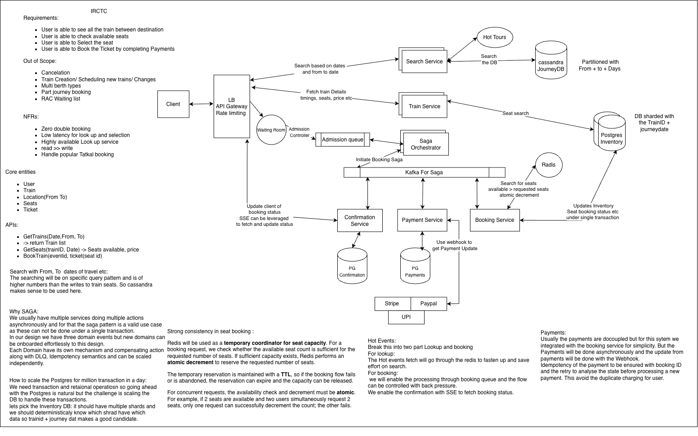

# IRCTC / Railway Ticket Booking — Staff-Level HLD

> This is an **IRCTC-like railway reservation design**, not a claim about IRCTC's internal production architecture. The goal is to adapt the Ticketmaster patterns to railway-specific inventory, concurrency, waitlist/RAC, payment and journey-segment allocation.

---

> If you have not gone through the TicketMaster I strongly suggest you give it a look here. [Ticket Master](../ticketmaster/Ticketmaster_Initial_HLD.md)

# 1. Requirements

## Functional Requirements

### Search

- Search trains between source and destination for a journey date.
- Filter by:
  - Train
  - Class
  - Quota
  - Departure/arrival time
  - Availability
- View train route and intermediate stations.
- View fare and availability.

### Booking

- Select train, class and passenger details.
- Select berth preferences where applicable.
- Book one or more passengers.
- Reserve available inventory.
- Complete payment.
- Generate a booking/PNR.
- Return confirmed/RAC/waitlisted status.

### Booking Status

- User can retrieve booking/PNR status.
- User receives status updates asynchronously.

### Railway-Specific Requirements

- RAC support.
- Waitlist support.
- Quota-aware inventory.
- Journey-specific seat/berth allocation.
- A seat/berth can potentially be used by different passengers on different journey segments.
- Cancellation/refund lifecycle.
- Charting/operational state changes.

---

# 2. Non-Functional Requirements

- **No double allocation** of the same seat/berth for overlapping journey segments.
- High availability for search.
- Strong consistency for inventory allocation.
- Low latency for availability lookup.
- Very high read volume.
- Extreme traffic spikes during high-demand booking windows.
- Backpressure for peak booking traffic.
- Idempotent booking/payment operations.
- Durable booking state.
- Eventual consistency acceptable for search/read projections.
- Horizontal scalability.
- Fault tolerance and recovery.

---

# 3. Core Entities

```text
User
Train
Station
Route
Journey
Coach
Seat / Berth
Class
Quota
Passenger
Booking / PNR
Payment
RAC Entry
Waitlist Entry
```

Important distinction:

```text
Train
  └── Route
       └── Stations / Segments
            └── Inventory availability
```

A railway seat is **not simply globally AVAILABLE/BOOKED**.

Its availability depends on:

```text
Train
+ Date
+ Coach/Class
+ Seat/Berth
+ Source Station
+ Destination Station
+ Quota
```

---

# 4. Key Difference From Ticketmaster

Ticketmaster:

```text
Event
  ↓
Seat
  ↓
AVAILABLE → HELD → CONFIRMED
```

Railway reservation:

```text
Train
  ↓
Route
  ↓
Journey segments
  ↓
Seat/Berth allocation
```

Example:

```text
A ── B ── C ── D ── E
```

Seat 42 could be:

```text
User 1: A → C
User 2: C → E
```

So we cannot simply say:

```text
Seat 42 = BOOKED
```

The actual question is:

> Is Seat 42 available for the requested journey segment?

This is one of the most important differences in the IRCTC design.

---

# 5. High-Level Architecture

```text
                              ┌──────────────┐
                              │    Client    │
                              └──────┬───────┘
                                     │
                              ┌──────▼───────┐
                              │ LB / Gateway │
                              │ Rate Limit   │
                              └──────┬───────┘
                                     │
                  ┌──────────────────┼──────────────────┐
                  │                  │                  │
                  ▼                  ▼                  ▼
             Search Service     Train Service     Booking Queue
                  │                  │                  │
                  ▼                  ▼                  ▼
             Search Cache       PostgreSQL       Booking Service
                  │                                     │
                  ▼                                     │
             Cassandra                              │
                                                        │
                              ┌─────────────────────────┼──────────────┐
                              │                         │              │
                              ▼                         ▼              ▼
                       Inventory Service         Payment Service   Booking State
                              │                         │              │
                              ▼                         ▼              ▼
                         Redis / DB              Payment Provider  PostgreSQL
                              │                         │
                              │                      Webhook
                              │                         │
                              └──────────────┬──────────┘
                                             │
                                             ▼
                                      Saga / Orchestrator
                                             │
                          ┌──────────────────┼─────────────────┐
                          ▼                  ▼                 ▼
                    Confirmation        RAC/Waitlist      Notification
                       / PNR               Service           Service
```





---

# 6. Search Flow

Search is read-heavy.

```text
User
  ↓
API Gateway
  ↓
Search Service
  ↓
Cache
  ↓ cache miss
Search Index
```

Train schedule and static metadata can be projected into Cassandra.

```text
PostgreSQL
    ↓
   CDC
    ↓
Cassandra
```

Search can tolerate eventual consistency.

However:

> **Search availability is not authoritative booking availability.**

The final inventory decision must be made by the Inventory/Booking path.

---

# 7. Availability Query

Availability should be journey-aware.

Example:

```text
Train 123
Bhubaneswar → Bangalore
Date = D
Class = 3A
Quota = General
```

The Inventory Service evaluates:

```text
Requested segment:
Bhubaneswar → Bangalore

Candidate seat:
Coach B1 / Seat 42

Existing allocations:
Seat 42
  ├── A → C
  └── C → E
```

If the requested segment overlaps an existing allocation:

```text
A → D
```

the seat cannot be allocated.

If it does not overlap:

```text
A → C
requested C → E
```

the seat may be reusable.

---

# 8. Booking Flow

```text
User
  ↓
POST /bookings
  ↓
API Gateway
  ↓
Booking Queue / Admission Control
  ↓
Booking Service
  ↓
Inventory Service
  ↓
Atomic Reservation
  ↓
Create Booking = PAYMENT_PENDING
  ↓
Payment Service
  ↓
Payment Provider
```

The booking API returns quickly:

```http
202 Accepted
```

Example:

```json
{
  "bookingId": "B123",
  "status": "PAYMENT_PENDING"
}
```

The user then completes payment.

---

# 9. High-Demand Booking / Tatkal-Like Traffic

Railway booking can produce an extreme burst.

Without admission control:

```text
Millions of users
       ↓
Booking Service
       ↓
Inventory DB
       ↓
Overload
```

Use:

```text
Waiting Room / Admission Control
            ↓
      Booking Queue
            ↓
   Controlled Booking Rate
            ↓
      Booking Service
```

The objective is:

> Protect the inventory and booking systems by controlling admission rather than allowing every incoming request to directly contend for inventory.

---

# 10. Queue Design

The queue should not blindly serialize all bookings.

Partitioning can be based on a hot-inventory key such as:

```text
trainId + journeyDate + class + quota
```

For particularly hot trains, additional partitioning/sharding may be needed.

However, there is an important tradeoff:

- More serialization reduces concurrency conflicts.
- Too much serialization reduces throughput.

The inventory key should therefore be chosen based on the actual contention boundary.

---

# 11. Inventory Concurrency

The core requirement:

> Two users must never receive the same overlapping seat allocation.

A simple global lock per seat is insufficient because railway seats can be reused across non-overlapping segments.

The conceptual operation is:

```text
Request:
Train 123
Date D
Seat 42
Bhubaneswar → Bangalore

Check:
Does Seat 42 have an overlapping allocation?

If NO:
    atomically create allocation
Else:
    reject / try another seat
```

The atomicity boundary must include:

```text
availability check
+
allocation creation
```

Otherwise:

```text
User A checks → available
User B checks → available

User A allocates
User B allocates

DOUBLE BOOKING
```

---

# 12. CAS / Optimistic Concurrency

The Ticketmaster lesson carries over:

```text
CAS / atomic operation
        ↓
Only one conflicting reservation wins
```

A version-based model is also possible:

```text
inventory_version = 10

User A reads 10
User B reads 10

A:
UPDATE ... WHERE version = 10
→ success → version 11

B:
UPDATE ... WHERE version = 10
→ 0 rows
→ retry / choose another allocation
```

The correct mechanism depends on the inventory data model and contention pattern.

The key requirement is:

> **The allocation decision must be atomic at the contention boundary.**

---

# 13. Seat Hold

For payment-driven temporary reservation:

```text
AVAILABLE
    ↓
HELD
    ↓
PAYMENT_PENDING
    ↓
CONFIRMED
```

Timeout:

```text
HELD / PAYMENT_PENDING
        ↓
TTL expires
        ↓
RELEASE
```

Redis can be used for fast temporary holds and TTL.

However:

> Redis should not silently become the only durable source of railway inventory truth.

A durable inventory/booking store is required.

---

# 14. RAC and Waitlist

This is a major difference from Ticketmaster.

If confirmed inventory is unavailable:

```text
Availability
     │
     ├── Confirmed
     │
     ├── RAC
     │
     └── Waitlist
```

The booking request can transition to:

```text
BOOKING_CONFIRMED
RAC
WAITLISTED
```

The exact allocation and promotion rules are domain-specific and should be isolated inside the reservation/allocation subsystem.

Conceptually:

```text
Confirmed cancellation
        ↓
Inventory becomes available
        ↓
RAC / Waitlist evaluation
        ↓
Promotion
        ↓
Booking state update
```

This is one reason IRCTC needs a richer inventory lifecycle than Ticketmaster.

---

# 15. Booking State Machine

Initial state machine:

```text
                    ┌───────────────┐
                    │     CREATED   │
                    └───────┬───────┘
                            │
                     Inventory hold
                            │
                            ▼
                  ┌───────────────────┐
                  │ PAYMENT_PENDING   │
                  └────────┬──────────┘
                           │
               ┌───────────┼────────────┐
               │           │            │
           payment       timeout      failure
           success          │            │
               │            │            │
               ▼            ▼            ▼
        ┌────────────┐  RELEASED      FAILED
        │ CONFIRMED  │
        └────────────┘
               │
               ├── RAC
               │
               └── WAITLISTED
```

The actual railway lifecycle can be extended later with:

- charting
- cancellation
- refund
- RAC promotion
- waitlist promotion

---

# 16. Payment

Payment remains asynchronous.

```text
Booking Service
      ↓
Payment Service
      ↓
Payment Provider
      ↓
User
      ↓
Provider Webhook
      ↓
Payment Service
      ↓
PaymentCompleted
      ↓
Saga / Booking Workflow
```

Payment should be isolated from Booking Service because it has its own:

- provider integration
- idempotency
- payment states
- webhook processing
- refund lifecycle
- reconciliation

The detailed payment/Saga workflow is covered in the deep-dive section.

---

# 17. Saga

For the production-grade IRCTC design, introduce a Saga to coordinate distributed state transitions.

Conceptually:

```text
                 Booking Saga
                     │
        ┌────────────┼────────────┐
        ▼            ▼            ▼
    Reserve       Payment      Confirm
    Inventory                  Booking
        │            │            │
        └────────────┴────────────┘
                Compensation
```

Example:

```text
Reserve inventory
      ↓
Payment succeeds
      ↓
Confirmation fails
      ↓
Retry confirmation
      ↓
If unrecoverable:
    refund payment
    release inventory
```

The Saga is a workflow coordinator, not a replacement for transactional boundaries.

---

# 18. Idempotency

Booking requests must be idempotent.

Example:

```http
POST /bookings
Idempotency-Key: user123-request456
```

If the client retries:

```text
Request 1 → B123
Request 2 → same idempotency key
           ↓
        return B123
```

No duplicate booking should be created.

Payment operations and webhook processing also require idempotency.

---

# 19. Booking Status to Client

Use the same pattern learned from Ticketmaster.

```text
POST /bookings
       ↓
202 Accepted + bookingId
       ↓
GET /bookings/B123
       ↓
Current state
       ↓
SSE /bookings/B123/events
       ↓
Future state changes
```

Example:

```text
GET
 ↓
PAYMENT_PENDING

SSE
 ↓
PAYMENT_COMPLETED
 ↓
CONFIRMED
```

The durable booking state remains the source of truth.

---

# 20. SSE Recovery

If SSE disconnects:

```text
SSE disconnected
       ↓
GET /bookings/B123
       ↓
       ├── terminal state → DONE
       │
       └── non-terminal
              ↓
        reconnect SSE
```

If payment completes before SSE connects:

```text
Payment completed
       ↓
Booking = CONFIRMED
       ↓
Client GET
       ↓
CONFIRMED
```

The client does not depend on receiving an SSE event to discover the final state.

---

# 21. Redis Pub/Sub / Kafka for SSE

Do not introduce this automatically.

Basic version:

```text
Booking Service
      ↓
PostgreSQL
      ↓
SSE
      ↓
Client
```

At larger scale, multiple Booking Service/SSE instances may need an event distribution layer:

```text
Booking Service
      ↓
Event / Outbox
      ↓
Kafka / Redis Pub/Sub
      ↓
SSE instances
      ↓
Clients
```

Important distinction:

```text
PostgreSQL = source of truth

Pub/Sub = notification/distribution mechanism
```

Redis Pub/Sub should not be treated as the durable source of booking state.

Kafka is more appropriate if durable event replay is required.

---

# 22. PNR / Confirmation

Once the booking workflow reaches a successful terminal state:

```text
Inventory confirmed
        ↓
Booking confirmed
        ↓
PNR generated
        ↓
Notification
```

For RAC/waitlist:

```text
Booking
  ↓
RAC / WAITLISTED
  ↓
PNR/status returned
```

The PNR/booking identifier should remain stable across state transitions.

---

# 23. Search vs Booking Consistency

This is an important interview distinction.

### Search

Can tolerate:

```text
eventual consistency
```

because a slightly stale search index is acceptable.

### Availability

Needs:

```text
strong consistency at allocation time
```

because stale data cannot result in two passengers receiving the same inventory.

### Booking status

Needs:

```text
durable consistent state
```

because users must eventually see the actual booking result.

---

# 24. Failure Scenarios

### Inventory Service fails

```text
Booking
   ↓
Inventory unavailable
   ↓
Do not confirm booking
   ↓
Retry / return temporary failure
```

### Redis fails

Do not assume a seat is safely held solely because of an unavailable Redis layer.

The durable inventory/booking state must remain authoritative.

### Payment succeeds but Booking Service crashes

```text
Payment provider
      ↓
Webhook
      ↓
Payment Service
      ↓
durable PaymentCompleted
      ↓
Saga resumes
```

### Client disconnects

Booking continues independently.

```text
Client disconnected
       ↓
Booking continues
       ↓
Client reconnects
       ↓
GET PNR/booking
       ↓
current state
```

### Duplicate webhook

Use payment/provider event ID or idempotency key:

```text
Webhook event E123
     ↓
already processed?
     ├── YES → ignore
     └── NO  → process
```

---

# 25. Capacity and Hotspot Considerations

The railway system has multiple hotspot dimensions:

```text
Hot train
Hot route
Hot journey date
Hot class
Hot quota
Hot booking window
```

Therefore, partitioning should not simply be:

```text
partition by trainId
```

without considering concentration.

A useful conceptual key is:

```text
trainId + journeyDate + class + quota
```

but very popular combinations may still require sharding or admission control.

The goal is to distribute load while preserving the serialization required for conflicting inventory.

---

# 26. Recommended Data Ownership

```text
Search Service
    → Cassandra / Cache

Train/Event Metadata
    → PostgreSQL

Booking
    → PostgreSQL

Inventory Allocation
    → Inventory Store + durable booking state

Temporary Holds
    → Redis

Payment
    → Payment Service + Payment Provider

Events
    → Kafka / Event Bus when durable event distribution is required
```

---

# 27. What We Reused From Ticketmaster

Ticketmaster taught us:

```text
Search
   ↓
Event details
   ↓
Seat selection
   ↓
Booking Queue
   ↓
Atomic seat reservation
   ↓
Payment
   ↓
Webhook
   ↓
SSE status
```

IRCTC keeps these concepts but changes the inventory model:

```text
Event
  ↓
Train
  ↓
Route
  ↓
Journey segment
  ↓
Seat/Berth allocation
```

And adds:

```text
Quota
RAC
Waitlist
PNR
Berth preference
Journey-specific inventory
Cancellation/refund
Charting
```

---

# 28. Staff-Level Design Discussion

The most important architectural decision is:

> **Where is the contention boundary?**

For Ticketmaster:

```text
event + seat
```

For railway:

```text
train + date + seat/berth + journey segment
```

Everything else follows from that:

- queue partitioning
- locking/CAS
- inventory data model
- scaling strategy
- consistency model
- hotspot handling

This should be explained explicitly in an interview.

---

# 29. Interview Questions

## Requirements

1. What are the functional and non-functional requirements?
2. What is different about railway inventory compared with event tickets?
3. How do source and destination affect availability?

## Inventory / Concurrency

4. How do you prevent double booking?
5. Why isn't `seat.status = BOOKED` sufficient?
6. How do you model a seat that can be reused on different journey segments?
7. Where is the atomicity boundary?
8. Would you use CAS, optimistic locking or a distributed lock?
9. What happens if two users request the same train/class/segment simultaneously?
10. How do you handle inventory hotspots?

## Queue / Admission

11. Why do we need a booking queue?
12. How do you handle Tatkal-like traffic spikes?
13. How would you design a waiting room?
14. How do you maintain fairness?
15. How do you partition the queue?
16. What happens if one train becomes a hot partition?

## RAC / Waitlist

17. How would you model RAC?
18. How does cancellation affect RAC/waitlist?
19. How do you promote a waitlisted passenger?
20. What happens when a confirmed seat becomes available?

## Payment / Saga

21. Why isolate Payment Service?
22. Why use webhooks?
23. What happens if payment succeeds but inventory confirmation fails?
24. What are the Saga compensating actions?
25. How do you handle duplicate payment webhooks?
26. How do you reconcile payment and booking state?

## SSE

27. Why SSE?
28. What happens if SSE disconnects?
29. What if booking completes before SSE connects?
30. How do multiple Booking Service instances distribute events?
31. When would you introduce Redis Pub/Sub?
32. When would Kafka be preferable?

## Consistency

33. Where do you need strong consistency?
34. Where is eventual consistency acceptable?
35. Is Cassandra allowed to be stale?
36. Can availability search be stale?
37. What is the source of truth?

## Failure Modes

38. What happens if Redis fails?
39. What happens if PostgreSQL fails?
40. What happens if the payment provider is unavailable?
41. What happens if the client disconnects?
42. What happens if the booking worker crashes halfway through processing?
43. How do retries avoid duplicate bookings?

## Staff-Level

44. What is your contention boundary?
45. What is your partition key and why?
46. How do you prevent a single hot train from becoming a hot partition?
47. What happens during a complete booking-window surge?
48. How do you recover from partial failures?
49. How do you reconcile inventory, booking and payment state?
50. Which consistency guarantees are business-critical and which can be relaxed?

---

# 30. Final Mental Model

For the interview, think of IRCTC as four major problems:

```text
                 IRCTC HLD
                    │
        ┌───────────┼────────────┐
        │           │            │
        ▼           ▼            ▼
     SEARCH      INVENTORY     BOOKING
        │           │            │
   Cassandra  Segment      Queue
   + Cache        Allocation   + Admission
                  CAS/Lock        │
                  TTL             ▼
                              PAYMENT
                                 │
                              Saga
                                 │
                         Confirmation/PNR
                                 │
                                SSE
```

The most important insight:

> **IRCTC is not fundamentally a "seat booking" problem. It is a journey-segment inventory allocation problem under extreme contention.**

That is the key architectural difference we should carry into the deep-dive discussions.
