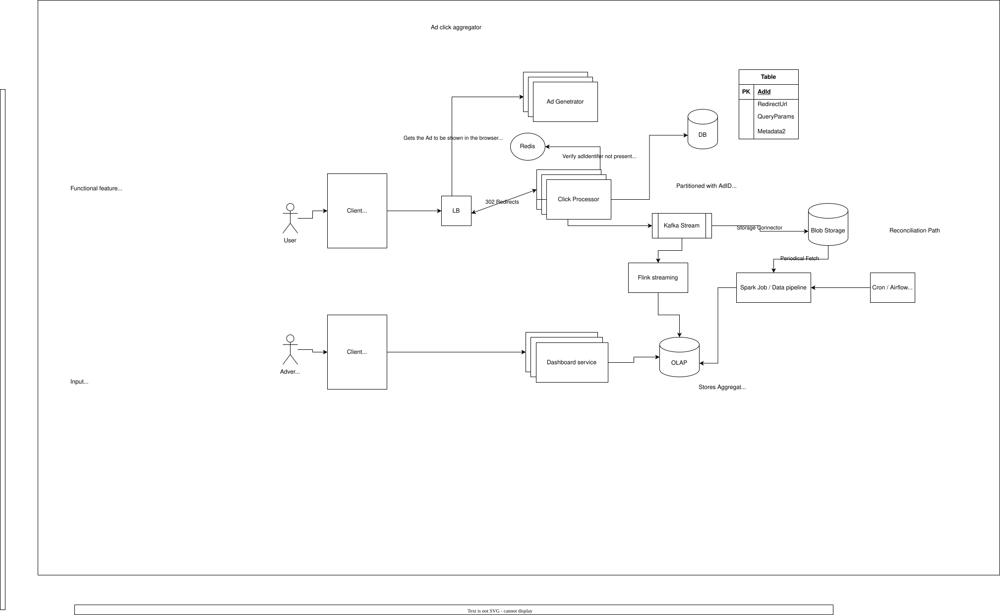

# Ad Click Aggregator --- Staff System Design Notes

> Goal: design a highly available ad-click tracking and analytics system
> that redirects users reliably and lets advertisers query click metrics
> at **1-minute granularity**.

------------------------------------------------------------------------

## 1. Functional Requirements

### User / click path

-   User clicks an ad.
-   User is redirected to the advertiser's website.
-   Click must not be silently lost.
-   Click processing should be asynchronous wherever possible.

### Advertiser path

-   Advertiser can query click metrics over time.
-   Metrics are available at **1-minute granularity**.
-   Interactive analytics queries should target **\<1 second** latency.

### Out of scope

-   Ad targeting and serving
-   Cross-device tracking
-   Offline-channel integrations

------------------------------------------------------------------------

## 2. Non-Functional Requirements

Given requirements:

-   \~10M ads
-   \~10K clicks/sec peak
-   Low-latency analytics
-   Fault tolerant --- avoid click loss
-   As real-time as practical
-   Idempotent click processing

Important clarification:

> The most important user-facing operation is **redirecting the user**.
> Analytics can tolerate temporary lag; the click itself should not be
> lost.

------------------------------------------------------------------------

# 3. Back-of-the-Envelope Capacity Estimates

## Given

  Metric                           Assumption
  ------------------------------ ------------
  Total ads                               10M
  Peak clicks/sec                         10K
  Estimated average clicks/sec             2K
  Average click event size          500 bytes
  Kafka replication factor                  3
  Analytics retention in OLAP         30 days
  Raw-event retention in Blob         1 year+
  Aggregation granularity            1 minute

> These are interview assumptions, not production measurements. State
> them explicitly and adjust if the interviewer gives different numbers.

------------------------------------------------------------------------

## 3.1 Clicks per day

### Average traffic

``` text
2,000 clicks/sec
× 60
× 60
× 24

= 172.8M clicks/day
```

### Peak traffic

``` text
10,000 clicks/sec
× 60
× 60
× 24

= 864M clicks/day
```

Do not assume the system runs at peak all day. Use peak for sizing the
hot path and average for storage-volume estimates.

------------------------------------------------------------------------

## 3.2 Raw event storage

Assume:

``` text
event size = 500 bytes
```

### Average daily raw volume

``` text
172.8M × 500 bytes
≈ 86.4 GB/day
```

### Peak-equivalent daily volume

``` text
864M × 500 bytes
≈ 432 GB/day
```

With compression in Parquet, the actual Blob footprint may be materially
smaller.

For a rough interview estimate, say:

``` text
~100 GB/day raw at average traffic
~400+ GB/day if peak were sustained
```

Then apply your assumed compression ratio if needed.

------------------------------------------------------------------------

## 3.3 Kafka throughput

At peak:

``` text
10K events/sec × 500 bytes
= 5 MB/sec payload
```

With Kafka replication factor 3:

``` text
~15 MB/sec of replicated payload
```

Then add protocol/record/replication overhead.

The important interview conclusion:

> **10K events/sec is not a particularly large Kafka workload. The
> harder problems are durability, hot keys, correctness, downstream
> processing, and analytics serving.**

------------------------------------------------------------------------

## 3.4 Kafka partitions

Do not blindly say "one partition per X clicks."

Estimate based on:

-   producer throughput
-   consumer throughput
-   desired parallelism
-   ordering requirements
-   future growth

For example, if one partition comfortably handles \~1K--5K events/sec
for this event size/workload, then a few partitions may handle current
traffic, but provision more for parallelism and growth.

A reasonable interview starting point:

``` text
~12–24 partitions
```

Then explain that the exact number is load-test driven.

Key choice:

``` text
partition key = adId / suitable sharded key
```

If one ad becomes extremely hot, consider a derived/sharded key rather
than allowing one Kafka partition to become a bottleneck.

------------------------------------------------------------------------

## 3.5 1-minute aggregate volume

Worst-case theoretical number of ad-minute buckets:

``` text
10M ads × 1,440 minutes/day
= 14.4B ad-minute combinations/day
```

But this is a **worst-case upper bound** assuming every ad receives at
least one click every minute.

Real cardinality is:

``` text
number of active ads
× active minutes
× requested dimensions
```

This is why the aggregation table/query model matters much more than the
raw 10M-ad number.

If additional dimensions are added:

``` text
adId × minute × country × device × ...
```

cardinality can explode.

Keep the first design limited to the dimensions actually required.

------------------------------------------------------------------------

## 3.6 Query volume

Query QPS is not specified.

Assume something such as:

``` text
100–1,000 dashboard queries/sec
```

for initial sizing, then ask the interviewer for the expected QPS.

The important serving requirement is:

``` text
query → OLAP → <1 sec
```

Use pre-aggregated data rather than scanning raw click events.

------------------------------------------------------------------------

# 4. High-Level Architecture

``` text
                         ┌───────────────┐
                         │ Ad Generator  │
                         └───────┬───────┘
                                 │
                          Ad metadata
                                 ↓
                           DB + Redis
                                 │
                                 │
User → Client → LB → Click Processor
                         │
                         │
                    durable capture
                         │
                         ↓
                       Kafka
                      /     \
                     /       \
                    ↓         ↓
                 Flink      Blob Storage
                   ↓             ↓
                  OLAP          Spark
                   ↑             ↓
                   └─────────────┘
                    reconciliation

Advertiser → Client → Dashboard Service → OLAP
```



### Core responsibilities

``` text
Click Processor
    → validate click
    → resolve redirect
    → create/accept unique adIdentifier
    → durably capture click
    → publish asynchronously
    → redirect user

Kafka
    → durable event backbone
    → decouple producers from consumers
    → absorb bursts

Flink
    → real-time stream processing
    → event-time aggregation
    → 1-minute windows
    → low-latency updates

Blob Storage
    → durable historical event store
    → replay/backfill source

Spark
    → batch recomputation
    → reconciliation
    → historical correction

OLAP
    → fast advertiser analytics queries
```

------------------------------------------------------------------------

# 5. Why Kafka + Flink + Blob + Spark?

This is intentionally more complex than a simple Kafka → Spark design.

### Real-time path

``` text
Kafka → Flink → OLAP
```

Used for:

-   low-latency aggregation
-   event-time processing
-   windows/watermarks
-   continuously updated metrics

### Durable historical path

``` text
Kafka → Blob Storage
```

Used for:

-   long-term retention
-   replay
-   backfill
-   audit/debugging
-   disaster recovery

### Reconciliation path

``` text
Blob → Spark → OLAP
```

Used when:

-   Flink logic has a bug
-   historical data must be recomputed
-   late/corrected data needs reconciliation
-   derived OLAP data needs repair

Key principle:

> **OLAP is derived data, not the ultimate source of truth.**

------------------------------------------------------------------------

# 6. Click Path

A clean HLD flow:

``` text
User
 ↓
Client
 ↓
Load Balancer
 ↓
Click Processor
 ↓
validate signed click
 ↓
durable capture / outbox
 ↓
Kafka
 ↓
302 Redirect
```

The exact implementation of the durable capture is an LLD discussion.

At HLD level, say:

> "I want a durable buffer/outbox so a temporary Kafka outage doesn't
> force us to choose between losing the click and failing the user
> redirect."

If the interviewer challenges complexity, discuss the alternative:

``` text
Click Processor → Kafka → 302
```

where Kafka itself is the durability boundary.

Trade-off:

-   simpler
-   lower operational complexity
-   but redirect availability becomes more coupled to Kafka availability

------------------------------------------------------------------------

# 7. Idempotency

`adIdentifier` means:

> one identifier for a specific ad shown to a specific user / impression
> context.

It is therefore suitable as an idempotency key **if the business
semantics guarantee that it represents one logical click/impression that
should only count once**.

Example:

``` text
User1 → Ad1 → adIdentifier=A
User1 → Ad1 → A          duplicate
User2 → Ad1 → B
User1 → Ad2 → C
```

Logical events:

``` text
A, B, C
```

At HLD:

``` text
adIdentifier
     ↓
idempotent processing
```

Do not dive into `SETNX`, WAL details, or exact retry implementation
unless asked.

Important failure mode:

``` text
mark idempotent
      ↓
Kafka publish fails
```

This is one reason a durable outbox/buffer is attractive.

------------------------------------------------------------------------

# 8. Redis and DB

### DB

Canonical source for ad metadata:

``` text
adId
redirectUrl
campaign
query parameters
metadata
```

### Redis

Cache hot ad metadata:

``` text
adId → redirect metadata
```

Potentially also supports short-lived idempotency state, but do not make
Redis the source of truth.

Normal path:

``` text
Click Processor
      ↓
Redis
      ↓
cache hit → continue
```

Cache miss:

``` text
Redis miss
    ↓
DB
    ↓
populate Redis
```

Avoid a DB lookup on every click.

------------------------------------------------------------------------

# 9. Kafka

Kafka acts as the **event backbone**, not the permanent analytics
database.

``` text
Click Processor
      ↓
    Kafka
     / \
    /   \
 Flink  Storage Connector
   ↓          ↓
  OLAP       Blob
```

Important HLD considerations:

-   partitioning
-   replication
-   consumer scaling
-   consumer lag
-   retention
-   replay
-   ordering requirements
-   idempotent downstream processing

Do not over-specify broker settings unless asked.

------------------------------------------------------------------------

# 10. Flink --- Real-Time Processing

Flink is a distributed stream-processing engine.

Mental model:

``` text
Kafka
  ↓
Flink
  ↓
continuous processing
  ↓
state
  ↓
windowed aggregation
  ↓
OLAP
```

For a 1-minute aggregation:

``` text
key = (adId, 1-minute event-time window)
```

Conceptually:

``` text
ad1 @ 12:00:05
ad2 @ 12:00:10
ad1 @ 12:00:20
ad1 @ 12:00:45

          ↓

(ad1, 12:00–12:01) = 3
(ad2, 12:00–12:01) = 1
```

Flink maintains distributed state and uses event-time
semantics/watermarks to reason about late events.

At HLD:

> "Flink continuously consumes Kafka, maintains keyed/windowed state,
> and emits minute-level aggregates to OLAP."

Do not go into checkpoint barriers/state backend internals unless
challenged.

------------------------------------------------------------------------

# 11. Spark --- Reconciliation / Batch

Spark is used separately from the real-time path.

``` text
Blob Storage
     ↓
Spark
     ↓
recompute
     ↓
OLAP
```

Typical use cases:

-   backfill
-   historical correction
-   reconciliation
-   rebuilding aggregates
-   large-scale offline analysis

Why both?

> **Flink optimizes for low-latency continuous processing; Spark gives
> us a strong large-scale batch/reprocessing tool.**

------------------------------------------------------------------------

# 12. Kafka → Blob Storage

Use a Kafka storage sink / connector rather than making Spark
responsible for the primary landing path.

``` text
Kafka
  ↓
Storage Connector
  ↓
Blob Storage
```

Do not create one object per event.

Instead:

``` text
Kafka events
   ↓
buffer/batch
   ↓
Parquet files
```

Example logical layout:

``` text
blob://click-events/

event_date=2026-09-06/
    event_hour=12/
        part-00001.parquet
        part-00002.parquet
        ...
```

Prefer a columnar format such as:

``` text
Parquet
```

because it provides efficient analytical reads and compression.

For a lakehouse-style implementation, an open table format such as
Iceberg can sit on top of the object storage.

------------------------------------------------------------------------

# 13. Why Object Storage Is the Durable Historical Source

Think of the layers as:

``` text
Kafka
→ current event stream / buffering

Blob Storage
→ durable historical event history

Flink
→ real-time computation

Spark
→ historical computation

OLAP
→ fast analytical serving
```

If Flink has a bug:

``` text
Blob
 ↓
Spark
 ↓
recompute
 ↓
OLAP
```

If OLAP is corrupted:

``` text
Blob
 ↓
rebuild
```

If Spark fails:

``` text
retry/reprocess
```

This gives the system a replayable source.

------------------------------------------------------------------------

# 14. OLAP Data Model

A useful logical aggregate:

``` text
AdClickMinuteAggregate

adId
minute
clickCount
updatedAt
```

If additional dimensions are required:

``` text
adId
minute
country
device
clickCount
```

The primary serving access pattern is:

``` text
WHERE adId = ?
  AND minute BETWEEN ? AND ?
```

The aggregate key should therefore align with that query.

For example:

``` text
(adId, minute, dimensions...)
```

Avoid querying raw click events for dashboard requests.

------------------------------------------------------------------------

# 15. 1-Minute Aggregation: Micro-Batch vs Window

Important distinction:

### Processing trigger

How frequently the engine processes incoming records.

### Aggregation window

How events are grouped.

They are independent.

For example:

``` text
Flink
continuous processing

Aggregation:
12:00–12:01
12:01–12:02
...
```

With Spark Structured Streaming, the common execution model is
micro-batch:

``` text
Kafka
 ↓
5-sec microbatch
 ↓
Spark
 ↓
update state
 ↓
5-sec microbatch
 ↓
Spark
```

The 1-minute aggregation window can span many micro-batches.

Do not say:

> "Spark triggers every minute because the aggregation window is one
> minute."

Those are separate concepts.

------------------------------------------------------------------------

# 16. Late Events / Watermarks

Suppose:

``` text
eventTime = 12:00:40
```

but the event arrives later.

The system must decide how long to keep the old window open.

Conceptually:

``` text
12:00–12:01 window
        ↓
wait for late events
        ↓
watermark passes
        ↓
finalize
        ↓
OLAP
```

This means a 1-minute metric does not necessarily become final exactly
at `12:01:00`.

The finalization delay depends on the event-time/watermark policy.

If business requires fresher but potentially revisable numbers:

``` text
initial aggregate
      ↓
OLAP
      ↓
late event
      ↓
correct aggregate
      ↓
OLAP update
```

------------------------------------------------------------------------

# 17. Failure Scenarios

## Cassandra / raw operational DB outage

If raw click persistence is downstream of Kafka:

``` text
Kafka
 ↓
consumer
 ↓
DB ❌
```

Kafka retains the events.

Consumer catches up after recovery.

User redirect remains available.

------------------------------------------------------------------------

## Kafka outage

If Kafka is the only durability boundary:

``` text
Click Processor
      ↓
Kafka ❌
```

You must choose:

-   fail the click
-   redirect and potentially lose analytics
-   use a durable buffer/outbox

Given the requirement "don't cause click drops":

``` text
Click Processor
      ↓
Durable buffer
      ↓
Kafka
```

is defensible.

At HLD, stop at the durable-buffer box.

------------------------------------------------------------------------

## Flink outage

Kafka retains events.

``` text
Flink ❌
   ↓
Kafka backlog
   ↓
Flink recovers
   ↓
catch up
```

Analytics may temporarily lag; clicks need not be lost.

------------------------------------------------------------------------

## OLAP outage

Real-time processing can continue if the sink/backpressure strategy
allows it.

Kafka remains the replayable event source.

Once OLAP recovers, aggregates can be replayed/reconciled.

------------------------------------------------------------------------

## Blob Storage outage

Kafka temporarily buffers events subject to retention.

Storage connector retries later.

Long-term durability depends on the configured retention and storage
recovery strategy.

------------------------------------------------------------------------

# 18. Consistency Model

Separate canonical data from derived data.

### Canonical

``` text
Ad metadata → DB
Raw click events → Blob Storage
```

### Derived

``` text
Kafka → Flink → OLAP
Blob → Spark → OLAP
```

Therefore:

> OLAP can be eventually consistent with the raw event history.

This is acceptable because analytics can tolerate small
delays/corrections, while redirect correctness is the primary
user-facing requirement.

------------------------------------------------------------------------

# 19. Scalability

### Click Processor

Stateless horizontally scalable services:

``` text
LB
 ├── instance
 ├── instance
 ├── instance
 └── ...
```

### Kafka

Scale through partitions.

### Flink

Scale through parallel operators and partitioned state.

### Blob

Object storage scales independently.

### Spark

Scale workers for historical processing.

### OLAP

Scale ingestion and query nodes according to workload.

### Redis

Cluster/shard if necessary; cache only hot metadata.

------------------------------------------------------------------------

# 20. Hot Ad Problem

A celebrity/popular ad may receive a disproportionate number of clicks.

If everything is keyed only by:

``` text
adId
```

then one ad can become a hot key.

Possible approach:

``` text
(adId, shard)
```

For example:

``` text
ad1#0
ad1#1
ad1#2
...
ad1#N
```

Then aggregate shards:

``` text
ad1#0 = 1,200
ad1#1 = 1,350
ad1#2 = 1,100

             ↓

ad1 = 3,650
```

Do not add this complexity for every ad automatically. Use it for
pathological hot keys.

------------------------------------------------------------------------

# 21. Interviewer Attack Questions

### Requirements

1.  What exactly must never be lost?
2.  Is analytics allowed to be delayed?
3.  How fresh must the 1-minute metrics be?
4.  What is expected dashboard QPS?

### Click path

5.  What happens if Redis is down?
6.  What happens if DB is down?
7.  What happens if Kafka is down?
8.  Why 302?
9.  What is `adIdentifier`?
10. How do you prevent duplicate clicks?

### Kafka

11. How many partitions?
12. What is the partition key?
13. What happens if a consumer dies?
14. What happens if Kafka falls behind?
15. How long is retention?
16. How do you replay events?

### Flink

17. Why Flink instead of Spark?
18. How does 1-minute aggregation work?
19. What is event time?
20. What is a watermark?
21. What happens to late events?
22. What happens if Flink crashes?

### Storage

23. Why Blob Storage?
24. Why Parquet?
25. Why not store raw events directly in OLAP?
26. How do you partition the data?
27. How do you prevent millions of tiny files?

### OLAP

28. Why OLAP?
29. What is the aggregate table key?
30. How do you guarantee \<1 sec queries?
31. What happens when OLAP is unavailable?
32. How do you correct bad aggregates?

### Architecture

33. Why both Flink and Spark?
34. Why both Kafka and Blob Storage?
35. Is the outbox necessary?
36. What is the source of truth?
37. Where is eventual consistency acceptable?

------------------------------------------------------------------------

# 22. Common Mistakes to Avoid

-   Making Cassandra/DB part of the synchronous redirect path
    unnecessarily
-   Using `adId` itself as the idempotency key when multiple users can
    click the same ad
-   Treating Redis as the source of truth
-   Treating Kafka as permanent historical storage
-   Creating one Blob object per click
-   Querying raw events for every dashboard request
-   Confusing processing trigger with aggregation window
-   Assuming a 1-minute window is finalized exactly at the end of the
    minute
-   Ignoring late events
-   Using Spark batch jobs as the only real-time processing mechanism
    when sub-minute freshness matters
-   Adding Flink + Spark + outbox without explaining why each complexity
    is justified
-   Going into LLD before the interviewer asks

------------------------------------------------------------------------

# 23. HLD vs LLD Boundary

## HLD

Say:

``` text
Durable Buffer
Kafka
Flink
Blob Storage
Spark
OLAP
```

Explain **why each exists**.

## LLD --- only when challenged

Then discuss:

``` text
SETNX
WAL
outbox schema
checkpoint internals
Flink state backend
Kafka acks
exact partition counts
retry algorithms
transactional sink
```

Staff-level signal:

> **Know the deeper details, but don't dump them into the HLD. Descend
> only when the interviewer asks.**

------------------------------------------------------------------------

# 24. Quick Cheat Sheet

``` text
Click
  ↓
Click Processor
  ↓
Durable capture
  ↓
Kafka
  ├──────────────→ Flink → OLAP
  │
  └──────────────→ Blob Storage
                       ↓
                     Spark
                       ↓
                      OLAP

Advertiser
  ↓
Dashboard Service
  ↓
OLAP
```

### Data ownership

``` text
Ad metadata
    → DB

Hot metadata
    → Redis

Event stream
    → Kafka

Historical raw events
    → Blob Storage / Parquet

Real-time aggregates
    → Flink → OLAP

Historical reconciliation
    → Spark → OLAP
```

### Mental model

``` text
Kafka
→ move/buffer events

Flink
→ compute continuously

Blob
→ remember history

Spark
→ recompute history

OLAP
→ answer analytics queries
```

------------------------------------------------------------------------

# 25. Final Staff-Level Mental Model

When designing this system, repeatedly ask:

``` text
1. What absolutely cannot be lost?
          ↓
2. What can be temporarily stale?
          ↓
3. What is the source of truth?
          ↓
4. What is derived data?
          ↓
5. What is my durability boundary?
          ↓
6. What happens when Kafka fails?
          ↓
7. What happens when processing fails?
          ↓
8. Can I replay the events?
          ↓
9. Can one ad become a hot key?
          ↓
10. Can the analytics query be served from pre-aggregated data?
          ↓
11. What happens at 100× scale?
          ↓
12. Am I solving an HLD problem or an LLD problem?
```

> **Interview mantra:** Start with the business-critical path. Make the
> click durable. Decouple ingestion from processing. Keep raw events
> replayable. Use streaming for freshness, batch for reconciliation, and
> OLAP for serving. Add complexity only when a requirement or failure
> mode justifies it.
