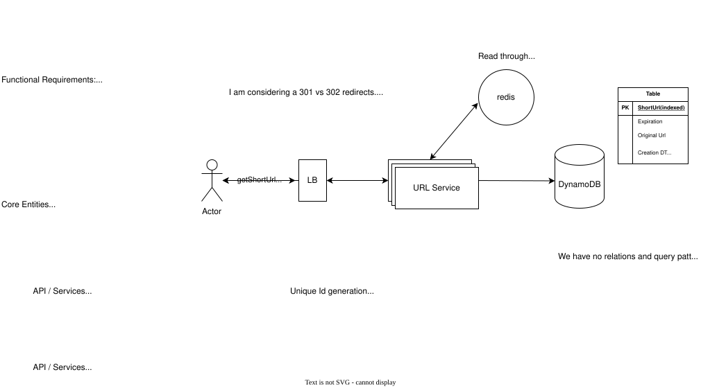

# Bitly --- URL Shortener System Design

## 1. Problem Statement

Design a URL shortening service similar to Bitly.

### Functional Requirements

-   Create a short URL from a long URL.
-   Optionally support a custom alias.
-   Optionally support an expiration time.
-   Redirect users from the short URL to the original URL.

### Non-Functional Requirements

-   Low latency on redirects (target: \~200 ms or better).
-   Scale to \~100M DAU and \~1B+ stored URLs.
-   Ensure uniqueness of the short code.
-   High availability.
-   Eventual consistency is acceptable where appropriate.

------------------------------------------------------------------------

# 2. Core Entities

The primary entity is a URL mapping:

``` text
short_id  →  original_url
```

Example:

``` text
aZ91xKpQ → https://example.com/a/very/long/path
```

Additional metadata can include:

-   `user_id`
-   `created_at`
-   `expires_at`
-   `status`

Custom aliases are treated as another form of `short_id`.

Example:

``` text
my-company → https://company.com
```

------------------------------------------------------------------------

# 3. API Design

## Create Short URL

``` http
POST /urls
```

Request:

``` json
{
  "originalUrl": "https://example.com/some/very/long/url",
  "alias": "my-company",
  "expirationTime": "2027-01-01T00:00:00Z"
}
```

`alias` and `expirationTime` are optional.

Response:

``` json
{
  "shortUrl": "https://bit.ly/my-company"
}
```

or:

``` json
{
  "shortUrl": "https://bit.ly/aZ91xKpQ"
}
```

## Redirect

``` http
GET /{short_id}
```

Example:

``` http
GET /aZ91xKpQ
```

Response:

``` http
302 Location: https://example.com/some/very/long/url
```

------------------------------------------------------------------------

# 4. High-Level Architecture

``` text
                         ┌──────────┐
                         │  Client  │
                         └────┬─────┘
                              │
                              ▼
                         ┌──────────┐
                         │    LB    │
                         └────┬─────┘
                              │
                    ┌─────────┴─────────┐
                    │    URL Service    │
                    │  (stateless)      │
                    └─────────┬─────────┘
                              │
                         ┌────▼────┐
                         │  Redis  │
                         │  Cache  │
                         └────┬────┘
                              │ cache miss
                              ▼
                       ┌─────────────┐
                       │  DynamoDB   │
                       │ URL Mapping │
                       └─────────────┘
```

The application servers are stateless and can be horizontally scaled
behind a load balancer.

The redirect path is optimized around a cache-first/read-through
pattern:

``` text
GET /aZ91xKpQ
      │
      ▼
    Redis
      │
   ┌──┴──┐
 HIT    MISS
  │       │
  ▼       ▼
URL    DynamoDB
          │
          ▼
       Redis SET
          │
          ▼
        redirect
```





------------------------------------------------------------------------

# 5. Short-Code Generation

## Candidate approaches

### A. Hash original URL

``` text
original URL
    ↓
MD5
    ↓
Base62
    ↓
truncate
```

This was considered but rejected as unnecessary.

Why?

-   We do not require deterministic mapping.
-   The same original URL can legitimately have multiple short URLs.
-   Hash truncation still has collisions.
-   We need collision handling regardless.
-   MD5 adds complexity without solving the uniqueness problem.

### B. Global counter

``` text
1000000001
     ↓
  Base62
     ↓
15ft3x
```

Advantages:

-   No collision.
-   Very efficient.
-   Short IDs can be generated deterministically.

Problems:

-   IDs are predictable/enumerable.
-   May expose system growth patterns.
-   Requires careful distributed ID generation.
-   Security/privacy requirements may make predictable IDs undesirable.

This is a valid design when enumeration is acceptable, but it is not the
preferred choice here.

### C. Random Base62 --- chosen approach

Generate a random Base62 ID:

``` text
SecureRandom
    ↓
Base62
    ↓
8-character ID
```

Example:

``` text
aZ91xKpQ
```

Use a sufficiently large namespace so collisions are rare.

The database remains the final correctness mechanism.

------------------------------------------------------------------------

# 6. Base62

Base62 uses:

``` text
A-Z
a-z
0-9
```

Number of possible IDs:

``` text
62^L
```

where `L` is the number of characters.

Examples:

    Length            Namespace
  -------- --------------------
         6       \~56.8 billion
         7      \~3.52 trillion
         8       \~218 trillion
         9   \~13.5 quadrillion
        10    \~839 quadrillion

A 6-character namespace looks large, but with billions of randomly
generated URLs, birthday-paradox effects make collisions much more
likely than simple `N > n` reasoning suggests.

Therefore 6 characters is not a comfortable choice for a 1B+ URL system.

An 8-character Base62 namespace gives \~218 trillion possible IDs and
makes individual insert collisions extremely rare at 1B stored mappings.

------------------------------------------------------------------------

# 7. Collision Handling

Random generation does **not** mathematically guarantee uniqueness.

The correct guarantee comes from the datastore.

Do not implement:

``` text
SELECT short_id
WHERE short_id = candidate

if not found:
    INSERT
```

This is vulnerable to a race:

``` text
Server A                  Server B

check candidate           check candidate
     ↓                         ↓
  not found                  not found
     ↓                         ↓
  insert                    insert
```

Both requests can observe the key as available.

## Correct approach

Use an atomic conditional insert / uniqueness constraint.

Conceptually:

``` text
generate candidate
       ↓
conditional insert
       ↓
 ┌─────┴─────┐
success    conflict
   │           │
   ▼           ▼
return       generate
             another
             candidate
                │
                └── retry
```

For a relational database:

``` sql
UNIQUE(short_id)
```

For DynamoDB:

``` text
PutItem
ConditionExpression:
attribute_not_exists(short_id)
```

This gives us:

-   distributed ID generation
-   no centralized ID generator
-   random/non-enumerable IDs
-   correctness through atomic uniqueness enforcement

------------------------------------------------------------------------

# 8. Custom Alias

Custom aliases follow the same uniqueness mechanism.

Example:

``` text
bit.ly/my-company
```

The alias itself becomes the `short_id`.

``` text
short_id = "my-company"
```

Do not rely on:

``` text
check alias
    ↓
if available
    ↓
insert
```

Instead:

``` text
conditional insert
       ↓
 ┌─────┴─────┐
success    conflict
   │           │
   ▼           ▼
alias       alias already
reserved       exists
```

This handles concurrent requests for the same alias safely.

Generated IDs and custom aliases can therefore share the same key space.

------------------------------------------------------------------------

# 9. Database Choice

## PostgreSQL

PostgreSQL is absolutely capable of implementing the system,
particularly at smaller or moderate scale.

Advantages:

-   Strong transactional guarantees.
-   Simple uniqueness constraint.
-   Mature operational ecosystem.
-   Easy schema and query model.
-   Excellent fit for the simple key lookup.

However, at extremely large scale, horizontal distribution and massive
datasets become more operationally complex.

## DynamoDB / Distributed NoSQL

The URL mapping workload is a strong NoSQL use case.

Primary access pattern:

``` text
Get(short_id)
```

There are:

-   no joins
-   no complex relational queries
-   simple writes
-   massive read volume
-   natural key-based partitioning
-   potentially very large datasets

Therefore the chosen design uses DynamoDB for the URL mapping store.

The key should be:

``` text
Partition Key = short_id
```

Example item:

``` json
{
  "short_id": "aZ91xKpQ",
  "original_url": "https://example.com/...",
  "user_id": "123",
  "created_at": "...",
  "expires_at": "..."
}
```

Redirect lookup becomes a direct point read.

------------------------------------------------------------------------

# 10. Why DynamoDB Fits the Access Pattern

The dominant operation is:

``` text
short_id → original_url
```

This maps directly to:

``` text
GetItem(short_id)
```

The partition key naturally distributes records across the datastore.

This is preferable to introducing relational complexity that the
workload does not require.

A broader Bitly-like product could still use a relational database for
things such as:

-   users
-   organizations
-   subscriptions
-   billing
-   permissions

The URL mapping store does not need to contain those relationships.

------------------------------------------------------------------------

# 11. Redis Cache

Redirects are overwhelmingly read-heavy.

The cache should therefore sit directly in front of the persistent URL
store.

Cache entry:

``` text
Key:
aZ91xKpQ

Value:
https://example.com/...
```

Flow:

``` text
GET /aZ91xKpQ
        │
        ▼
      Redis
        │
   ┌────┴────┐
 HIT        MISS
  │           │
  ▼           ▼
URL       DynamoDB
              │
              ▼
          Redis SET
```

This keeps the common redirect path extremely fast and protects DynamoDB
from the full redirect traffic.

------------------------------------------------------------------------

# 12. Redirect Semantics: 301 vs 302

## 301 --- Permanent Redirect

Indicates that the resource has permanently moved.

Potential advantages:

-   Browsers and intermediaries may cache the redirect.
-   Can reduce repeated requests to the URL service.
-   Lower infrastructure load.

Potential downside:

-   Once cached, changing the destination can be difficult to observe
    immediately.
-   Less control over subsequent requests.

## 302 --- Temporary Redirect

Indicates that the redirect is temporary.

Advantages:

-   More control over future requests.
-   Useful when short links can be edited or disabled.
-   The URL service can observe subsequent requests and perform
    application-level processing.

### Analytics clarification

Analytics do **not inherently require 302**.

The server receives the short URL request before returning either
redirect response, so click events can be recorded with either status.

The more important distinction is **caching and mutability**.

For a mutable/trackable short-link product, 302 is a reasonable default.

------------------------------------------------------------------------

# 13. Storage Estimates

Suppose the logical URL mapping record averages approximately 250 bytes.

Approximate logical storage:

``` text
1B URLs
≈ 250 GB

10B URLs
≈ 2.5 TB

100B URLs
≈ 25 TB
```

These are logical data estimates only.

Actual physical storage will be higher because of:

-   indexes / internal structures
-   replication
-   metadata
-   WAL where applicable
-   backups
-   operational overhead

The key lesson is:

> Storage capacity should not be confused with database throughput or
> operational capacity.

------------------------------------------------------------------------

# 14. Scaling Strategy

Do not introduce sharding solely because the system might eventually
reach 100B records.

A practical evolution can be:

``` text
Stage 1
DynamoDB + Redis

        ↓

Stage 2
Increase DynamoDB capacity
+ Redis scaling

        ↓

Stage 3
Partition/shard as dataset and traffic require

        ↓

Stage 4
Multi-region / global architecture
```

DynamoDB already provides distributed storage and partitioning
internally, so application-level sharding is not required from day one.

If using a self-managed distributed database, `hash(short_id)` is a
natural partitioning strategy because the dominant access pattern is
lookup by `short_id`.

------------------------------------------------------------------------

# 15. Availability

The redirect path should not depend exclusively on Redis.

Normal path:

``` text
Redis HIT
   ↓
redirect
```

If Redis misses:

``` text
Redis MISS
   ↓
DynamoDB
   ↓
redirect
```

If Redis is unavailable:

``` text
Redis unavailable
      ↓
bypass cache
      ↓
DynamoDB
      ↓
redirect
```

The trade-off is increased latency and increased datastore load during a
Redis outage.

Redis should therefore be treated primarily as a **performance
optimization and load-reduction layer**, not the sole source of truth.

DynamoDB remains the durable source of truth.

------------------------------------------------------------------------

# 16. Cache Consistency

URL creation:

``` text
POST /urls
     │
     ▼
DynamoDB write
     │
     ▼
Redis populate
     │
     ▼
return short URL
```

The persistent database should be written first.

If:

``` text
DynamoDB = success
Redis = failure
```

the URL has still been successfully created.

A subsequent redirect can:

``` text
Redis MISS
    ↓
DynamoDB GET
    ↓
Redis SET
    ↓
redirect
```

This gives eventual cache population without losing the URL mapping.

------------------------------------------------------------------------

# 17. Expiration

Expiration can be represented using:

``` text
expires_at
```

The redirect service should verify expiration semantics before
redirecting.

DynamoDB TTL can be used for eventual physical cleanup, but TTL deletion
should not be treated as the only correctness mechanism for an expired
URL because TTL cleanup is asynchronous.

Therefore:

``` text
request
   ↓
lookup
   ↓
is expired?
 ┌─┴─┐
yes  no
 │    │
 ▼    ▼
404 redirect
```

Redis entries should also have an appropriate TTL.

------------------------------------------------------------------------

# 18. Hot URLs

A small number of URLs may receive a huge percentage of traffic.

Example:

``` text
/aZ91xKpQ
```

becomes extremely hot.

Redis protects the database by serving these mappings from memory.

Potential concerns:

-   cache hot spots
-   uneven Redis load
-   cache eviction
-   one extremely popular key

For very extreme workloads, the cache layer can be horizontally scaled
and hot-key handling can be considered separately.

------------------------------------------------------------------------

# 19. Failure Scenarios to Drill

These are important interview discussion points.

### Redis is down

``` text
Redis unavailable
      ↓
DynamoDB
      ↓
redirect
```

Trade-off: higher latency and increased DynamoDB traffic.

### DynamoDB is down but Redis has the value

A cache hit can still serve the redirect.

This demonstrates an important property:

> A cache can improve availability of the read path for already-cached
> data, not just latency.

### DynamoDB succeeds but Redis fails

Treat URL creation as successful.

Redis is repopulated on a later cache miss.

### Two users request the same alias

Conditional write / uniqueness guarantee allows only one to win.

### Two servers generate the same random ID

Conditional write / uniqueness guarantee allows one to win; the other
retries.

------------------------------------------------------------------------

# 20. Important Design Principles

### Principle 1 --- Random generation does not guarantee uniqueness

Randomness makes collisions rare.

The datastore makes uniqueness correct.

### Principle 2 --- Never use check-then-insert for uniqueness

Use an atomic uniqueness/conditional-write operation.

### Principle 3 --- Cache is not the source of truth

Persistent storage owns the URL mapping.

### Principle 4 --- Choose the datastore based on access patterns

The key access pattern is:

``` text
Get(short_id)
```

This makes a distributed key-value store a strong fit.

### Principle 5 --- Do not prematurely shard

Scale the datastore when actual storage/throughput/availability
requirements justify it.

### Principle 6 --- Redirect status affects caching semantics

301 vs 302 is primarily about permanence, caching, and mutability---not
whether analytics are possible.

------------------------------------------------------------------------

# 21. Current Preferred Design

``` text
                         ┌──────────┐
                         │  Client  │
                         └────┬─────┘
                              │
                              ▼
                         ┌──────────┐
                         │    LB    │
                         └────┬─────┘
                              │
                    ┌─────────▼─────────┐
                    │    URL Service    │
                    │    Stateless      │
                    └─────────┬─────────┘
                              │
                         ┌────▼────┐
                         │  Redis  │
                         │  Cache  │
                         └────┬────┘
                              │
                         cache miss
                              │
                         ┌────▼──────┐
                         │ DynamoDB  │
                         │            │
                         │ PK:        │
                         │ short_id   │
                         └────────────┘
```

### URL creation

``` text
Request
  ↓
custom alias?
  ├── yes → conditional write(alias)
  │
  └── no  → generate random Base62
                 ↓
            conditional write
                 ↓
              conflict?
              ├── no → success
              └── yes → retry
```

### Redirect

``` text
GET /short_id
      ↓
    Redis
      │
   ┌──┴──┐
 HIT   MISS
  │      │
  │      ▼
  │   DynamoDB
  │      │
  │      ▼
  │   Redis SET
  │      │
  └──┬───┘
     ▼
 HTTP 302
 Location: original_url
```

------------------------------------------------------------------------

# 22. Interview Drill --- Next Questions

The design is intentionally not considered "finished". The next
deep-dive questions are:

1.  What exactly happens when Redis is completely unavailable for 30
    minutes?
2.  What happens when DynamoDB is unavailable but Redis contains the
    URL?
3.  Should creation write DynamoDB first or Redis first?
4.  How do we avoid cache stampede on a popular URL after expiration?
5.  How do we handle expired URLs that are still present in Redis?
6.  How do we collect click analytics without increasing redirect
    latency?
7.  Should analytics be synchronous or asynchronous?
8.  Where does Kafka fit?
9.  How do we handle multi-region deployment?
10. How do we handle a region failure?
11. How do we guarantee uniqueness if IDs are generated independently in
    multiple regions?
12. What happens when the same custom alias is requested concurrently in
    different regions?
13. How do we migrate data if the partitioning strategy changes?
14. What consistency model do we actually need for URL creation and
    redirects?
15. What happens if the URL is deleted immediately after being cached?

These are the areas that turn this from a simple URL-shortener HLD into
a strong senior/staff-level discussion.
