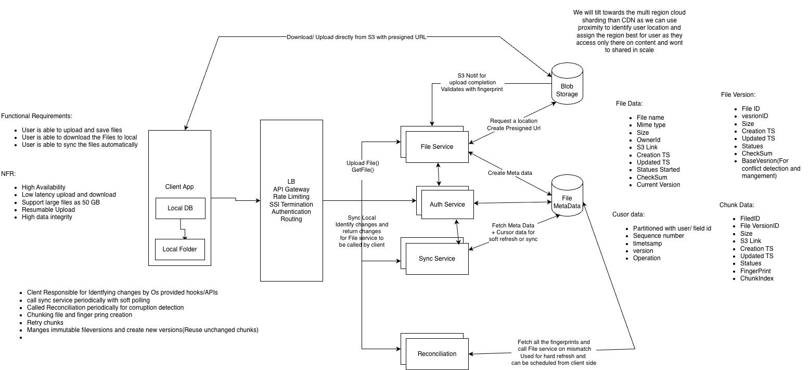

# Dropbox-like File Synchronization System - HLD

## 1. Problem

Design a Dropbox-like distributed file storage and synchronization system.

Core requirements:

- Users can upload/download files.
- Files synchronize across multiple devices.
- Large files should support resumable uploads.
- Multiple devices can modify the same file.
- Deletes must propagate to offline devices.
- Files should be stored durably and efficiently.
- System should support sharing and multi-region deployment.

---

# 2. High-Level Architecture

```text
                         Global DNS / GSLB
                                |
                         API Gateway
                                |
              +-----------------+-----------------+
              |                                   |
        File Service                         Sync Service
              |                                   |
        Metadata DB                         ChangeLog
              |                                   |
              +-------------+---------------------+
                            |
                      Object Storage
                         (S3/GCS)
                            |
                     Client Devices
              +-------------+-------------+
              |                           |
          Local DB                   Local Files
```



### Important design choice

The client uploads/downloads file data directly to object storage using short-lived presigned URLs.

Application services handle:

- Authentication
- Authorization
- Metadata
- Versioning
- Sync decisions
- Upload lifecycle

They should not proxy large file payloads.

---

# 3. File Upload Flow

For large files, split the file into chunks.

Example:

```text
report.pdf
    |
    +-- Chunk 0
    +-- Chunk 1
    +-- Chunk 2
    +-- Chunk 3
```

A typical chunk size could be 5 MB.

Each chunk gets a SHA-256 fingerprint.

```text
Chunk 0 → hash A
Chunk 1 → hash B
Chunk 2 → hash C
```

Fingerprints help with:

- Change detection
- Deduplication
- Resumable uploads
- Integrity validation

### Fingerprint vs checksum

The same hash algorithm can serve different purposes.

**Fingerprint:**

> Is this the same content?

**Checksum:**

> Was this content corrupted?

---

# 4. Metadata Model

Keep logical files, immutable versions, and chunks separate.

### File

```text
fileId
ownerId
fileName
parentFolderId
currentVersion
status
createdAt
updatedAt
```

### FileVersion

```text
fileId
versionId
versionNumber
baseVersion
size
fileChecksum
totalChunks
createdAt
status
```

### Chunk

```text
fileId
versionId
chunkIndex
fingerprint
size
storageKey
status
```

Actual file bytes live in object storage.

Metadata DB stores references to the objects.

### Why immutable versions?

```text
File F123
   |
   +-- V1
   +-- V2
   +-- V3
   +-- V4
```

A modification creates a new version rather than modifying an old version.

Example:

```text
V4 = [A, B, C, D]

New version:

V5 = [A, B, X, D]
```

Unchanged chunks can be reused.

---

# 5. Resumable Upload

Create an upload session before uploading chunks.

```text
UploadSession

uploadId
fileId
versionId
totalChunks
status
```

Upload state:

```text
UPLOADING
     |
     v
FINALIZING
     |
     v
COMPLETED
```

### Flow

```text
Client
  |
  | Create upload session
  v
File Service
  |
  | Presigned URLs
  v
Client
  |
  | Upload chunks directly
  v
Object Storage
```

If the network fails:

```text
Uploaded:
0 1 2 4

Missing:
3
```

Client only retries chunk 3.

It does not upload the entire file again.

### Temporary namespace

```text
S3/temp/{uploadId}/chunk-{n}
```

Temporary objects are not considered part of the current file until finalization succeeds.

---

# 6. Upload Finalization

When all chunks are uploaded:

```text
UPLOADING
    |
    | all chunks present
    v
FINALIZING
    |
    | validate fingerprints/checksum
    v
DB transaction
    |
    +-- Create FileVersion
    +-- Store chunk references
    +-- Update currentVersion
    +-- Add ChangeLog entry
    +-- Mark upload COMPLETED
```

The metadata transaction should atomically update the file state and the change record where the database supports transactions.

---

# 7. DB + Object Storage Consistency

There is normally no ACID transaction spanning:

```text
Metadata DB + S3
```

Do not introduce 2PC just for this.

Use:

- Upload state machine
- Immutable objects
- Idempotent operations
- Durable upload events
- Reconciliation jobs

### Example failure

```text
S3 upload succeeds
        |
        v
DB update fails
```

The upload remains in:

```text
FINALIZING
```

A retry/reconciliation process can safely complete it.

### Orphan objects

If an upload permanently fails:

```text
S3/temp/{uploadId}/...
```

can be cleaned using:

- TTL/lifecycle rules
- Background reconciliation

### Completed version but missing S3 object

Periodic reconciliation checks that metadata references actually exist in object storage.

---

# 8. Idempotency

Network failures can cause clients to retry a request even though the server already processed it.

### Chunk idempotency

A chunk is uniquely identified by:

```text
(uploadId, chunkIndex)
```

Persist:

```text
status
fingerprint
```

If the same request is retried:

```text
Already uploaded
      ↓
Return existing result
```

If the same chunk index is retried with a different fingerprint:

```text
Conflict
```

Do not silently overwrite it.

### Complete upload must also be idempotent

If completion succeeded but the response was lost:

```text
Client → completeUpload()
       X response lost

Client → completeUpload() again
```

The server should return the already-created version instead of creating another version.

### Fingerprint != idempotency key

Fingerprint:

> Identifies content.

Idempotency key:

> Identifies an operation/request.

---

# 9. Versioning

Treat each modification as an immutable FileVersion.

```text
File F123
   |
   +-- V1
   +-- V2
   +-- V3
   +-- V4 ← current
```

A version can contain:

```text
versionId
versionNumber
baseVersion
fileChecksum
totalSize
totalChunks
```

Benefits:

- Conflict detection
- Version history
- Restore
- Sync
- Reuse of unchanged chunks

---

# 10. Conflict Resolution

Two devices can modify the same version.

```text
                 V5
                /  \
               /    \
          Device A  Device B
             |         |
            V6-A      V6-B
```

When uploading, the client sends:

```text
baseVersion = 5
```

Server checks:

```text
currentVersion == baseVersion
```

### No conflict

```text
currentVersion = 5
baseVersion    = 5

→ create V6
```

### Conflict

```text
currentVersion = 6
baseVersion    = 5

→ conflict
```

Do not silently overwrite the existing version.

For generic files, create a conflicted copy.

For application-specific formats, merge logic could be applied.

---

# 11. ChangeLog + Cursor Based Sync

Use short polling rather than pushing every change to every device.

The Sync Service maintains a durable change stream.

Example:

```text
userId
sequence
fileId
versionId
operation
timestamp
```

Operations:

```text
CREATE
UPDATE
DELETE
```

### Cursor

The client stores:

```text
cursor = 1003
```

Then asks:

```text
GET /changes?cursor=1003
```

Server returns changes after sequence 1003.

```text
1004 → file A updated
1005 → file B created
1006 → file C deleted
```

And:

```text
nextCursor = 1006
```

### Why sequence instead of timestamp?

Timestamps can:

- Collide
- Arrive out of order
- Depend on clock behavior

A logical monotonically ordered sequence is cleaner.

For strict per-user ordering, use a per-user sequence.

### Cursor advancement

Client should:

1. Fetch changes.
2. Apply changes locally.
3. Persist local state.
4. Persist the new cursor.

If the client crashes before step 4, the same changes may be received again.

Therefore client-side application should also be idempotent.

### Cursor expiration

ChangeLog entries cannot live forever.

If a client has been offline beyond the retention period:

```text
cursor expired
       |
       v
Full metadata reconciliation
       |
       v
Establish new cursor
```

---

# 12. Delete Propagation

Do not immediately remove all metadata when a file is deleted.

Use a tombstone.

```text
File F123

status = DELETED
deletedAt = ...
```

And record:

```text
F123 → DELETE
```

This is important for offline clients.

### Example

Device A deletes:

```text
report.pdf
```

Device B has been offline for 10 days.

When Device B reconnects:

```text
ChangeLog
   |
   v
DELETE F123
   |
   v
Remove local report.pdf
```

After the retention period:

```text
Tombstone
    |
    v
Background cleanup
    |
    +-- Remove metadata
    +-- Remove unused versions/chunks
    +-- Remove S3 objects
```

---

# 13. Authorization and Sharing

Keep authorization logically separate from file metadata.

Example:

```text
resourceId = FolderA
userId     = UserB
role       = EDITOR
```

Typical roles:

```text
OWNER
EDITOR
VIEWER
```

### Download flow

```text
Client
  |
  v
API Gateway
  |
  v
File Service
  |
  v
Authorization check
  |
  v
Generate presigned URL
  |
  v
Client → Object Storage
```

Never allow the client to construct arbitrary object-storage keys.

The service should resolve:

```text
fileId
   ↓
authorization
   ↓
storageKey
   ↓
presigned URL
```

Folder permissions can be inherited by descendant files/folders.

---

# 14. Multi-Region

Keep the main design simple.

Deploy stateless services across regions.

```text
                  Global DNS / GSLB
                         |
              +----------+----------+
              |                     |
           Region A              Region B
              |                     |
        API + Services        API + Services
              |                     |
           Metadata DB ← replication →
              |
        Object Storage
           ↕ replication
```

### Home region

Assign a user's namespace to a home region.

```text
User A → Region A
User B → Region B
User C → Region C
```

Metadata writes primarily go to the user's home region.

This gives a clear authority for metadata writes and avoids unnecessary multi-master conflicts.

Object storage can use cross-region replication.

During regional failure, traffic can fail over to another region depending on the consistency/failover strategy.

---

# 15. Failure Handling Summary

| Failure | Handling |
|---|---|
| Network failure during upload | Retry missing chunks |
| Duplicate chunk request | Idempotent response |
| Different content for same chunk | Conflict |
| Completion request retried | Idempotent completion |
| S3 succeeds, DB fails | FINALIZING + retry/reconciliation |
| DB succeeds, response lost | Retry safely |
| Temporary upload abandoned | Lifecycle/TTL cleanup |
| Client offline | ChangeLog + cursor |
| Cursor expired | Full reconciliation |
| File deleted | Tombstone |
| Two devices edit same version | Optimistic concurrency |
| S3 object missing | Reconciliation/alert |
| Region failure | Global routing + replicated data |

---

# 16. What Goes in the Main HLD Diagram?

Keep the diagram clean.

### Show

```text
Client
  ↓
API Gateway
  ↓
File Service
  ↓
Metadata DB

Client ───────────────→ Object Storage
        presigned URL

Client
  ↓
Sync Service
  ↓
ChangeLog
```

### Don't clutter the main diagram with

- Tombstones
- Cursor implementation
- Idempotency keys
- Upload state machine
- Conflict resolution
- Reconciliation jobs
- Detailed authorization model
- Multi-region replication details

These are excellent **interviewer follow-up topics**.

---

# 17. Staff-Level Interview Talking Points

If the interviewer asks for deeper details, focus on these:

### Upload

> "Large files are chunked and uploaded directly to object storage using presigned URLs. Upload sessions make the process resumable."

### Consistency

> "I don't try to create a distributed transaction between S3 and the metadata database. I use an upload state machine, immutable objects, idempotency and reconciliation."

### Sync

> "I'm using short polling with a durable ordered ChangeLog. Clients maintain a cursor and fetch only changes after that cursor."

### Delete

> "Deletes use tombstones so offline clients can learn that a file was deleted."

### Conflicts

> "The client sends its base version. If that version is no longer current, optimistic concurrency detects the conflict instead of silently overwriting another device's update."

### Sharing

> "Authorization is checked before generating a short-lived presigned URL."

### Multi-region

> "Users have a home region for metadata writes, while services and object storage are deployed across multiple regions for availability and disaster recovery."

---

# 18. Core Design Principles

The design relies on a few important principles:

```text
1. Separate metadata from file bytes.

2. Upload bytes directly to object storage.

3. Use immutable versions.

4. Make operations idempotent.

5. Don't rely on distributed ACID transactions.

6. Use reconciliation for eventual consistency failures.

7. Use ordered change tracking for synchronization.

8. Use tombstones for deletes.

9. Use optimistic concurrency for conflicting edits.

10. Keep the main HLD simple and explain deeper mechanisms when asked.
```


---

# 19. Interview Questions & Preparation

Use these as follow-up questions to practice after drawing the HLD.

## A. Requirements & Scale

### Q1. What are the functional requirements?

**Answer:**

- Upload files
- Download files
- Synchronize files across devices
- Support large files
- Resume interrupted uploads
- Handle concurrent modifications
- Delete files and propagate deletes
- Share files/folders
- Maintain file versions

### Q2. What are the non-functional requirements?

**Answer:**

- High durability
- High availability
- Low sync latency
- Scalability
- Efficient bandwidth usage
- Fault tolerance
- Secure access

### Q3. Why don't you send file data through your application servers?

**Answer:**

Large files would consume application-server bandwidth, memory and connections.

Instead:

```text
Client → API → get presigned URL
Client ───────────────→ Object Storage
```

This allows object storage to handle the heavy data transfer.

---

# B. Chunking & Upload

### Q4. Why do we chunk files?

**Answer:**

- Resume partial uploads
- Retry only failed chunks
- Parallel uploads
- Avoid restarting large uploads
- Enable chunk-level deduplication

### Q5. How do you choose chunk size?

**Answer:**

There is a trade-off.

Smaller chunks:

- Better retry granularity
- More metadata
- More requests

Larger chunks:

- Fewer requests
- More data retransmitted on failure

A reasonable starting point is around 5-10 MB, then tune based on workload and network characteristics.

### Q6. How do you resume an interrupted upload?

**Answer:**

Create an `UploadSession`.

```text
uploadId
fileId
versionId
totalChunks
status
```

The client asks which chunks are already uploaded and retries only the missing ones.

### Q7. What happens if chunk 7 is uploaded twice?

**Answer:**

Use:

```text
(uploadId, chunkIndex)
```

as the logical chunk identity.

If the retry has the same fingerprint, return the existing state.

If it has a different fingerprint, return a conflict.

---

# C. Fingerprints, Deduplication & Integrity

### Q8. Why calculate a fingerprint for every chunk?

**Answer:**

It helps with:

- Deduplication
- Change detection
- Resumable uploads
- Integrity verification

### Q9. Is a fingerprint the same as a checksum?

**Answer:**

The hash algorithm can be the same, but the purpose is different.

Fingerprint:

> Is this content the same?

Checksum:

> Was the content corrupted?

### Q10. How would you implement deduplication?

**Answer:**

Store chunks by content fingerprint.

```text
fingerprint → object storage location
```

If a new file contains an already existing chunk, reuse the existing object instead of uploading another copy.

Reference counting or garbage-collection metadata can be used to determine when an unreferenced chunk can be deleted.

---

# D. Metadata & Versioning

### Q11. Why separate File and FileVersion?

**Answer:**

A logical file can have many versions.

```text
File F123
   |
   +-- V1
   +-- V2
   +-- V3
```

The File represents the logical entity, while FileVersion represents an immutable snapshot.

This makes version history, conflict detection and restore easier.

### Q12. Why are versions immutable?

**Answer:**

If old versions are immutable:

- Concurrent operations are easier to reason about
- Conflict detection is straightforward
- Restore becomes easy
- History is preserved
- Multiple versions can safely coexist

### Q13. How do you restore an old version?

**Answer:**

Don't mutate the old version.

Create a new version using the old version's chunk references.

```text
V5 current
 |
 | restore V2
 v
V6 → same content as V2
```

---

# E. Consistency

### Q14. Can you have one transaction across DB and S3?

**Answer:**

Normally no.

S3/object storage and the metadata database do not participate in the same ACID transaction.

I would use:

```text
State machine
+
Idempotency
+
Immutable objects
+
Reconciliation
```

instead of 2PC.

### Q15. What if S3 upload succeeds but DB update fails?

**Answer:**

The upload remains in `FINALIZING`.

A retry/reconciliation process validates the uploaded objects and completes the metadata transaction.

### Q16. What if DB says the upload is complete but the S3 object is missing?

**Answer:**

A reconciliation job periodically verifies metadata references against object storage.

Depending on the situation, it can recover from another replica, mark the version unavailable, or raise an operational alert.

### Q17. How do you clean abandoned uploads?

**Answer:**

Temporary objects are stored under an upload-specific namespace:

```text
S3/temp/{uploadId}/...
```

Lifecycle/TTL rules remove objects belonging to abandoned sessions.

---

# F. Idempotency

### Q18. Why is idempotency important here?

**Answer:**

The client can lose the network response after the server has already processed a request.

The client then retries.

Without idempotency, the retry could create duplicate versions or duplicate processing.

### Q19. Is chunk fingerprint enough for idempotency?

**Answer:**

No.

Fingerprint identifies content.

Idempotency key identifies an operation.

```text
Fingerprint → same content?
Idempotency key → same request?
```

### Q20. Is `completeUpload()` idempotent?

**Answer:**

Yes.

If completion already created version V6 and the response was lost, another `completeUpload()` should return the existing V6 instead of creating V7.

---

# G. Synchronization

### Q21. How does a device know that another device changed a file?

**Answer:**

The client periodically polls the Sync Service.

```text
Client
   |
   | cursor=1003
   v
Sync Service
   |
   v
ChangeLog
```

The service returns changes after that cursor.

### Q22. Why use a ChangeLog?

**Answer:**

The client doesn't need to repeatedly download the complete metadata state.

It asks:

> "What changed since my last known position?"

This makes synchronization incremental.

### Q23. Why not use timestamps as the cursor?

**Answer:**

Timestamps can collide and don't provide a reliable logical ordering.

A monotonically ordered sequence is cleaner.

### Q24. What happens if the client crashes after applying changes but before updating the cursor?

**Answer:**

It may receive the same changes again.

Therefore applying changes locally must be idempotent.

### Q25. What if the client was offline for several months?

**Answer:**

The ChangeLog has finite retention.

If the cursor is too old:

```text
Cursor expired
      ↓
Full metadata reconciliation
      ↓
New cursor
```

### Q26. Why polling instead of WebSockets?

**Answer:**

For this design, short polling keeps the architecture simpler and avoids maintaining a large number of persistent connections.

The trade-off is slightly higher sync latency and additional polling traffic.

If near-real-time synchronization becomes a strict requirement, push mechanisms can be introduced later.

---

# H. Delete Propagation

### Q27. What happens when a file is deleted?

**Answer:**

Don't immediately erase all metadata.

Mark it:

```text
status = DELETED
```

and create a delete change/tombstone.

Offline clients can then receive the delete when they reconnect.

### Q28. Why do you need tombstones?

**Answer:**

Without a tombstone, an offline client cannot distinguish:

```text
File never existed
```

from:

```text
File existed and was deleted
```

### Q29. When can the tombstone be permanently deleted?

**Answer:**

After the configured retention period, once clients are expected to have synchronized.

Then background cleanup can remove the metadata and unreferenced objects.

---

# I. Conflict Resolution

### Q30. What happens if two devices edit the same file?

**Answer:**

Use optimistic concurrency.

The client sends:

```text
baseVersion = 5
```

The server checks:

```text
currentVersion == baseVersion
```

If true, create the next version.

If false, a conflict exists.

### Q31. Why not simply overwrite the latest version?

**Answer:**

Because the second client may have modified the file based on stale data.

Silently overwriting it causes data loss.

For generic files, create a conflicted copy.

For application-specific formats, merge logic may be possible.

---

# J. Authorization & Sharing

### Q32. How do you secure file downloads?

**Answer:**

Before generating a presigned URL:

```text
Client
 ↓
File Service
 ↓
Authorization
 ↓
Presigned URL
 ↓
Object Storage
```

The URL should be short-lived.

### Q33. Can the client directly specify an S3 key?

**Answer:**

No.

The client should provide a logical `fileId`.

The server performs:

```text
fileId
  ↓
authorization
  ↓
resolve storageKey
  ↓
presigned URL
```

This prevents arbitrary object access.

### Q34. How would folder sharing work?

**Answer:**

Store permission at the folder level:

```text
FolderA → UserB → EDITOR
```

and resolve inherited permissions for descendants.

---

# K. Multi-Region

### Q35. How would you make the system multi-region?

**Answer:**

Deploy stateless services across regions.

Assign each user's namespace a home region for metadata writes.

```text
User A → Region A
User B → Region B
```

Replicate metadata and object storage to another region for disaster recovery.

### Q36. Why not use multi-master metadata writes everywhere?

**Answer:**

It makes concurrent metadata updates significantly harder to reason about.

A home-region authority gives a clear write owner for a user's namespace and reduces cross-region conflicts.

### Q37. What happens if the home region goes down?

**Answer:**

Global routing can fail over traffic to another region.

The replicated metadata/object data can be used depending on the selected RPO/RTO and consistency model.

---

# L. Scale & Performance

### Q38. What becomes the bottleneck first?

Possible bottlenecks include:

- Metadata DB
- ChangeLog reads/writes
- Upload-session metadata
- Authorization checks
- Network bandwidth

Object storage handles the large file payload, so application servers aren't the primary file-transfer bottleneck.

### Q39. How would you scale the metadata DB?

Partition/shard based on a natural ownership key such as:

```text
userId / namespaceId
```

Keep frequently accessed metadata indexed appropriately.

### Q40. How would you reduce sync load?

Use:

- Incremental ChangeLog
- Cursor-based sync
- Pagination
- Polling backoff
- Batch change retrieval
- Full reconciliation only when necessary

---

# 20. Rapid-Fire Interview Drill

Practice answering these in 30-60 seconds:

1. Why direct upload to S3?
2. Why chunk files?
3. How do resumable uploads work?
4. What is the role of the chunk fingerprint?
5. How do you prevent duplicate chunk uploads?
6. How do you model versions?
7. What happens if S3 succeeds but DB fails?
8. Why not use 2PC?
9. How do you reconcile DB and S3?
10. How does a client know what changed?
11. Why use a cursor?
12. What if the cursor expires?
13. How do you propagate deletes?
14. Why do you need tombstones?
15. What if two devices edit simultaneously?
16. How does optimistic concurrency work?
17. How do you prevent unauthorized S3 access?
18. How does folder sharing work?
19. How would you make this multi-region?
20. What would you change if near-real-time sync were required?

---

# 21. Staff-Level "Why?" Questions

These are particularly useful because Staff interviews often test the reasoning behind the design rather than just component selection.

### Why S3/object storage instead of DB BLOBs?

Object storage is designed for large durable objects and scales independently from metadata workloads.

### Why immutable versions?

They simplify concurrency, history, rollback and conflict handling.

### Why short polling?

It is simpler than maintaining persistent connections and is sufficient when near-real-time synchronization isn't a strict requirement.

### Why ChangeLog instead of repeatedly fetching all metadata?

Incremental synchronization avoids transferring unchanged state.

### Why reconciliation?

Distributed systems can have partial failures. Reconciliation repairs state that cannot be atomically updated across independent systems.

### Why tombstones?

They preserve delete information long enough for offline clients to learn about the deletion.

### Why optimistic concurrency?

Conflicting edits are detected without holding distributed locks while clients are editing files.

### Why not put everything in one service?

Separating file metadata, synchronization and object storage responsibilities keeps the system scalable and avoids coupling large data transfer with control-plane operations.

---

# 22. Interviewer's Likely Follow-Up Chain

A common interview path could look like:

```text
Design Dropbox
      |
      v
Why chunk files?
      |
      v
How do resumable uploads work?
      |
      v
What if S3 succeeds but DB fails?
      |
      v
How do you make completion idempotent?
      |
      v
How does another device learn about the change?
      |
      v
What if the device was offline?
      |
      v
How do you handle deletes?
      |
      v
What if two devices edit simultaneously?
      |
      v
How do you handle sharing?
      |
      v
How would you make it multi-region?
```

Be prepared to answer this chain without changing the core architecture.

---

# 23. 30-Second Design Summary

> "I'd separate the control plane from the data plane. The client talks to the File Service for metadata and upload-session management, while large file chunks go directly to object storage using presigned URLs. Files are represented as immutable versions composed of chunk references. Uploads are resumable and idempotent. For synchronization, clients short-poll a durable ordered ChangeLog using a cursor. Deletes use tombstones, and concurrent edits use optimistic concurrency based on the client's base version. DB and object storage consistency is handled through state machines and reconciliation rather than distributed transactions. Authorization is checked before issuing presigned URLs, and multi-region deployment uses a home region for metadata writes with replicated storage for failover."
