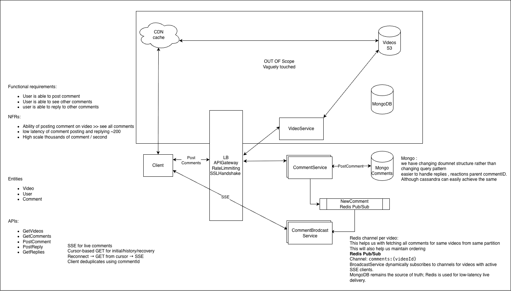

# Live Video Comments --- HLD

## 1. Problem

Design a high-scale live video commenting system where users can:

-   Post comments on a video
-   View existing comments
-   Reply to comments
-   Receive new comments in near real time

### NFRs

-   Low latency for live comment delivery
-   Thousands of comments/second
-   Efficient cursor-based pagination
-   High availability
-   Support very large numbers of concurrent viewers

------------------------------------------------------------------------

## 2. High-Level Architecture

``` text
Client
  |
  v
Load Balancer / API Gateway
  |
  +--------------------+
  |                    |
  v                    v
CommentService    CommentBroadcastService
  |                    ^
  |                    |
  v                    |
MongoDB            Redis Pub/Sub
  ^                    ^
  |                    |
  +--------------------+
       comment write
```





### Responsibilities

  -----------------------------------------------------------------------
  Component                           Responsibility
  ----------------------------------- -----------------------------------
  Load Balancer                       Distribute API/SSE connections

  CommentService                      Create/read comments and replies

  MongoDB                             Durable source of truth

  Redis Pub/Sub                       Low-latency live comment
                                      notification

  CommentBroadcastService             Maintain SSE connections and fan
                                      out comments

  SSE                                 Server → client live delivery

  Client                              Render comments, reconnect,
                                      deduplicate
  -----------------------------------------------------------------------

------------------------------------------------------------------------

## 3. Why SSE?

The dominant real-time communication pattern is:

``` text
Server → Client
```

A user posts a comment through normal HTTP, while new comments are
pushed to viewers.

Therefore:

``` text
POST /comments       → HTTP
POST /replies        → HTTP
GET /comments        → HTTP
GET /comments/stream → SSE
```

WebSocket is not necessary because we do not require persistent
bidirectional communication for the live comment stream.

------------------------------------------------------------------------

## 4. Comment Data Model

Use MongoDB with comments and replies represented by the same entity.

``` text
Comment
-------
commentId
videoId
userId
text
parentCommentId
createdAt
replyCount
reactionCount
...
```

### Top-level comment

``` text
parentCommentId = null
```

### Reply

``` text
parentCommentId = <parent comment ID>
```

Replies are stored as separate documents rather than embedded inside the
parent comment.

This prevents a popular comment from becoming an unbounded MongoDB
document.

For the initial design, support one level of replies:

``` text
Comment
 ├── Reply
 ├── Reply
 └── Reply
```

------------------------------------------------------------------------

## 5. MongoDB Choice

MongoDB is chosen over Cassandra/PostgreSQL for this design.

### Why MongoDB?

The access pattern is predictable:

-   Fetch comments for a video
-   Fetch replies for a comment
-   Insert comments/replies
-   Cursor-based pagination

Cassandra can handle this workload very well, but MongoDB provides more
flexibility for an evolving comment document.

Future requirements may add:

-   Reactions
-   Reaction counts
-   Reply counts
-   Moderation metadata
-   Flags
-   Additional comment attributes

PostgreSQL could also scale with sharding, but the system does not
require relational semantics, joins, or transactions across relational
entities.

### Key principle

> Choose the simplest database that satisfies the scale and access
> patterns without introducing unnecessary relational or operational
> complexity.

------------------------------------------------------------------------

## 6. MongoDB Index

Primary access pattern:

``` text
(videoId, parentCommentId, createdAt, commentId)
```

This supports:

### Top-level comments

``` text
videoId = V1
parentCommentId = null
```

### Replies

``` text
videoId = V1
parentCommentId = C1
```

`commentId` can act as a deterministic tie-breaker for pagination.

------------------------------------------------------------------------

## 7. APIs

### Create comment

``` http
POST /videos/{videoId}/comments
```

``` json
{
  "text": "Great video!"
}
```

### Reply to comment

``` http
POST /videos/{videoId}/comments/{commentId}/replies
```

``` json
{
  "text": "Absolutely!"
}
```

### Get comments

``` http
GET /videos/{videoId}/comments?cursor=<cursor>&limit=50
```

### Get replies

``` http
GET /videos/{videoId}/comments/{commentId}/replies?cursor=<cursor>&limit=50
```

### Live comment stream

``` http
GET /videos/{videoId}/comments/stream
```

Uses SSE.

------------------------------------------------------------------------

## 8. Live Comment Flow

When a user posts a comment:

``` text
Client
  |
  | POST /comments
  v
CommentService
  |
  +----> MongoDB
  |
  +----> Redis Pub/Sub
             |
             | comments:{videoId}
             v
     CommentBroadcastService
             |
             v
            SSE
             |
             v
          Clients
```

MongoDB is the source of truth.

Redis Pub/Sub is only the low-latency live delivery mechanism.

------------------------------------------------------------------------

## 9. Redis Pub/Sub

Use a Redis channel per video:

``` text
comments:{videoId}
```

Example:

``` text
comments:123
comments:456
comments:789
```

Each BroadcastService dynamically subscribes only to channels for videos
for which it currently has active SSE clients.

Local state:

``` text
Map<VideoId, Set<SSEConnection>>
```

When a Redis event arrives:

``` text
Redis event
    |
    v
videoId = V1
    |
    v
local map.get(V1)
    |
    v
send to all SSE connections for V1
```

When the last client for a video disconnects, the broadcaster can
unsubscribe from that video's Redis channel.

------------------------------------------------------------------------

## 10. Why Redis Pub/Sub Instead of Kafka?

Redis Pub/Sub is suitable because live comment delivery is ephemeral.

We do not require Redis to be the durable event store.

### Redis Pub/Sub

-   Very low latency
-   Simple fan-out
-   Lightweight
-   No persistence/replay
-   Suitable for live notification

### Kafka

-   Durable
-   Replayable
-   Partition ordering
-   Better for durable event processing
-   More infrastructure and operational complexity

For this use case:

``` text
MongoDB = durability
Redis = live notification
```

Kafka is unnecessary unless requirements change to require durable event
streaming or independent consumers.

------------------------------------------------------------------------

## 11. Missed Comments / Reconnect

Redis Pub/Sub can lose messages if a client is disconnected.

This is acceptable because MongoDB is the source of truth.

Recovery flow:

``` text
SSE disconnect
     |
     v
Client reconnects
     |
     +----> GET comments from cursor
     |
     +----> establish SSE
     |
     v
deduplicate by commentId
```

The client can also paginate backwards to view older comments.

``` text
Current cursor
   |
   +---- newer comments
   |
   +---- older comments
```

### Important property

> Redis provides low-latency delivery; cursor-based MongoDB reads
> provide recovery.

------------------------------------------------------------------------

## 12. At-Least-Once Delivery

The system should tolerate duplicate delivery rather than attempting
exactly-once delivery.

Potential duplicate:

``` text
SSE → C101
GET → C101, C102, C103
```

Client deduplicates using:

``` text
commentId
```

Therefore:

``` text
at-least-once delivery
+
idempotent client consumption
```

is preferred over trying to build exactly-once delivery.

Client-side state should be bounded; do not retain every comment ID
indefinitely. Use a bounded/TTL-based recent-ID structure appropriate to
the reconnect window.

------------------------------------------------------------------------

## 13. Redis Failure

If:

``` text
Mongo write → SUCCESS
Redis publish → FAILURE
```

the comment is still durable in MongoDB.

The live notification may be delayed/missed, but clients can recover it
using cursor-based GET.

### Optional stronger guarantee

If future requirements demand guaranteed publication attempts, introduce
an Outbox pattern:

``` text
Mongo transaction
 ├── Comment
 └── Outbox Event
          |
          v
    Outbox Worker
          |
          v
     Redis Pub/Sub
```

Do not introduce the Outbox unless the requirement actually needs
guaranteed event publication. For the current design, Mongo + cursor
recovery is sufficient.

------------------------------------------------------------------------

## 14. Multiple BroadcastService Instances

Each instance maintains:

``` text
VideoId → Set<SSE connections>
```

Example:

``` text
Broadcast-1 → V1, V2
Broadcast-2 → V1, V3
Broadcast-3 → V2, V4
```

For `V1`:

``` text
Redis channel: comments:V1

             +----> Broadcast-1 → V1 clients
Redis Pub/Sub
             +----> Broadcast-2 → V1 clients
```

Redis provides fan-out to every broadcaster subscribed to that video.

No global connection registry is required.

------------------------------------------------------------------------

## 15. Large Live Video

A video may have hundreds of thousands of concurrent viewers.

The Load Balancer distributes SSE connections:

``` text
                 LB
          /       |       \
         /        |        \
        v         v         v
      B1         B2        B3
    150K       175K      175K
   clients     clients    clients
```

Each broadcaster independently fans out the comment to its local SSE
connections.

The LB is intentionally abstracted in this HLD.

------------------------------------------------------------------------

## 16. Broadcaster Failure

If a BroadcastService instance dies:

``` text
Broadcast-2 dies
      |
      v
SSE connections disconnect
      |
      v
Browser/EventSource retries
      |
      v
Load Balancer
      |
      +----> healthy BroadcastService
      |
      v
GET comments from cursor
      |
      v
deduplicate
      |
      v
new SSE stream
```

Use reconnect backoff + jitter to avoid a thundering-herd reconnect when
a large broadcaster instance fails.

------------------------------------------------------------------------

## 17. Ordering

We do not require one global ordering across every comment and reply.

Required ordering:

-   Top-level comments ordered by creation time
-   Replies within a parent comment ordered by creation time

A reply can be displayed under its parent regardless of its position
relative to unrelated comments.

------------------------------------------------------------------------

## 18. Counters and Reactions

Future fields such as:

``` text
replyCount
reactionCount
likeCount
```

can be denormalized in MongoDB.

For example:

``` text
$inc: { replyCount: 1 }
```

Counters are derived metadata, while comments/replies remain the source
of truth.

If exact counters are not critical, they can be eventually consistent
and repaired/recomputed when necessary.

------------------------------------------------------------------------

## 19. Failure Modes

  -----------------------------------------------------------------------
  Failure                             Handling
  ----------------------------------- -----------------------------------
  Redis message lost                  Cursor-based MongoDB recovery

  Duplicate event                     Client deduplication by commentId

  BroadcastService dies               SSE reconnect + LB

  Many clients reconnect              Backoff + jitter

  Mongo unavailable                   Comment writes/read fail or degrade
                                      according to availability policy

  Redis unavailable                   Persist comment in Mongo; live
                                      delivery temporarily unavailable

  Popular video                       LB distributes SSE connections
                                      across broadcasters

  Large comment history               Cursor-based pagination

  Huge number of replies              Separate reply documents, never
                                      unbounded embedded arrays
  -----------------------------------------------------------------------

------------------------------------------------------------------------

## 20. Key Design Decisions

1.  **MongoDB** is the durable source of truth.
2.  **Redis Pub/Sub** provides ephemeral, low-latency live notification.
3.  **SSE** is used for server-to-client streaming.
4.  **HTTP APIs** are used for writes and historical reads.
5.  **Cursor-based pagination** handles history and reconnect recovery.
6.  **`commentId` deduplication** provides idempotent at-least-once
    delivery.
7.  **`parentCommentId`** models replies without a separate reply
    entity.
8.  **Dynamic Redis channels per video** provide efficient fan-out.
9.  **`VideoId → SSE connections`** is maintained locally by each
    broadcaster.
10. **Load Balancer** distributes long-lived SSE connections.
11. **Reconnect backoff + jitter** protects against thundering-herd
    failures.
12. Kafka is deliberately excluded because durable/replayable event
    streaming is not required.

------------------------------------------------------------------------

# Interview Questions / Follow-ups

### API & Data Model

-   Why use `parentCommentId` instead of a separate Reply table?
-   Would you support nested replies?
-   How would you paginate replies?
-   What indexes are required?
-   How do you avoid duplicate comments?

### Database

-   Why MongoDB instead of Cassandra?
-   Why not PostgreSQL?
-   How would MongoDB scale horizontally?
-   What happens if one video becomes a hot partition/key?
-   How would you handle counters such as `replyCount`?

### Redis

-   Why Pub/Sub instead of Kafka?
-   What happens when Redis loses a message?
-   What happens when Redis itself goes down?
-   How many Redis subscriptions can one broadcaster maintain?
-   How do you handle a video with 500K viewers?

### SSE

-   Why SSE instead of WebSocket?
-   How does reconnect work?
-   What happens when a broadcaster crashes?
-   How do you prevent duplicate events after reconnect?
-   How do you prevent a reconnect storm?

### Consistency

-   Mongo write succeeds but Redis publish fails --- what happens?
-   Redis publish succeeds but the broadcaster crashes --- what happens?
-   How do you guarantee no gaps during reconnect?
-   Why at-least-once instead of exactly-once?
-   Where is deduplication performed?

### Scalability

-   What happens at 10K comments/sec?
-   What happens when one video becomes extremely hot?
-   How do you distribute 500K SSE connections?
-   Can one broadcaster efficiently fan out a comment to 175K clients?
-   What becomes the bottleneck first?

### Staff-Level Follow-ups

-   What assumptions make Redis Pub/Sub sufficient?
-   At what requirement would you introduce Kafka?
-   At what requirement would you introduce an Outbox?
-   What part of the design is the source of truth?
-   Which components are stateful?
-   What is your degradation strategy when each dependency fails?
-   Which decisions are requirements-driven versus implementation
    choices?
