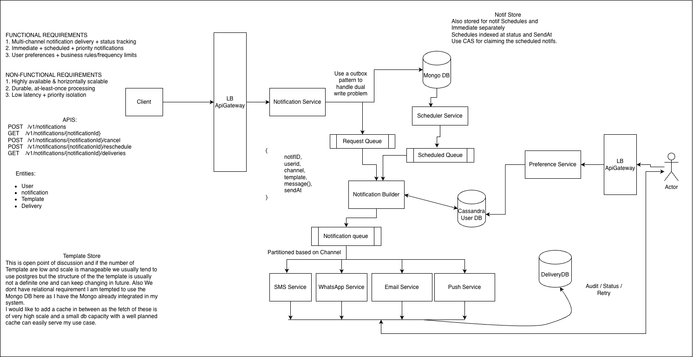

# Notification System --- Staff-Level HLD Notes

## 1. Problem Statement

Design a highly scalable notification platform that accepts notification
requests from multiple producers and delivers them through multiple
channels such as:

-   SMS
-   Email
-   Push
-   WhatsApp

The system should support:

-   Immediate notifications
-   Scheduled notifications
-   User preferences
-   Business/rule evaluation
-   Priority notifications
-   Asynchronous processing
-   Delivery tracking
-   Optional idempotency/deduplication
-   Provider abstraction
-   Backpressure and independent scaling

------------------------------------------------------------------------

# 2. Functional Requirements

## 2.1 Notification Creation

-   Accept notification requests from internal services/clients.
-   Support notification types:
    -   Transactional
    -   Marketing
    -   Security/OTP
    -   Alerts
-   Support one or multiple channels.
-   Support immediate and scheduled notifications.
-   Return a `notificationId`.

## 2.2 Scheduling

-   Allow a future `sendAt`.
-   Persist scheduled notifications durably.
-   Scheduler identifies due notifications.
-   Scheduler atomically claims notifications.
-   Support cancellation/rescheduling before delivery.
-   Multiple scheduler instances should work concurrently.

Important principle:

> Scheduler makes a notification eligible for delivery. It does not
> perform delivery.

## 2.3 User Preferences

Examples:

-   SMS enabled/disabled
-   Email enabled/disabled
-   Push enabled/disabled
-   Marketing opt-in
-   Quiet hours
-   Frequency limits

Preference DB is the **source of truth for user preference facts**.

## 2.4 Rule Engine

The Rule Engine answers:

> **Should I send this notification?**

Rules may include:

-   Channel eligibility
-   Marketing consent
-   Quiet hours
-   Frequency caps
-   Campaign rules
-   Notification-type eligibility
-   User segmentation
-   Business-level deduplication

Example:

``` text
Max promotional SMS = 3/day

Current count = 3
        ↓
SUPPRESS
```

## 2.5 Priority

Support high-priority notifications such as:

-   OTP
-   Security alerts
-   Critical transactional alerts

Normal/scheduled traffic must not starve high-priority traffic.

Priority is **not the same as channel**.

``` text
Priority = HIGH / NORMAL

Channel = SMS / EMAIL / PUSH / WHATSAPP
```

## 2.6 Delivery

-   Route notifications to channel-specific services.
-   Each channel can scale independently.
-   Channel services communicate with external providers.
-   Provider abstraction allows provider replacement.

## 2.7 Tracking

Track notification-level and channel-level status.

One notification can produce multiple deliveries:

``` text
N123
 ├── EMAIL → SENT
 ├── PUSH  → SENT
 └── SMS   → SUPPRESSED
```

------------------------------------------------------------------------

# 3. Non-Functional Requirements

## Availability

-   Notification ingestion should be highly available.
-   Failure of one channel/provider should not bring down other
    channels.
-   Scheduler should be horizontally scalable.

## Scalability

-   Stateless services where possible.
-   Kafka for asynchronous processing.
-   Horizontal consumer scaling.
-   Batch scheduler processing.
-   Independent channel scaling.

## Latency

Example targets:

-   Notification API p95 \< 100 ms
-   Immediate notification enters processing pipeline within seconds
-   High-priority notification gets a tighter SLO
-   Scheduled notification should meet an agreed `sendAt` tolerance

Exact SLOs are product-dependent.

## Durability

Once a notification is accepted:

> Notification intent must not be silently lost.

Use MongoDB + Outbox for reliable DB → Kafka publication.

## Consistency

Strong consistency where required:

-   Scheduled notification claiming
-   State transitions
-   Optional idempotency

Eventual consistency is acceptable for:

-   Preference cache, if introduced
-   Analytics
-   Reporting

## Ordering

No global ordering guarantee.

If ordering is required for a user:

``` text
Kafka key = userId
```

or another domain-specific key.

## Extensibility

Adding a new channel should not require modifying the core notification
pipeline.

## Security

-   Authenticate producers.
-   Authorize notification types.
-   Encrypt sensitive data.
-   Secure provider credentials.
-   Minimize PII stored in events/logs.

------------------------------------------------------------------------

# 4. Core Entities

## Notification

``` text
notificationId
userId
type
priority
channels
templateId
templateVersion
message
sendAt
status
createdAt
updatedAt
metadata
```

## Delivery

``` text
deliveryId
notificationId
userId
channel
status
attempt
provider
providerMessageId
failureReason
createdAt
updatedAt
```

Optional:

``` text
idempotencyKey
```

## UserPreference

``` text
userId
channel
enabled
quietHours
frequencyLimits
marketingOptIn
updatedAt
```

## OutboxEvent

``` text
eventId
aggregateId
eventType
payload
status
createdAt
publishedAt
```

------------------------------------------------------------------------

# 5. Storage Choices

  -----------------------------------------------------------------------
  Data                    Store                   Why
  ----------------------- ----------------------- -----------------------
  Notification intent     MongoDB                 Flexible notification
                                                  payload

  Outbox                  MongoDB                 Atomic with
                                                  notification

  User preferences        Cassandra               High-cardinality
                                                  key-based reads

  Event stream            Kafka                   Durable async
                                                  processing/replay

  Delivery state          Delivery DB             Channel-level delivery
                                                  lifecycle

  Templates               Template Store/Mongo    Versioning + manageable
                          initially               volume
  -----------------------------------------------------------------------

## Preference Cache

Redis is **optional**, not mandatory.

Do not introduce Redis simply because preference reads are frequent.

High user cardinality can mean poor cache reuse:

``` text
User A → one request
User B → one request
User C → one request
...
```

Cassandra is already optimized for:

``` text
GET preferences WHERE userId = ?
```

Start with Cassandra and measure.

Add Redis when there is evidence of:

-   Hot users
-   High cache locality
-   Cassandra becoming a bottleneck
-   p95/p99 latency pressure

Principle:

> Cassandra is the source of truth. Redis is only an optimization.

------------------------------------------------------------------------

# 6. High-Level Architecture

``` text
                         Client
                           |
                           v
                    API Gateway / LB
                           |
                           v
                 Notification Service
                           |
                    +------+------+
                    |             |
                    v             v
                 MongoDB       Outbox
                    |             |
                    |        Outbox Relay
                    |             |
                    |             v
                    |       Request Kafka
                    |             |
                    |             v
                    |     Notification Builder
                    |        /           \
                    |       /             \
                    | Preferences      Rule Engine
                    |   (Cassandra)         |
                    |       \               /
                    |        +-------------+
                    |                |
                    |         Priority Router
                    |           /       \
                    |          v         v
                    |        HIGH      NORMAL
                    |          |         |
                    |          +----+----+
                    |               |
                    |        Delivery Queues
                    |               |
                    |      +--------+--------+
                    |      |        |        |
                    |     SMS    Email     Push
                    |      |        |        |
                    |      +--------+--------+
                    |               |
                    |           Providers
                    |               |
                    |               v
                    |          Delivery DB
                    |
                    |
Scheduled path:
                    MongoDB
                       |
                       v
                 Scheduler Service
                       |
                Atomic claim/CAS
                       |
                       v
                Scheduled Queue
                       |
                       v
                 Priority Router
```





------------------------------------------------------------------------


# 7. Immediate vs Scheduled Flow

## Immediate

``` text
API
 ↓
Notification Service
 ↓
Mongo + Outbox
 ↓
Kafka
 ↓
Notification Builder
 ↓
Preference + Rule Engine
 ↓
Priority Router
 ↓
Delivery Queue
 ↓
Channel Service
 ↓
Provider
```

## Scheduled

``` text
API
 ↓
Notification Service
 ↓
Mongo
 ↓
SCHEDULED

Scheduler
 ↓
Atomic claim
 ↓
CLAIMED
 ↓
Scheduled Queue
 ↓
Priority Router
 ↓
Builder
 ↓
Preference + Rule Engine
 ↓
Delivery
```

Why evaluate rules near delivery?

Because state can change between scheduling and delivery:

``` text
Monday:
schedule notification

Tuesday:
user disables SMS

Friday:
notification becomes due
```

The latest preference should normally be evaluated on Friday.

------------------------------------------------------------------------

# 8. Scheduler Deep Dive

## Due Query

Maintain an index suitable for:

``` text
status = SCHEDULED
sendAt <= now
```

Example:

``` text
(status, sendAt)
```

## Atomic Claim

Avoid:

``` text
SELECT due records
UPDATE later
```

because multiple schedulers can select the same record.

Use an atomic transition:

``` text
findAndModify:

status = SCHEDULED
sendAt <= now

SET:
status = CLAIMED
claimedBy = schedulerId
claimedAt = now
```

Only one scheduler successfully claims the record.

## Scheduler Burst

If 5M notifications become due simultaneously:

Do not blindly publish 5M events at once.

Use:

-   Batch claiming
-   Controlled publishing
-   Backpressure
-   Consumer autoscaling
-   Reserved high-priority capacity

------------------------------------------------------------------------

# 9. Priority Deep Dive

Priority should be treated as an independent dimension from channel.

``` text
                    Ready Notifications
                           |
                    Priority Router
                      /         \
                     v           v
                   HIGH        NORMAL
                     |           |
                     v           v
                High Queue    Normal Queue
                     |           |
                     +-----+-----+
                           |
                      Delivery
```

Reserve capacity for high priority.

Example:

``` text
30% HIGH
70% NORMAL
```

Actual allocation should be configurable based on SLOs.

This prevents:

``` text
10M scheduled notifications
          ↓
      Normal Queue
          ↓
      Consumer backlog
          ↓
OTP waits behind backlog
```

------------------------------------------------------------------------

# 10. Notification Builder

Responsibilities:

1.  Read notification intent.
2.  Fetch current user preferences.
3.  Resolve eligible channels.
4.  Evaluate Rule Engine.
5.  Resolve template.
6.  Render channel-specific payload.
7.  Produce delivery events.
8.  Attach metadata/idempotency key when required.

Example:

``` text
Input:
channels = [SMS, EMAIL]

Preference:
SMS = disabled
EMAIL = enabled

Rule Engine:
EMAIL eligible

Output:
EMAIL delivery
```

Principle:

> Scheduler determines **when** the notification becomes eligible.
> Builder + Rule Engine determine **what should actually be delivered**.

------------------------------------------------------------------------

# 11. Preference Service

Recommended initial design:

``` text
Notification Builder
        |
        v
Preference Service
        |
        v
Cassandra
```

Cassandra partition/access pattern:

``` text
partition key = userId
```

Example:

``` text
GET user preferences by userId
```

This is a good Cassandra use case because:

-   predictable key-based lookup
-   high cardinality
-   horizontal scalability
-   high read throughput

Do not add Redis by default.

------------------------------------------------------------------------

# 12. Rule Engine vs Preference DB

Keep the separation:

``` text
Preference DB = FACTS
Rule Engine    = DECISIONS
Delivery DB    = DELIVERY FACTS
```

Example:

``` text
Preference DB:
SMS enabled = true
Marketing = true
SMS limit = 3/day

Rule Engine:
Current count = 3
        ↓
SUPPRESS
```

Rule Engine can use:

-   Preference DB
-   Delivery/history data
-   Notification metadata
-   Campaign/business rules

------------------------------------------------------------------------

# 13. Idempotency

Default system semantic:

> **At-least-once delivery.**

This is often sufficient for notification systems.

Duplicates are not automatically a technical failure if product
semantics allow them.

If a specific notification type requires strict duplicate prevention:

``` text
idempotencyKey = hash(notificationId + channelId)
```

Store it in Delivery DB with a uniqueness constraint.

``` text
DeliveryDB

idempotencyKey UNIQUE
notificationId
userId
channel
status
```

Duplicate Kafka event:

``` text
N123 + EMAIL
        |
        v
same idempotencyKey
        |
        v
unique constraint
        |
        v
duplicate → skip
```

### Do not use:

``` text
userId + channel
```

because the same user can legitimately receive many different
notifications on the same channel.

### Important distinction

**Rule Engine:**

> "Should this user receive this notification?"

**Delivery DB idempotency:**

> "Have I already processed this exact notification/channel?"

These solve different problems.

------------------------------------------------------------------------

# 14. At-Least-Once vs Exactly-Once

## At-Least-Once

Preferred default.

Advantages:

-   Simpler
-   Durable
-   Easy retry/replay
-   No distributed exactly-once requirement

Tradeoff:

-   Duplicate delivery may occur.

## Exactly-Once

Difficult across:

``` text
Kafka
+
our DB
+
external provider
```

A provider timeout can leave us uncertain whether the external side
effect actually happened.

Therefore:

> Do not build the entire system around exactly-once unless product
> requirements justify the complexity.

------------------------------------------------------------------------

# 15. Channel Services

Each channel is independently scalable:

``` text
SMS Service
Email Service
Push Service
WhatsApp Service
```

Each should use a provider abstraction:

``` text
Email Service
    |
    +-- Provider A
    +-- Provider B
```

Benefits:

-   Provider replacement
-   Provider-specific rate limits
-   Provider-specific payload mapping
-   Provider isolation
-   Independent scaling

------------------------------------------------------------------------

# 16. Delivery DB

Separate notification intent from delivery execution.

Example:

``` text
Notification N123

EMAIL → SENT
PUSH  → SENT
SMS   → SUPPRESSED
```

DeliveryDB stores channel-level facts:

``` text
deliveryId
notificationId
channel
status
attempt
provider
providerMessageId
failureReason
timestamps
```

Optional:

``` text
idempotencyKey
```

when strict duplicate prevention is required.

------------------------------------------------------------------------

# 17. Kafka Design

Potential topics:

``` text
notification.request
notification.scheduled
notification.delivery.high
notification.delivery.normal
```

Channel-specific topics can be introduced if workloads need stronger
isolation.

## Partition Key

Possible choices:

### userId

Useful when per-user ordering matters.

### notificationId

Useful for notification-level ordering.

### channel

Useful only if channel-level workload isolation is the primary
requirement.

Avoid claiming global ordering.

------------------------------------------------------------------------

# 18. State Machine

## Notification

``` text
CREATED
   |
   +----> SCHEDULED
   |          |
   |          v
   |       CLAIMED
   |          |
   +----------+
              v
            READY
              |
              v
          PROCESSING
          /        \
        DONE     SUPPRESSED
```

## Delivery

``` text
CREATED
   |
   v
PROCESSING
   |
   +--> SENT
   |
   +--> FAILED
   |
   +--> SUPPRESSED
```

Exact state set can be simplified based on requirements.

------------------------------------------------------------------------

# 19. Cancellation / Rescheduling

Cancellation:

``` text
SCHEDULED → CANCELLED
```

Rescheduling:

``` text
SCHEDULED
   ↓
update sendAt
```

Race condition:

``` text
User cancels
       |
Scheduler claims
```

Use conditional atomic transitions.

For notifications already sent to an external provider, cancellation may
no longer be possible.

------------------------------------------------------------------------

# 20. Backpressure

Potential bottlenecks:

``` text
Scheduler
Builder
Preference DB
Kafka
Channel Service
External Provider
```

Controls:

-   Batch scheduler release
-   Kafka consumer lag monitoring
-   Bounded concurrency
-   Provider rate limiting
-   Autoscaling
-   Separate priority capacity
-   Controlled scheduled burst release

Core principle:

> Never allow a scheduler burst to directly become an uncontrolled
> provider burst.

------------------------------------------------------------------------

# 21. Observability

## Metrics

``` text
notifications_created
notifications_scheduled
notifications_suppressed
notifications_delivered

scheduler_lag
queue_lag

builder_latency
delivery_latency

provider_latency
provider_error_rate
```

For scheduled notifications, especially track:

``` text
actualDeliveryTime - requestedSendAt
```

## Tracing

Propagate:

``` text
notificationId
deliveryId
correlationId
```

across services.

------------------------------------------------------------------------

# 22. API Design

## Create Notification

``` http
POST /v1/notifications
```

``` json
{
  "userId": "U123",
  "type": "ORDER_SHIPPED",
  "channels": ["EMAIL", "PUSH"],
  "templateId": "ORDER_SHIPPED",
  "message": {},
  "sendAt": "2026-10-06T12:00:00Z",
  "priority": "NORMAL"
}
```

Response:

``` json
{
  "notificationId": "N123",
  "status": "SCHEDULED"
}
```

## Get Notification

``` http
GET /v1/notifications/{notificationId}
```

## Get Deliveries

``` http
GET /v1/notifications/{notificationId}/deliveries
```

## Cancel

``` http
POST /v1/notifications/{notificationId}/cancel
```

## Reschedule

``` http
POST /v1/notifications/{notificationId}/reschedule
```

``` json
{
  "sendAt": "2026-10-07T10:00:00Z"
}
```

## Preferences

``` http
GET /v1/users/{userId}/preferences
PUT /v1/users/{userId}/preferences
```

------------------------------------------------------------------------

# 23. Outbox Deep Dive

Naive:

``` text
Mongo write
Kafka publish
```

Problem:

``` text
Mongo SUCCESS
Kafka FAILURE
```

Notification exists but event is lost.

Outbox:

``` text
BEGIN
  insert Notification
  insert OutboxEvent
COMMIT
```

Then:

``` text
Outbox Relay
     ↓
Kafka
```

Outbox guarantees eventual publication if the DB transaction succeeds
and the relay keeps retrying.

Important:

> Outbox solves the DB-to-broker dual-write problem. It does not create
> end-to-end exactly-once delivery.

------------------------------------------------------------------------

# 24. Failure / Recovery Model

### Kafka unavailable

Outbox retains unpublished events.

### Builder crashes

Kafka retains the event for redelivery.

### Scheduler crashes

Another scheduler can claim/reclaim eligible work depending on claim
timeout/state.

### Provider unavailable

Channel service can isolate provider problems from other channels.

### Large backlog

Scale consumers and apply backpressure.

The system is designed around:

> **Durable asynchronous processing + at-least-once semantics.**

------------------------------------------------------------------------

# 25. Key Tradeoffs

## Mongo vs Cassandra for Notification

Mongo: - flexible notification document - flexible payload - convenient
initial choice

Cassandra: - excellent for predictable key-based access - less flexible
querying

Use Mongo for notification intent unless access patterns clearly demand
otherwise.

## Cassandra vs Redis

Cassandra: - source of truth - high-cardinality user data - predictable
userId lookup - horizontally scalable

Redis: - optional optimization - useful for hot users / high cache
locality - not automatically beneficial with huge cardinality and low
reuse

Decision:

> Start Cassandra-only. Add Redis based on measured cache hit rate and
> Cassandra latency/load.

## Kafka vs Traditional Queue

Kafka: - high throughput - replay - multiple consumers - durable event
stream

Traditional queue: - simpler work distribution

Kafka fits because this system has multiple asynchronous stages and
replay requirements.

## Separate Priority Queues

Pros: - protects urgent traffic - predictable latency

Cons: - additional operational complexity - capacity management

Worth it when high-priority notifications have a strong SLO.

------------------------------------------------------------------------

# 26. Important Interview Questions

## Requirements

1.  What are immediate vs scheduled notifications?
2.  Which notifications are high priority?
3.  Are duplicates acceptable?
4.  What is the scheduling precision requirement?
5.  Do users need cancellation/rescheduling?

## Architecture

6.  Why Kafka?
7.  Why Mongo?
8.  Why Cassandra for preferences?
9.  Why separate DeliveryDB?
10. Why do we need Notification Builder?

## Outbox

11. What problem does Outbox solve?
12. What if Outbox Relay crashes?
13. Does Outbox provide exactly-once delivery?

## Scheduling

14. How do multiple schedulers avoid duplicate claims?
15. How do you handle 10M notifications becoming due simultaneously?
16. How do cancellation and scheduling race?
17. How do you guarantee scheduled notification timing?

## Priority

18. How does urgent traffic bypass a scheduled backlog?
19. How do you prevent high priority from starving normal traffic?
20. Why is priority different from channel?

## Rules

21. Where do preferences live?
22. Where are frequency caps evaluated?
23. Why separate Preference DB and Rule Engine?
24. When should business-level deduplication happen?

## Idempotency

25. Can Kafka deliver the same event twice?
26. Are duplicates always a problem?
27. How would you implement strict duplicate prevention?
28. Why `hash(notificationId + channelId)`?
29. Why not `userId + channel`?
30. Can you guarantee exactly-once with an external provider?

## Scale

31. How would you handle 100M notifications/day?
32. How would you partition Kafka?
33. How do you handle provider rate limits?
34. How do you prevent scheduler bursts?
35. When would you introduce Redis?

## Extensibility

36. How do you add a new channel?
37. How do you support multiple providers?
38. How do you version templates?
39. How do you isolate provider-specific logic?

------------------------------------------------------------------------

# 27. Staff-Level Design Principles

1.  **Separate notification intent from delivery execution.**
2.  **Scheduler makes notifications eligible; it does not deliver
    them.**
3.  **Priority and channel are orthogonal dimensions.**
4.  **Outbox solves DB → Kafka dual-write reliability.**
5.  **Default to at-least-once unless product requires stronger
    semantics.**
6.  **Do not distribute idempotency logic throughout the pipeline.**
7.  **Use DeliveryDB for technical exact-duplicate prevention when
    required.**
8.  **Use Rule Engine for business eligibility, frequency caps and
    policy.**
9.  **Preference DB stores facts; Rule Engine makes decisions.**
10. **Cassandra is sufficient for high-cardinality preference lookups;
    Redis is an optimization, not a default.**
11. **Use queues for burst absorption and backpressure.**
12. **Reserve capacity for high-priority traffic.**
13. **Keep providers behind channel-specific adapters.**
14. **Adding a new channel should not require changing the core
    notification workflow.**

------------------------------------------------------------------------

# 28. Final Architecture Summary

``` text
                         Client
                           |
                           v
                    API Gateway / LB
                           |
                           v
                 Notification Service
                           |
                    +------+------+
                    |             |
                    v             v
                 MongoDB       Outbox
                                  |
                             Outbox Relay
                                  |
                                  v
                           Request Kafka
                                  |
                                  v
                       Notification Builder
                         /              \
                        /                \
                 Preference DB        Rule Engine
                   Cassandra               |
                        \                  /
                         +----------------+
                                  |
                           Priority Router
                            /          \
                           v            v
                         HIGH         NORMAL
                           |            |
                           +-----+------+
                                 |
                         Delivery Queues
                                 |
                   +-------------+-------------+
                   |             |             |
                  SMS          Email         Push
                   |             |             |
                   +-------------+-------------+
                                 |
                              Providers
                                 |
                                 v
                            Delivery DB
                                 |
                         Optional idempotency


Scheduled:
MongoDB
   ↓
Scheduler
   ↓
Atomic Claim / CAS
   ↓
Scheduled Queue
   ↓
Priority Router
```

## One-line interview answer

> **"I would design the platform as an asynchronous, at-least-once
> notification pipeline: MongoDB stores notification intent with an
> Outbox for reliable Kafka publication; a scheduler makes future
> notifications eligible; the Builder evaluates current Cassandra-backed
> preferences and business rules; priority lanes protect urgent traffic;
> channel services independently deliver through provider adapters; and
> DeliveryDB tracks channel state and provides optional deterministic
> idempotency where the product requires strict duplicate prevention."**
