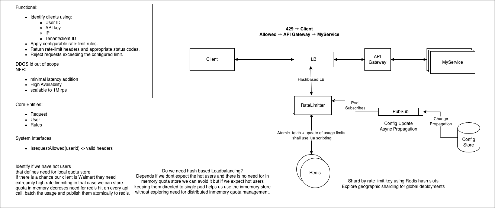

# Distributed Rate Limiter

## 1. Requirements

### Functional

-   Identify clients using:
    -   User ID
    -   API key
    -   IP
    -   Tenant ID
-   Apply configurable rate-limit rules.
-   Return appropriate status codes and rate-limit headers.
-   Reject requests exceeding the configured limit.

### Non-functional

-   Minimal latency added to request path.
-   High availability.
-   Horizontally scalable.
-   Target: \~1M requests/sec.
-   No single point of failure.
-   Atomic rate-limit decisions under concurrency.

> DDoS protection is out of scope. It should be handled at
> CDN/WAF/network/edge layers.

------------------------------------------------------------------------

## 2. High-Level Architecture

``` text
Client
   |
   v
  LB
   |
   v
Rate Limiter
   |
   +------ Redis Cluster
   |
   +------ Local Config Cache
   |
   v
API Gateway
   |
   v
MyService


Control Plane:

Config Store
     |
     v
   Pub/Sub
     |
     v
Rate Limiter Pods
     |
     v
Local Config Cache
```

### Request flow

``` text
Client
  |
  v
LB
  |
  v
Rate Limiter
  |
  +---- reject ----> 429 + Retry-After ---> Client
  |
  +---- allow -----> API Gateway ---> MyService
```

Configuration management/write path is out of scope.



------------------------------------------------------------------------

## 3. Rate-Limit Key

The key represents the entity whose quota is being enforced.

Examples:

``` text
user:{userId}
api:{apiKey}
tenant:{tenantId}
ip:{ip}
user:{userId}:endpoint:{endpoint}
```

For client APIs, a natural choice is:

``` text
rate_limit:{apiKey}
```

The key can also incorporate endpoint/resource when limits differ by
API.

------------------------------------------------------------------------

# 4. Rate-Limiting Algorithms

## Fixed Window

Allow N requests during a fixed time interval.

Example:

``` text
4,000,000 requests/hour
```

### Advantages

-   Very simple.
-   Cheap.
-   Easy to distribute.
-   Small amount of state.

### Drawback

Boundary effect:

``` text
11:59:59 -> 4M requests
12:00:00 -> 4M requests
```

Potentially allows 8M requests around the boundary.

This is acceptable when the product requirement is explicitly a
clock-aligned quota.

------------------------------------------------------------------------

## Token Bucket

**Chosen algorithm for this design.**

State:

``` text
tokens
lastRefillTime
```

Configuration:

``` text
capacity
refillRate
```

Request:

``` text
elapsed = now - lastRefillTime

tokens = min(
    capacity,
    tokens + elapsed * refillRate
)

if tokens >= 1:
    tokens--
    ALLOW
else:
    REJECT
```

### Why Token Bucket?

-   Supports controlled bursts.
-   Enforces a sustainable rate.
-   Small state.
-   No request queue.
-   Very suitable for synchronous APIs.
-   Easy to make atomic with Redis Lua.

Mental model:

> Fixed Window answers "how many requests occurred in this window?"
>
> Token Bucket answers "does this client currently have capacity to make
> this request?"

------------------------------------------------------------------------

## Leaky Bucket

Requests enter a queue and leave at a controlled rate.

Useful when the requirement is:

> Smooth traffic going into a downstream system.

Good for: - Expensive processing - Job processing - Notifications -
Traffic shaping

Less suitable for a normal synchronous API where returning `429` is
preferable to making the request wait.

------------------------------------------------------------------------

## Sliding Window

Answers:

> How many requests happened during the last N seconds?

Useful when rolling-window semantics are important.

Variants: - Sliding Window Log - Sliding Window Counter

More state/work than Token Bucket depending on implementation.

### Algorithm choice

Do not choose an algorithm because one is universally "better".

Choose based on the required semantics:

``` text
Clock-aligned quota       -> Fixed Window
Sustainable rate + burst  -> Token Bucket
Traffic smoothing         -> Leaky Bucket
Rolling-window semantics  -> Sliding Window
```

------------------------------------------------------------------------

# 5. Redis as Distributed State

Rate Limiter instances are stateless; Redis owns the distributed token
state.

``` text
Rate Limiter
      |
      v
Redis Cluster
```

Redis Cluster uses **16,384 hash slots**.

Conceptually:

``` text
rate-limit-key
      |
      v
    hash
      |
      v
  hash slot
      |
      v
 Redis shard
```

Therefore:

> Rate-limit state is sharded by the rate-limit key.

For example:

``` text
api:customer-123
      |
      v
hash slot 7421
      |
      v
Redis shard 2
```

The application does not need to manually maintain:

``` text
customer-A -> Redis-1
customer-B -> Redis-2
```

Redis Cluster manages slot ownership.

------------------------------------------------------------------------

# 6. Atomicity with Redis Lua

Token Bucket requires the following to be atomic:

``` text
Read state
    |
Calculate refill
    |
Check available tokens
    |
Consume token
    |
Write new state
```

Without atomicity:

``` text
Request A -> sees 1 token
Request B -> sees 1 token

A consumes
B consumes

2 requests allowed with 1 token
```

### Solution

Use a Redis Lua script.

The Lua source lives with the Rate Limiter application:

``` text
rate-limiter/
  redis/
    token_bucket.lua
```

The application loads the script into Redis and invokes it using
`EVALSHA`.

Execution happens atomically on the Redis node that owns the key.

### Deployment

Changing the Lua implementation does not require changing token state.

During rolling deployment:

``` text
RL v1 -> Lua v1
RL v2 -> Lua v2
```

Both can temporarily operate against the same Redis state as long as the
Redis state contract remains backward compatible.

If the meaning/format of the stored state changes, treat it as a state
migration/versioning problem.

------------------------------------------------------------------------

# 7. Time Handling

Gateway clocks can differ.

For token refill calculations, use Redis `TIME` inside the Lua script.

``` text
Rate Limiter
     |
     v
Redis Lua
     |
     v
Redis TIME
```

The Redis shard owning the bucket becomes the time authority for that
rate-limit operation.

------------------------------------------------------------------------

# 8. Geographic Sharding

For global deployments:

``` text
                 Global Edge
                      |
          +-----------+-----------+
          |           |           |
         APAC         US          EU
          |           |           |
        Redis       Redis       Redis
        Cluster     Cluster     Cluster
```

Within a region:

``` text
Region
  |
  v
Rate-limit key
  |
  v
Redis hash slot
  |
  v
Redis shard
```

### Benefits

-   Lower latency.
-   Regional isolation.
-   Horizontal scaling.
-   Better failure isolation.

### Tradeoff

A strict global per-user limit becomes harder when the same user can
access multiple regions.

For this design:

> Local enforcement can be strong while global enforcement may be
> approximate unless cross-region coordination is introduced.

------------------------------------------------------------------------

# 9. Hot Keys / Hot Clients

Redis distributes **keys**, not requests belonging to the same key.

Example:

``` text
Walmart API key
      |
      v
rate_limit:walmart
      |
      v
one hash slot
      |
      v
one Redis shard
```

If that client generates extremely high traffic, the shard can become a
hot shard.

### First approach

Do not optimize prematurely.

Monitor: - Redis CPU - Redis latency - Per-shard traffic - Requests per
key - Hot-key frequency

If Redis handles the expected load comfortably, keep the simple design.

------------------------------------------------------------------------

# 10. Local Quota for Hot Clients

If we identify sustained high-RPS clients, we can introduce local quota
leasing.

Instead of:

``` text
1M requests
    |
    +--> 1M Redis operations
```

we can do:

``` text
Redis
  |
  | lease 100K tokens
  v
Rate Limiter Pod
  |
  v
Local in-memory quota
  |
  +--> many local decisions
```

When local quota gets low, request another lease.

Usage can be aggregated and reconciled atomically with Redis rather than
performing a Redis operation for every request.

### Important

We are not creating independent local copies of the global quota.

Redis authoritatively allocates the lease.

Local memory only consumes the already-assigned quota.

------------------------------------------------------------------------

# 11. Hash-Based Load Balancing

Hash-based LB is **not inherently required**.

### Without local quota

Normal load balancing is sufficient:

``` text
LB
 |
 +-- RL1
 +-- RL2
 +-- RL3
       |
       v
     Redis
```

Any pod can process any client because Redis owns the shared state.

### With local per-client quota

Hash by API key/client ID:

``` text
apiKey
  |
  v
hash
  |
  v
same Rate Limiter pod
  |
  v
local quota
```

This avoids having one client's local quota distributed across multiple
pods.

### Tradeoff

A single extremely hot client can then overload one Rate Limiter pod.

If that happens, we need quota partitioning across multiple pods, which
introduces distributed quota coordination.

Therefore:

> Hash-based LB is an optimization for local state, not a fundamental
> requirement of the rate limiter.

------------------------------------------------------------------------

# 12. Configuration

Configuration is a control-plane concern.

``` text
Config Store
     |
     | change event
     v
   Pub/Sub
     |
     v
Rate Limiter Pods
     |
     v
Local Config Cache
```

Example:

``` text
apiKey = abc
algorithm = TOKEN_BUCKET
rate = 1000/sec
capacity = 2000
```

The request path should NOT call the Config Store.

Instead:

``` text
Request
  |
  v
Rate Limiter
  |
  +--> local config
  |
  +--> Redis token state
```

### Failure behavior

If configuration distribution is temporarily unavailable:

> Continue using the last-known-good configuration.

Configuration management/write path is out of scope.

------------------------------------------------------------------------

# 13. Failure Scenarios

## Rate Limiter Pod Failure

Rate Limiter is stateless.

``` text
LB
 |
 +-- RL1
 +-- RL2  X
 +-- RL3
```

Traffic is routed to healthy pods.

Redis retains rate-limit state.

------------------------------------------------------------------------

## Redis Node Failure

Use Redis Cluster with replicas and automatic failover.

The Rate Limiter should use bounded Redis timeouts.

------------------------------------------------------------------------

## Redis Unavailable

Two possible policies:

### Fail Open

``` text
Redis unavailable
      |
      v
Allow request
```

Higher availability, but temporarily loses rate limiting.

### Fail Closed

``` text
Redis unavailable
      |
      v
Reject request
```

Protects the backend, but impacts availability.

The choice depends on the resource being protected.

------------------------------------------------------------------------

## Redis Data Loss

Token state is ephemeral control state rather than business data.

If state is lost, buckets may be reinitialized.

This can cause temporary over-admission, so the consequence should be
considered when choosing Redis persistence/failure strategy.

------------------------------------------------------------------------

## Config Store Unavailable

Continue with last-known-good local configuration.

Do not make Config Store availability part of the request path.

------------------------------------------------------------------------

# 14. Deployment

## Rate Limiter

Stateless rolling/canary deployment:

``` text
v1 -> v2

RL1 v1
RL2 v1
RL3 v1
RL4 v2
      |
      v
   canary
      |
      v
gradual rollout
      |
      v
remove v1
```

Use graceful shutdown/connection draining.

------------------------------------------------------------------------

## Redis

Redis is stateful and deployed separately.

Use:

-   Replicas
-   Automatic failover
-   Rolling node upgrades
-   Gradual cluster topology changes

Do not upgrade all Redis nodes simultaneously.

Redis deployment should be independent of Rate Limiter deployment.

------------------------------------------------------------------------

# 15. Response Semantics

When a request exceeds its limit:

``` http
HTTP/1.1 429 Too Many Requests
Retry-After: 2
```

Optionally expose:

``` text
RateLimit-Limit
RateLimit-Remaining
RateLimit-Reset
```

Clients should use exponential backoff with jitter to avoid retry
storms.

------------------------------------------------------------------------

# 16. DDoS vs Application Rate Limiting

DDoS protection and application rate limiting are separate layers.

``` text
Internet
   |
   v
CDN / WAF / Edge       <- DDoS protection
   |
   v
Gateway
   |
   v
Rate Limiter            <- application policy
   |
   v
Service
```

DDoS protection handles network/edge-level attacks.

Application rate limiting understands: - User - API key - Tenant -
Endpoint - Subscription tier

------------------------------------------------------------------------

# 17. Observability

Monitor:

### Traffic

-   Requests/sec
-   Allowed/sec
-   Rejected/sec
-   429 rate

### Rate Limiter

-   Decision latency
-   Error rate
-   CPU
-   Memory
-   Hot clients

### Redis

-   CPU
-   Memory
-   Command latency
-   Errors/timeouts
-   Per-shard traffic
-   Hot keys

### Configuration

-   Config version
-   Propagation delay
-   Number of pods on stale configuration

------------------------------------------------------------------------

# 18. Key Design Decisions

  Area                      Decision
  ------------------------- ---------------------------------------------------------------
  Algorithm                 Token Bucket
  Distributed state         Redis
  Atomicity                 Redis Lua
  Time source               Redis TIME
  Redis scaling             Redis Cluster + hash slots
  Geographic scaling        Region → rate-limit key → Redis shard
  Rate Limiter state        Stateless
  Configuration             Local in-memory cache
  Config propagation        Pub/Sub
  Hot clients               Detect before optimizing
  Hot-client optimization   Local quota leasing
  LB                        Normal initially; hash-based if local quota requires affinity
  Redis failure             HA + explicit degraded-mode policy
  Deployment                Rolling/canary
  DDoS                      Out of scope / edge layer

------------------------------------------------------------------------

# 19. Interview Follow-up Questions

### Algorithm

-   Why Token Bucket over Fixed Window?
-   When would Sliding Window be preferable?
-   When would Leaky Bucket be preferable?
-   How do you support bursts?

### Redis

-   Why Redis?
-   How do you shard?
-   What are Redis hash slots?
-   What happens with a hot key?
-   What happens when a Redis node fails?
-   Why Lua?

### Scale

-   Can Redis handle 1M RPS?
-   What if one API key generates 200K RPS?
-   Can we avoid a Redis call for every request?
-   Why local quota?
-   Why would hash-based load balancing help?

### Consistency

-   Can the same user access different regions?
-   Is the global quota exact?
-   What happens during network partition?
-   What happens if configuration is stale?

### Failure

-   Fail open or fail closed?
-   What happens if Redis is unavailable?
-   What happens if the Rate Limiter pod crashes?
-   What happens if configuration propagation fails?

### Deployment

-   How do you deploy a new Rate Limiter version?
-   Where does the Lua script live?
-   What happens if the Redis cluster is being upgraded?
-   How do you maintain compatibility between old/new Lua scripts?

### Advanced

-   How would you implement global quota allocation?
-   How would you detect hot clients?
-   How would you lease quota to Rate Limiter pods?
-   How would you prevent local quota from violating the global quota?
-   How would you handle a client whose traffic is split across regions?

------------------------------------------------------------------------

# 20. Core Interview Takeaway

A clean first version is:

``` text
Client
  |
  v
LB
  |
  v
Stateless Rate Limiter
  |
  | Lua / atomic Token Bucket
  v
Redis Cluster
  |
  v
API Gateway
  |
  v
MyService
```

Start with the simple Redis-backed Token Bucket.

Then evolve only when measurements/requirements justify it:

``` text
Redis bottleneck
      |
      v
Identify hot clients
      |
      v
Local quota leasing
      |
      v
Hash-based routing if local affinity is required
```

> **The key design principle: keep the request path simple; move
> optimization and coordination into the control plane whenever
> possible.**
