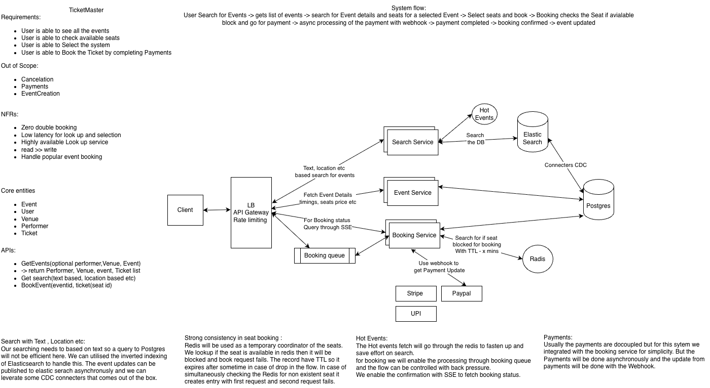

# Ticketmaster — Initial HLD

## 1. Requirements

### Functional Requirements

- User can search and view events.
- User can view event details and available seats.
- User can select seats and book tickets.
- User completes payment for the selected seats.
- User receives the booking status in near real time.

### Non-Functional Requirements

- Zero double booking.
- Low latency for event and seat lookup.
- Highly available booking system.
- Read-heavy workload.
- Handle highly popular events with large booking spikes.
- Apply backpressure so downstream booking systems are not overwhelmed.

### Out of Scope — Initial Version

- Cancellation and refund workflows.
- Payment-provider internals.
- Event creation/management.
- Advanced Saga/compensation workflows.
- Detailed notification infrastructure.

---

## 2. Core Entities

- **Event** — event metadata, venue, performer, timings.
- **Venue** — venue and seat information.
- **Seat/Ticket** — inventory associated with an event.
- **User** — customer booking the ticket.
- **Booking** — represents a user's booking attempt and its lifecycle.
- **Payment** — payment associated with a booking.

---

## 3. High-Level Architecture

```text
                         ┌───────────────┐
                         │     Client    │
                         └───────┬───────┘
                                 │
                         ┌───────▼───────┐
                         │ LB / API GW   │
                         │ Rate Limiting │
                         └───────┬───────┘
                                 │
              ┌──────────────────┼──────────────────┐
              │                  │                  │
              ▼                  ▼                  ▼
        Search Service      Event Service     Booking Queue
              │                  │                  │
              ▼                  ▼                  ▼
        Redis Cache          PostgreSQL       Booking Service
              │                                      │
              ▼                                      ├── Redis
        Elasticsearch                               │   Seat Hold
                                                     │
                                                     ├── PostgreSQL
                                                     │   Booking State
                                                     │
                                                     └── Payment Provider
                                                         │
                                                  Stripe / PayPal / UPI
                                                         │
                                                       Webhook
                                                         │
                                                         ▼
                                                  Booking Service
                                                         │
                                                   State Update
                                                         │
                                                         ▼
                                                       SSE
                                                         │
                                                         ▼
                                                      Client
```




---

## 4. Search Flow

Search is read-heavy and can tolerate eventual consistency.

```text
User
  ↓
API Gateway
  ↓
Search Service
  ↓
Redis Cache
  ↓ cache miss
Elasticsearch
```

PostgreSQL is the authoritative source for event data.

Event changes are propagated asynchronously:

```text
PostgreSQL
    ↓
  CDC
    ↓
Elasticsearch
```

Elasticsearch supports text/location/filter-based event search without putting search load directly on PostgreSQL.

For hot/popular events, frequently requested event/search data can be cached in Redis.

---

## 5. Event Details Flow

```text
User
  ↓
API Gateway
  ↓
Event Service
  ↓
PostgreSQL
```

The Event Service provides:

- Event details
- Venue information
- Timing
- Seat information/metadata
- Other event-specific details

---

## 6. Booking Flow

The initial booking flow is asynchronous.

```text
User
  ↓
POST /bookings
  ↓
API Gateway
  ↓
Booking Queue
  ↓
Booking Service
```

The queue provides backpressure during high-demand events.

The Booking Service:

1. Validates the booking request.
2. Attempts to atomically hold the selected seat.
3. Creates the booking.
4. Initiates payment.
5. Returns/maintains the booking state.

The initial API can return:

```http
202 Accepted
```

with a `bookingId`.

Example:

```json
{
  "bookingId": "B123",
  "status": "PAYMENT_PENDING"
}
```

The original HTTP request does not remain open while waiting for payment.

---

## 7. Seat Reservation

Zero double booking is a primary requirement.

Redis is used as a temporary reservation/coordination layer.

Conceptual state:

```text
AVAILABLE
    ↓
HELD
    ↓
CONFIRMED
```

A seat should be acquired atomically:

```text
if seat == AVAILABLE
    atomically change → HELD
else
    reject
```

A CAS/atomic Redis operation prevents two users from acquiring the same seat simultaneously.

The hold has a TTL:

```text
HELD
  │
  ├── payment succeeds → CONFIRMED
  │
  └── hold expires     → AVAILABLE
```

### Important ownership decision

Redis is used for the temporary hold/coordination mechanism.

PostgreSQL remains the durable source of booking state.

This avoids treating Redis as the permanent source of truth.

---

## 8. Payment Flow

For the initial design, payment is asynchronous.

```text
Booking Service
      ↓
Payment Provider
      ↓
User completes payment
      ↓
Stripe / PayPal / UPI
      ↓
Webhook
      ↓
Booking Service
      ↓
Update booking state
```

Example state transition:

```text
PAYMENT_PENDING
       ↓
   CONFIRMED
```

or:

```text
PAYMENT_PENDING
       ↓
PAYMENT_FAILED / EXPIRED
```

The detailed payment Saga, compensation, refund and reconciliation workflows are intentionally deferred to a later deep dive.

---

## 9. Returning Async Status to the Client

Instead of keeping the original booking request open, the client receives a `bookingId`.

### Step 1 — Create booking

```text
POST /bookings
        ↓
202 Accepted
        ↓
bookingId = B123
```

### Step 2 — Fetch current state

```text
GET /bookings/B123
        ↓
{
  "bookingId": "B123",
  "status": "PAYMENT_PENDING"
}
```

### Step 3 — Establish SSE

```text
GET /bookings/B123/events
        ↓
SSE connection
        ↓
wait for state changes
```

The GET gives the client the current snapshot.

SSE is responsible for future updates.

Conceptually:

```text
GET = "Where am I now?"

SSE = "Tell me when my state changes."
```

When payment completes:

```text
Payment Webhook
      ↓
Booking Service
      ↓
B123 → CONFIRMED
      ↓
SSE event
      ↓
Client
```

If the booking is already terminal when SSE is established, there is no need to maintain the connection.

---

## 10. SSE Recovery

SSE is not the source of truth.

PostgreSQL/Booking state is the source of truth.

If SSE disconnects:

```text
SSE disconnected
       ↓
GET /bookings/B123
       ↓
       ├── CONFIRMED / FAILED / EXPIRED
       │       ↓
       │      DONE
       │
       └── non-terminal
               ↓
          Re-establish SSE
```

This also handles the race where payment completes before the SSE connection is established.

Example:

```text
POST → 202 B123
        ↓
Payment completes
        ↓
Booking = CONFIRMED
        ↓
GET B123
        ↓
CONFIRMED
```

The client does not depend on receiving an SSE event to discover the final state.

---

## 11. Hot Events — Initial Direction

Popular events can generate a massive request spike.

Without admission control:

```text
Millions of users
       ↓
Booking Service
       ↓
DB / Redis / Payment
       ↓
Overload
```

The initial design therefore introduces a Booking Queue:

```text
Large traffic spike
       ↓
Booking Queue
       ↓
Controlled processing rate
       ↓
Booking Service
```

The queue protects downstream services and provides backpressure.

A deeper **Waiting Room / Admission Control** design will be covered separately.

---

## 12. Data Stores

### PostgreSQL

Authoritative transactional store for:

- Events
- Users
- Bookings
- Payment/booking state
- Durable seat/booking state

### Redis

Used for:

- Temporary seat holds
- Seat TTLs
- Atomic/CAS reservation
- Hot-event/search caching

### Elasticsearch

Used for:

- Text search
- Location-based search
- Event filtering
- Read-optimized search

### CDC

```text
PostgreSQL
    ↓
   CDC
    ↓
Elasticsearch
```

Keeps the search index asynchronously synchronized with the authoritative database.

---

## 13. Key Design Decisions

### Why Elasticsearch?

Search requirements are different from transactional booking requirements. Elasticsearch provides efficient text/location/filter-based search without putting heavy search traffic directly on PostgreSQL.

### Why Redis for seat holds?

Seat acquisition needs a fast atomic operation and temporary ownership with expiration. Redis supports atomic operations and TTL naturally.

### Why a Booking Queue?

A hot event can produce traffic far beyond what the booking service and its downstream systems can safely process. The queue provides backpressure and decouples incoming traffic from processing capacity.

### Why 202 Accepted?

Booking completion is asynchronous because payment requires an external interaction and webhook. Returning `202` with a booking ID avoids keeping an HTTP request open.

### Why GET + SSE?

GET provides the current durable booking state. SSE provides subsequent server-to-client state updates without continuous polling.

---

## 14. Current Booking State Machine

Initial version:

```text
                ┌──────────────────┐
                │     AVAILABLE    │
                └────────┬─────────┘
                         │
                    Seat Hold
                         │
                         ▼
                ┌──────────────────┐
                │       HELD       │
                └───────┬──────────┘
                        │
              ┌─────────┴──────────┐
              │                    │
        Payment success       TTL/payment failure
              │                    │
              ▼                    ▼
       ┌─────────────┐       ┌─────────────┐
       │  CONFIRMED  │       │  AVAILABLE  │
       └─────────────┘       └─────────────┘
```

Booking status and seat inventory state should be treated as related but distinct concepts.

---

## 15. Deferred Deep-Dive Topics

The first version intentionally does not solve every distributed-systems problem.

Next deep dives:

1. **Hot events — Waiting Room / Admission Control**
2. **Booking Queue design and partitioning**
3. **Saga orchestration**
4. **Payment failure and compensation**
5. **Confirmation service**
6. **Idempotency**
7. **Redis vs PostgreSQL consistency**
8. **SSE at very large scale**
9. **Redis Pub/Sub vs Kafka for event distribution**
10. **Failure recovery and reconciliation**
11. **Capacity estimation and partitioning**

The goal is to first understand the basic system and then progressively make it production-grade.

---

# Interview Questions

### Basic Architecture

1. Why did you separate Search Service from Booking Service?
2. Why Elasticsearch instead of PostgreSQL for search?
3. What is the source of truth?
4. Why is Redis needed?
5. Why is the booking request asynchronous?
6. Why return `202 Accepted`?

### Seat Concurrency

7. How do you guarantee zero double booking?
8. Why CAS/atomic Redis operation?
9. What happens if two users select the same seat simultaneously?
10. What happens when a seat hold expires?
11. What happens if Redis fails after a seat is held?
12. Should Redis or PostgreSQL be the source of truth?

### Booking Queue

13. Why do you need a queue?
14. What happens when 5 million users try to book simultaneously?
15. How do you apply backpressure?
16. How do you scale consumers?
17. How would you partition the queue?
18. How do you handle duplicate booking requests?

### Payment

19. Why is payment asynchronous?
20. Why use a webhook?
21. What happens if the webhook is delivered twice?
22. What happens if payment succeeds but Booking Service is temporarily unavailable?
23. What happens if payment succeeds but the booking cannot be confirmed?

### SSE

24. Why SSE instead of polling?
25. Why SSE instead of WebSockets?
26. What happens if payment completes before SSE is established?
27. What happens if SSE disconnects?
28. How does the client eventually learn the final booking state?
29. What happens if multiple Booking Service instances are serving SSE connections?
30. When would you introduce Redis Pub/Sub or Kafka behind SSE?

### Staff-Level Follow-ups

31. How would you handle a hot event with millions of concurrent users?
32. How would you design a waiting room?
33. How would you guarantee fairness in admission?
34. Where would you introduce Saga?
35. What are the compensation actions?
36. How would you make booking idempotent?
37. How would you reconcile payment and booking state?
38. What happens if PostgreSQL is unavailable?
39. What happens if Elasticsearch is unavailable?
40. Which components can tolerate eventual consistency and which require strong consistency?
