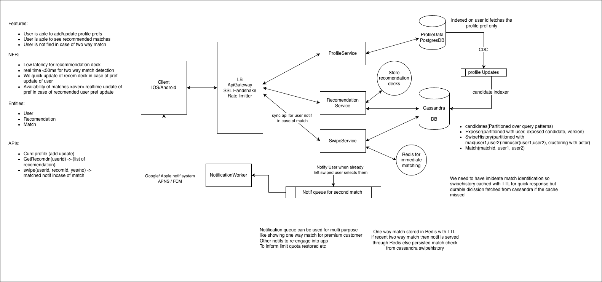

# Tinder — System Design

## 1. Requirements

### Functional
- User can create/update profile and discovery preferences.
- User can get a recommendation deck.
- User can LIKE/PASS a candidate.
- If both users LIKE each other, create a match.
- Return match status synchronously from the swipe API.
- Notify the other user asynchronously after a match.

### Non-functional
- Low-latency recommendation serving.
- Match detection and match creation target: **<50 ms p95**.
- Notification delivery is asynchronous and is **not** part of the 50 ms SLA.
- A user's own preference update should invalidate/regenerate their recommendation deck quickly.
- Other users' profile changes may propagate eventually.
- Recommendation exposure history should have product-defined TTL.

---

# 2. High-Level Architecture

```text
                         PostgreSQL
                    Profile + Preferences
                           |
                    +------|------+
                    |             |
                   CDC       Preference
                    |        invalidation
                    v             |
             Profile Updates      v
                    |       Recommendation
                    v           Service
             Candidate Indexer      |
                    |               |
                    v               |
              +-------------+       |
              |  Cassandra  |<------+
              | Candidate   |
              | Geo Index   |
              +------+------+
                     |
                 nearby cells
                     |
                     v
              Candidate Pool
                     |
              eligibility filters
                     |
                  ML Ranker
                     |
                  top ~100
                     |
                     v
                Redis Deck
                     |
                     v
                   User


Swipe path:

User
 |
 | POST /v1/swipes
 v
Swipe Service
 |
 +--> Redis Recent-LIKE Cache
 |
 +--> Cassandra SwipeHistory
 |
 +--> reciprocal LIKE?
          |
         YES
          |
          v
    Match IF NOT EXISTS
       Cassandra
          |
       +--+----------------+
       |                   |
       v                   v
 HTTP response       Notification Queue
 {matched:true}              |
                             v
                     Notification Worker
                             |
                          APNS / FCM
```





---

# 3. Storage Responsibilities

| Store | Responsibility |
|---|---|
| PostgreSQL | Source of truth for profile + discovery preferences |
| Cassandra Candidate Index | Query-optimized representation of discoverable user profiles |
| Cassandra Exposure | `(viewerId, candidateId, profileVersion)` with TTL |
| Cassandra SwipeHistory | Durable LIKE/PASS interaction history |
| Cassandra Match | Durable match state using canonical user pair |
| Redis Recommendation Deck | Hot, disposable recommendation deck for active users |
| Redis Recent-LIKE Cache | Short-lived LIKE cache for fast reciprocal-like detection |
| Kafka/CDC | Propagate profile changes to the derived candidate index |
| Notification Queue | Decouple notification delivery from swipe API |

**Principle:** Redis is an optimization. Cassandra/PostgreSQL hold durable truth.

---

# 4. Profile and Preference Model

Keep **profile attributes** separate from **discovery preferences**.

### Profile
Attributes describing the user and used when they appear as someone else's candidate:

- `userId`
- `geoCell`
- `gender`
- `age / ageBucket`
- `profileVersion`
- `activeStatus`
- `lastActiveAt`
- recommendation/ranking features

### Preferences
Attributes describing who the user wants to see:

- desired gender
- age range
- max distance
- other product filters

A user's preferences affect **their own feed**, not somebody else's.

Example:

```text
B changes:
"I want age 25-30"
```

Only B's future recommendations change.

If B changes profile attributes such as age/location, B's candidate representation is updated because A may now see a different version of B.

---

# 5. Profile → Candidate Index

Do not synchronously update PostgreSQL and Cassandra from the Profile Service.

```text
Profile Service
      |
      v
PostgreSQL
      |
     CDC
      |
      v
Kafka / Profile Update Event
      |
      v
Candidate Indexer
      |
      v
Cassandra Candidate Index
```

Why:
- Profile DB remains the source of truth.
- Candidate Store is a derived projection.
- Candidate updates can be eventually consistent.
- Indexer can retry/replay events.
- Profile Service does not need a distributed transaction with Cassandra.

When a recommendation-relevant profile attribute changes, Candidate Indexer updates the user's indexed representation and `profileVersion`.

If the user moves:

```text
geoCell A -> geoCell B
```

remove/update the old representation and insert into the new bucket.

---

# 6. Candidate Store

Do **not** precompute:

```text
user -> thousands/millions of candidates
```

That creates a potentially enormous `users × candidates` relationship.

Instead store each user's discoverable profile once in a query-optimized geo index.

Conceptually:

```text
geoCell + coarse gender + ageBucket
        |
        +--> candidate users
```

The exact Cassandra partitioning can evolve, but the important idea is:

> Use geo as the first major reduction dimension.

For dense areas use finer geo cells; sparse areas can use larger cells. H3/S2/geohash are implementation choices.

---

# 7. Recommendation Generation

Example:

```text
User A preferences
       |
       v
Recommendation Service
       |
       v
Nearby geo cells
       |
       v
Candidate shortlist
       |
       +--> preference filtering
       +--> exposure filtering
       +--> swipe/block filtering
       |
       v
Eligible candidates
       |
       v
ML ranking
       |
       v
Top ~100
       |
       v
Redis Deck
```

### Important: no bidirectional preference filtering

We do **not** require:

```text
A likes B
AND
B's preferences accept A
```

to show B to A.

A's feed is determined by A's preferences and candidate eligibility.

B changing their preferences should not affect A's feed.

---

# 8. Candidate Oversampling

Do not fetch exactly 100 candidates if the goal is to produce a 100-user deck.

Example:

```text
Cassandra -> 500 candidates
       |
       v
preference filter
       |
exposure filter
       |
swipe/block filter
       |
       v
180 eligible
       |
       v
ML ranking
       |
       v
100 candidates
```

If insufficient candidates remain, query additional nearby cells / candidate buckets.

---

# 9. ML Ranking

ML belongs **after candidate retrieval and eligibility filtering**.

```text
Candidate Store
      |
      v
~500 candidates
      |
      v
Eligibility filtering
      |
      v
ML Ranker
      |
      v
Top 100
      |
      v
Redis Deck
```

ML should not search the entire user population.

Features can include:

- distance
- age difference
- activity
- profile completeness
- shared interests
- other ranking features

Use batched ranking requests rather than one network call per candidate.

### ML failure fallback

If ML ranking is unavailable:

```text
ML unavailable
     |
     v
deterministic ranking
     |
     v
Redis Deck
```

ML improves ranking but should not become a hard dependency for basic recommendation serving.

---

# 10. Redis Recommendation Deck

Redis stores the active user's hot deck.

Example:

```text
user U1:
[A, B, C, D, E, ...]
```

Serve 20 at a time.

When the deck becomes low:

```text
remaining ~20
     |
     v
async refill
     |
     v
Candidate Store
     |
     v
filter -> rank -> append to Redis
```

Do not wait until the deck is completely empty if possible.

The deck is **disposable derived state**, not source of truth.

If Redis loses the deck, regenerate it.

---

# 11. Exposure History

Exposure is different from swipe history.

### Exposure means:

> "This candidate was recently shown to this user."

Store:

```text
(viewerId, candidateId, profileVersion)
```

with TTL.

Example:

```text
U1 -> U2 -> version 7 -> SEEN
```

If U2 changes recommendation-relevant profile data:

```text
U2 version 8
```

then:

```text
(U1, U2, version 8)
```

is a new exposure key and U2 can become eligible again.

### When to record exposure

Exposure is recorded when the recommendation service commits candidates to the served response/deck, not when the user swipes.

This prevents an un-swiped candidate from immediately returning in the next deck.

Perfect "physically saw it" semantics are unnecessary; define exposure as "committed to the served recommendation response."

---

# 12. Swipe API

```http
POST /v1/swipes
```

Request:

```json
{
  "targetUserId": "U456",
  "action": "LIKE"
}
```

Response:

```json
{
  "matched": false
}
```

or:

```json
{
  "matched": true,
  "matchId": "M123"
}
```

The API is **synchronous** because the user needs to know immediately whether their swipe created a match.

---

# 13. Swipe + Match Flow

```text
User A
  |
  | POST /swipes B LIKE
  v
Swipe Service
  |
  +--> persist A -> B LIKE
  |
  +--> check B -> A LIKE
          |
       +--+--+
       |     |
      NO    YES
       |     |
       |     v
       |  create Match
       |     |
       +-----+
             |
             v
       HTTP response
```

### Recent LIKE optimization

Cache recent LIKEs in Redis with TTL:

```text
A -> B LIKE
    |
    +--> Cassandra SwipeHistory (durable)
    |
    +--> Redis Recent-LIKE cache
```

When B likes A:

```text
B -> A LIKE
    |
    v
Redis: A -> B ?
    |
   HIT
    |
    v
Match immediately
```

On Redis miss:

```text
Redis miss
    |
    v
Cassandra SwipeHistory
    |
    v
A -> B exists?
```

Redis is only an optimization. Cassandra remains the source of truth.

---

# 14. SwipeHistory Data Model

Use a canonical pair so both directional swipes are colocated.

```text
pairKey = (min(userA,userB), max(userA,userB))
```

Conceptually:

```text
A:B
 ├── actor=A -> LIKE
 └── actor=B -> LIKE
```

This is cleaner than partitioning only by `max(userId)`.

The actor remains part of the row identity.

### Idempotency

Repeated:

```text
A -> B LIKE
A -> B LIKE
```

maps to the same logical record:

```text
(A:B, actor=A)
```

So retrying the same request does not create a second logical swipe.

If the product allows:

```text
LIKE -> PASS
```

then the same directional record represents the latest state.

---

# 15. Match Creation

Use the same canonical pair:

```text
matchKey = (min(userA,userB), max(userA,userB))
```

Example:

```text
A likes B
B likes A
       |
       v
same pair key: A:B
       |
       v
create Match if absent
```

Concurrent requests:

```text
A -> B LIKE             B -> A LIKE
      |                       |
      +-----------+-----------+
                  |
                  v
               A:B
                  |
        idempotent match creation
                  |
             exactly one
             logical match
```

Implementation can use Cassandra conditional/compare-and-set semantics where appropriate, but the HLD requirement is:

> Match creation must be idempotent using the canonical pair key.

---

# 16. Why not Saga for Redis + Cassandra?

Redis is a cache.

We do not need a distributed transaction between:

```text
Cassandra durable swipe
+
Redis cache
```

Correctness:

```text
Cassandra = source of truth
Redis = optimization
```

If Redis fails:

```text
Redis miss
   |
   v
Cassandra lookup
   |
   v
repopulate Redis
```

A Saga would add complexity without solving a business consistency requirement.

---

# 17. Notification

Notification is outside the synchronous swipe SLA.

```text
Match created
     |
     +--------------------> HTTP response
     |                       matched=true
     |
     v
Notification Queue
     |
     v
Notification Worker
     |
     v
APNS / FCM
     |
     v
Other user
```

The 50 ms SLA is:

```text
POST /swipe
  -> durable swipe
  -> reciprocal LIKE detection
  -> match creation
  -> response
```

It does **not** include:

```text
Queue -> Worker -> APNS/FCM -> phone
```

This prevents external push delivery latency from affecting the swipe API.

---

# 18. Preference Update

User changes own preferences:

```text
PUT /v1/profile/preferences
          |
          v
      PostgreSQL
          |
          +--> increment preferenceVersion
          |
          +--> invalidate recommendation deck
```

The deck can also carry:

```text
preferenceVersion
```

Safety check:

```text
deck.preferenceVersion
        !=
current.preferenceVersion
```

→ discard/regenerate deck.

This protects against stale Redis invalidation.

Other users' preference changes do not affect this user's feed.

---

# 19. Why Candidate Store is Eventually Consistent

If B changes profile:

```text
B profile
   |
   v
PostgreSQL
   |
  CDC
   |
   v
Candidate Indexer
   |
   v
Cassandra Candidate Store
```

There can be a short delay.

That's acceptable because the requirement prioritizes recommendation availability over real-time freshness for other users.

The next candidate generation sees the updated profile.

---

# 20. Back-of-the-Envelope Calculation

Use these as **illustrative assumptions**, not actual Tinder production numbers.

Assumptions:

```text
100M registered users
20M DAU
100 swipes / DAU / day
20 recommendation requests / DAU / day
100 candidates / deck
500 candidates fetched per generation
3x peak / average
```

### Swipe traffic

```text
20M × 100
= 2B swipes/day

2B / 86,400
≈ 23K/sec average

Peak ≈ 70K/sec
```

### Recommendation requests

```text
20M × 20
= 400M/day

≈ 4.6K/sec average

Peak ≈ 14K/sec
```

Most are Redis deck reads.

### Deck generation

```text
20M × 20 / 100
≈ 4M deck generations/day

≈ 46/sec average
≈ 140/sec peak
```

If each generation evaluates ~500 candidates:

```text
4M × 500
= 2B candidate evaluations/day

≈ 23K candidate evaluations/sec average
≈ 70K/sec peak
```

Use batched ML ranking rather than one request per candidate.

### Swipe storage

Assume ~100 B/swipe:

```text
2B × 100 B
≈ 200 GB/day raw

RF=3
≈ 600 GB/day replicated
```

This motivates retention/archival policies for old interaction history.

### Exposure storage

```text
20M × 20
= 400M exposures/day
```

At ~50 B:

```text
≈ 20 GB/day raw
≈ 60 GB/day with RF=3
```

With 30-day TTL:

```text
≈ 1.8 TB steady-state replicated
```

Order of magnitude only; real Cassandra overhead will be higher.

### Redis decks

If ~20% of DAU are active with decks:

```text
4M active decks
× ~5 KB/deck
≈ 20 GB
```

Provision significantly more for Redis overhead, replicas, fragmentation and headroom.

### Recent LIKE cache

At ~70K peak swipes/sec and 10-minute TTL:

```text
70K × 600
≈ 42M recent likes
```

A few GB raw memory; provision substantially more after Redis overhead/replication.

### Profile CDC

Assume 5M profile changes/day:

```text
≈ 58 events/sec average
```

Even at 10x peak, this is far below swipe traffic.

### Notifications

Assume 1% of swipes become matches:

```text
2B × 1%
= 20M matches/day

≈ 230/sec average
≈ 700/sec peak
```

Notification traffic is not the primary scaling concern.

---

# 21. Main Scaling Bottlenecks

Order of magnitude:

1. **Swipe/interaction storage**
2. **Candidate retrieval + ML ranking**
3. **Redis hot state**
4. **Notification delivery**
5. **Profile CDC/indexing**

This validates the architecture:

- Cassandra handles large durable interaction writes.
- Redis handles low-latency recommendation serving.
- Candidate Store prevents scanning the entire user population.
- ML ranks a bounded candidate pool.
- CDC keeps derived candidate data eventually consistent.
- Notification processing is decoupled.

---

# 22. Key Design Principles

### Candidate retrieval vs ranking

Do not ask ML to search the entire population.

```text
Geo index
   ↓
candidate shortlist
   ↓
eligibility
   ↓
ML ranking
   ↓
deck
```

### Candidate population vs user state

Candidate Store answers:

> Who could potentially be recommended?

Exposure/Swipe state answers:

> Is this candidate still eligible for this user?

### Profile vs preferences

Profile attributes affect how a user appears to others.

Preferences affect the user's own feed.

### Durable vs cache

```text
PostgreSQL/Cassandra = correctness
Redis = speed
```

### Synchronous vs asynchronous

Synchronous:

```text
Swipe → match detection → response
```

Asynchronous:

```text
Profile CDC → Candidate Index
Match → Notification
Deck refill
```

---

# 23. Interview Questions / Follow-ups

### Recommendation
- Why Cassandra instead of Elasticsearch?
- Why geo cells?
- How do you prevent Cassandra `ALLOW FILTERING`?
- How do you handle dense geo cells?
- Why not precompute every user's candidate list?
- Why Redis deck?
- What happens if Redis loses a deck?
- How do you avoid duplicates across deck refills?
- Why exposure TTL?
- Why include profileVersion in exposure?
- How would you introduce an ML ranking model?
- What happens if ML is unavailable?

### Swipe / Match
- How do you detect a two-way LIKE?
- How do simultaneous likes race?
- How do you guarantee idempotency?
- Why canonical `(minUser,maxUser)`?
- Why Redis recent-LIKE cache?
- What happens if Redis is unavailable?
- Why not Saga?
- Why not Kafka in the synchronous swipe path?
- Why is notification asynchronous?
- Does APNS/FCM latency count toward the 50 ms SLA?
- Why Cassandra for Match?
- How does `IF NOT EXISTS` / conditional creation work?
- Can LWT fit the latency budget?

### Consistency
- What is source of truth?
- What happens if PostgreSQL updates but Candidate Store is stale?
- How do you handle CDC failure?
- What consistency level is needed for reciprocal swipe lookup?
- What happens if notification delivery fails?

### Scale
- Estimate swipe QPS.
- Estimate recommendation QPS.
- Estimate Cassandra storage.
- Estimate Redis memory.
- Estimate candidate-generation QPS.
- What becomes the bottleneck at 10x scale?
- How would you shard/bucket Cassandra?

---

# 24. Final Architecture Summary

```text
                 ┌───────────────────────┐
                 │      PostgreSQL       │
                 │ Profile + Preferences │
                 └──────────┬────────────┘
                            |
                           CDC
                            |
                            v
                    Candidate Indexer
                            |
                            v
                 ┌──────────────────────┐
                 │      Cassandra       │
                 │  Candidate Geo Index │
                 └──────────┬───────────┘
                            |
                      nearby geo cells
                            |
                            v
                 ┌──────────────────────┐
                 │ Recommendation       │
                 │ Service              │
                 │                      │
                 │ Filter + ML Rank     │
                 └──────────┬───────────┘
                            |
                            v
                       Redis Deck
                            |
                            v
                          User


User
 |
 | POST /swipe
 v
Swipe Service
 |
 +---- Redis Recent-LIKE Cache
 |
 +---- Cassandra SwipeHistory
 |
 +---- reciprocal LIKE
          |
          v
    Match IF NOT EXISTS
          |
          +----> Cassandra Match
          |
          +----> HTTP {matched:true}
          |
          +----> Notification Queue
                       |
                       v
                Notification Worker
                       |
                    APNS / FCM
```

## Final assessment

**~8.5–9/10 for a Senior/Staff interview design.**

The strongest parts are the separation of:

- candidate retrieval
- eligibility/exposure
- ML ranking
- Redis serving
- durable swipe history
- idempotent matching
- asynchronous notification

The main assumptions that should be explicitly called out in an interview are the **candidate geo-bucketing strategy, Cassandra consistency/conditional-write behavior, and the BOTE assumptions**.
