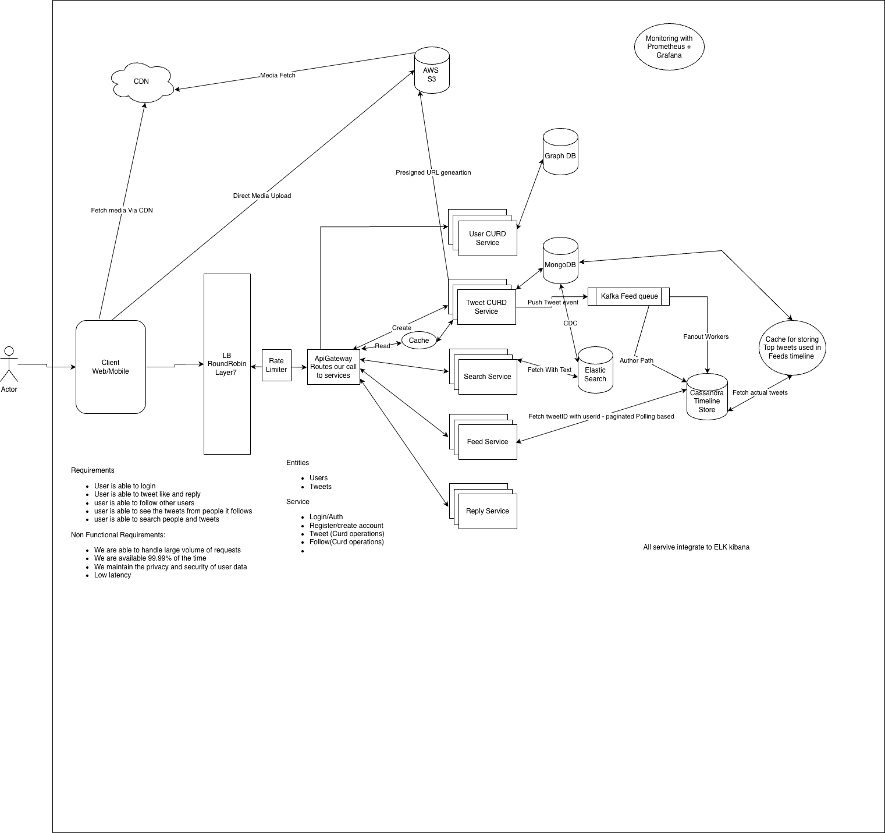

# Tweeter — Staff Engineer System Design Notes

> A top-to-bottom interview revision sheet for designing a Twitter/Tweeter-scale system. Use it to structure the discussion, then drill down where the interviewer pushes.

## 1. Problem Framing

### Core requirements
- Create/read/update/delete tweets
- Follow / unfollow users
- View home feed
- View author timeline
- Reply to tweets
- Search tweets/users
- Media upload
- Likes/replies/counts as extensions
- High availability and horizontal scalability

### Non-functional requirements
- Very high read and write volume
- Low feed-read latency
- Eventual consistency acceptable for derived feed data
- No unbounded hot partition from a celebrity/supernode
- Fault tolerance and retryability
- Cursor-based pagination
- Observability and rate limiting

### Staff-level opening
Ask about scale, read/write ratio, feed freshness, maximum followers, consistency requirements, and the most important queries. **Access patterns should drive the data model.**

## 2. High-Level Architecture

```text
Internet
   |
GSLB / Global Traffic Management
   |
Cluster
   |
Ingress / External LB
   |
API Gateway
   |
   +--> User Service
   +--> Tweet Service
   +--> Reply Service
   +--> Search Service
   +--> Feed Service
   |
   +--> MongoDB       -> canonical user/tweet data
   +--> Kafka         -> asynchronous events
   +--> Elasticsearch -> search index
   +--> Cassandra     -> timeline/read model
   +--> S3 + CDN      -> media
```



### Multi-cluster routing

```text
User
 |
DNS / GSLB
 |
Chosen cluster
 |
Ingress / LB
 |
API Gateway
 |
Kubernetes Service
 |
Pod
```

Kubernetes Service normally balances across pods **inside its cluster**. Independent clusters need something above them, such as GSLB/global traffic management.

## 3. Database Selection — Mental Model

### MongoDB
Document-oriented. Think: **“I have an entity/document and want flexible CRUD.”**

Good for Tweet/User entities, rich or variable documents, get-by-ID, update/delete, and flexible evolution.

Example:

```json
{
  "tweetId": "T123",
  "authorId": "U456",
  "text": "Hello",
  "createdAt": "...",
  "media": [],
  "replyCount": 20
}
```

### Cassandra
Wide-column/distributed database. Think: **“I know my access pattern, so I design the table around that query.”**

Good for timelines, author timelines, followers/following adjacency lists, and massive predictable reads/writes.

Example:

```text
PK = user_id + time_bucket
SK = created_at + tweet_id
```

### Interview one-liner
> **MongoDB is entity/document-oriented; Cassandra is access-pattern/partition-oriented.**

For Tweeter:

```text
MongoDB   = canonical Tweet/User data
Cassandra = derived Timeline / Feed data
```

Cassandra can store tweets too, but MongoDB is the more natural fit for Tweet entity CRUD.

## 4. Tweet Creation

```text
Client
  |
Tweet Service
  |
  +--> MongoDB (canonical tweet)
  |
  +--> Kafka: TweetCreated
             |
             v
        Feed Workers
```

The synchronous request should not wait for all follower timeline writes.

Kafka provides asynchronous event/work distribution and decouples tweet creation from feed fanout, search indexing, and other consumers.

**Terminology:** call Kafka a **topic**, not a queue. Topics are partitioned for scalability and parallel consumption.

## 5. Search

```text
MongoDB
   |
CDC / indexing pipeline
   |
Elasticsearch
   |
Search Service
```

Use MongoDB as the canonical source and Elasticsearch as the search index. Keep event responsibilities clear: e.g. `TweetCreated` for feed processing and MongoDB CDC for Elasticsearch indexing.

## 6. Normal User Feed — Fan-out-on-Write

Example: John has 100 followers and creates `T123`.

```text
John
 |
Tweet Service
 |
MongoDB
 |
Kafka: TweetCreated
 |
Feed Worker
 |
Get John's followers
 |
Write T123 into each follower's Timeline Store
```

This is **fan-out-on-write**. Pay the distribution cost at write time so feed reads are cheap.

Do not synchronously write 100 timelines before returning the tweet response. Persist/publish, return, and fan out asynchronously.

## 7. Timeline Store

The Timeline Store is a **derived/read-optimized model**, not the canonical tweet store.

A timeline entry can be tiny:

```text
user_id
tweet_id
created_at
```

### Cassandra model

Query: **“Give me Deepak's latest tweets.”**

```text
Partition Key = user_id + time_bucket
Sort/Clustering Key = created_at + tweet_id
```

Example:

```text
Deepak#2026-09-05
-----------------
12:10 T100
12:05 T98
11:58 T97
...
```

Time buckets bound partition size. Do not add hash sharding to every normal user without evidence; introduce extra sharding only for real hotspot/partition pressure.

## 8. Pagination

Avoid:

```text
OFFSET 100000
```

Use **cursor-based pagination** with deterministic ordering, e.g. `(created_at, tweet_id)`.

A cursor represents the continuation position from the previous page.

Interview phrase:
> “For large timelines I would use cursor-based pagination with deterministic `(timestamp, ID)` ordering rather than offset pagination.”

## 9. Timeline Cache

Caching every user's complete home timeline in Redis is often less valuable because timelines are highly unique.

A stronger cache candidate is:

```text
tweet_id -> tweet object
```

The same tweet can appear in millions of users' feeds, especially celebrity/viral tweets.

## 10. Fan-out Workers

```text
TweetCreated
    |
Worker
    |
Get followers
    |
fanout timeline writes
```

Parallelize large fanout work by chunks/tasks. Fanout should be:
- Retryable
- Idempotent
- Observable

Use a deterministic timeline-entry identity to avoid duplicate entries after retries.

## 11. One Kafka Topic vs Two

Initial design:

```text
Kafka
  |
TweetCreated
  |
Feed Workers
  |
Worker determines:
  normal OR celebrity
```

This keeps Tweet Service unaware of feed strategy.

If scale later makes filtering wasteful, introduce:

```text
TweetCreated
      |
Feed Dispatcher
   /       \
Normal    Celebrity
 topic      topic
```

The dispatcher is our service, not a Kafka feature. Split only when independent scaling, failure isolation, or consumption cost justifies it.

## 12. Celebrity Problem

Suppose a celebrity has 100M followers and creates `T9001`.

Naive fanout-on-write means 100M timeline writes for one tweet — unacceptable as the normal write path.

### Hybrid strategy

```text
Normal users    -> fan-out-on-write
Celebrities     -> fan-out-on-read
```

Celebrity flow:

```text
TweetCreated
    |
Feed Worker
    |
Author Timeline
```

Only the celebrity's author timeline receives the tweet; do not write it into 100M follower timelines.

## 13. Celebrity Feed Read

Suppose Deepak follows 147 normal users and 3 celebrities.

Deepak's precomputed timeline contains normal-author tweets. Feed Service separately reads the relevant celebrity author timelines and merges them by timestamp.

```text
Deepak timeline
      +
celebrity author timelines
      |
      v
Merge by timestamp
      |
Final tweet IDs
```

This is **fan-out on write + fan-in/merge on read**.

## 14. User Timeline vs Author Timeline

### User timeline

```text
Deepak -> tweets appearing in Deepak's home feed
```

### Author timeline

```text
ChatGPT -> tweets created by ChatGPT
```

They are different logical access patterns and can live in the same Cassandra cluster as separate logical tables/models.

## 15. Celebrity Pagination — Staff Drill-down

After merging a user timeline with multiple celebrity author timelines, pagination must preserve:
- deterministic ordering
- no duplicates
- no skipped tweets
- correct continuation across all sources

A cursor may need to remember continuation positions for the underlying sources:

```text
User timeline cursor
Celebrity A cursor
Celebrity B cursor
Celebrity C cursor
```

This is a likely interview drill-down.

## 16. Celebrity Classification

Avoid necessarily querying the User DB on every tweet. Possible approaches:
- Cached author metadata
- Distributed cache
- Precomputed celebrity flag
- Dynamic classification based on follower count/activity/fanout cost

Celebrity status can be an operational classification rather than a permanent user property.

## 17. Social Graph

Required queries:

```text
Following(user)
Followers(user)
DoesFollow(follower, followee)
Follow
Unfollow
```

### Cassandra adjacency-list approach

Maintain two denormalized views:

```text
Following
PK = follower_id
SK = followee_id
```

and:

```text
Followers
PK = followee_id
SK = follower_id
```

Duplication is deliberate: both directions become efficient queries.

## 18. Celebrity Followers / Supernodes

`Followers(ChatGPT)` with 100M followers can make one giant partition problematic.

Use bucketing/sharding for extreme users:

```text
ChatGPT#00
ChatGPT#01
ChatGPT#02
...
ChatGPT#99
```

For example:

```text
bucket = hash(follower_id) % N
```

Normal users can use simpler partitions; celebrities/supernodes can be bucketed adaptively.

Note: celebrity tweets do not need to fetch all 100M followers because they use fan-out-on-read.

## 19. Why Graph DB?

Graph databases are valid for social graphs.

```text
Nodes = users
Edges = FOLLOWS relationships
```

Graph DB mental model:
> **“I know the relationships and want to traverse them.”**

Strong for mutual follows, friend-of-friend, recommendations, and multi-hop traversal.

Examples: Neo4j, Amazon Neptune, JanusGraph, Azure Cosmos DB graph capabilities.

### Cassandra vs Graph DB

**Cassandra:** “I know my query. Design the partition around it.”

**Graph DB:** “I know my relationships. Traverse them.”

If Tweeter mainly needs `Followers(user)`, `Following(user)`, and `DoesFollow(A,B)`, Cassandra can be simpler and more predictable at massive scale. If multi-hop graph traversal is first-class, a graph DB becomes more compelling.

## 20. SQL vs Cassandra vs Graph DB

- **SQL:** viable at moderate scale with a `Follow(follower_id, followee_id)` table and indexes.
- **Cassandra:** strong for massive, predictable adjacency-list access.
- **Graph DB:** strong when relationship traversal is itself a core query/product requirement.

Staff answer:
> “The choice depends on access patterns. For simple adjacency-list lookups at extreme scale, Cassandra gives predictable partition-based performance. If multi-hop graph traversal is a first-class requirement, I'd consider a graph database.”

## 21. Reply System

A tweet may have ~1M replies. Do **not** keep one giant `tweet_id -> [1M reply IDs]` array/document.

Reply is its own entity:

```text
reply_id
tweet_id
author_id
text
created_at
```

Avoid a single Cassandra partition keyed only by `tweet_id` for viral tweets.

Better:

```text
PK = tweet_id + time_bucket + shard
SK = created_at + reply_id
```

Read relevant buckets/shards in parallel, merge/sort, then return a cursor-based page.

## 22. Media

Avoid sending large media through application servers.

```text
Client
  |
Request upload URL
  |
Media Service
  |
Presigned S3 URL
  |
Client uploads directly to S3
  |
CDN serves media
```

Benefits: application servers avoid large payloads, object storage provides durability, and CDN handles global delivery.

## 23. Caching Strategy

Strong candidate:

```text
tweet_id -> tweet object
```

Especially for celebrity/viral tweets.

Less compelling initially:

```text
user_id -> entire home timeline
```

because timelines are highly user-specific.

## 24. Consistency Model

Separate **source of truth** from **derived data**.

```text
MongoDB
  |
canonical tweet
```

Then:

```text
Kafka -> Timeline Store
      -> Elasticsearch
```

Timeline and search can be eventually consistent. State explicitly where eventual consistency is acceptable.

Example:

```text
Tweet created successfully
     |
     +--> search index may lag
     +--> feed fanout may lag
```

## 25. Failure Handling

### Kafka unavailable
Tweet persistence should not depend on every consumer being available. Use a reliable event-publication strategy; at larger scale consider an outbox/CDC-based approach or equivalent durable publication mechanism.

### Fanout worker crashes
Kafka events remain available for retry/reprocessing. Timeline writes must be idempotent.

### Cassandra unavailable
Replication/consistency configuration should support failure handling. Feed may temporarily be stale/unavailable rather than corrupting canonical tweet data.

### Elasticsearch unavailable
Tweet remains in MongoDB; search index catches up later.

### Cache unavailable
Fall back to the durable source.

## 26. Observability

Track:

### Feed
- Feed read latency
- Fanout latency
- Kafka consumer lag
- Timeline write failures
- Celebrity merge latency

### Kafka
- Producer failures
- Consumer lag
- Partition skew
- Throughput

### Cassandra
- Read/write latency
- Hot partitions
- Failed requests
- Compaction/repair health

### MongoDB
- Query latency
- Replica health
- Connection pressure

### API
- Request rate
- p95/p99 latency
- Error rate
- Saturation

Typical stack:

```text
Prometheus -> metrics
Grafana    -> dashboards
Logs       -> centralized logging
Tracing    -> distributed request tracing
```

## 27. Rate Limiting

Protect the platform from abuse and accidental overload.

```text
User/IP/API-key based
        |
Rate Limiter
        |
API Gateway
```

Different endpoints can have different limits. Distributed rate limiting may use Redis or another shared counter/token-bucket mechanism.

## 28. Core Trade-offs

### Fan-out-on-write
**Pros:** fast feed reads, predictable read path.

**Cons:** expensive writes for high-follower users; celebrity problem.

### Fan-out-on-read
**Pros:** cheap tweet creation; no massive follower writes.

**Cons:** expensive feed reads; more merge work; higher latency risk.

### Hybrid

```text
Normal      -> fan-out-on-write
Celebrity   -> fan-out-on-read
```

Practical choice for Tweeter.

## 29. Core Staff-Level Insight

The biggest design decision isn't “Mongo or Cassandra?” It is:

> **What are my access patterns, and which data is canonical vs derived?**

For Tweeter:

```text
Canonical entity data
        |
     MongoDB

Asynchronous events
        |
      Kafka

Read-optimized timeline
        |
    Cassandra

Full-text search
        |
 Elasticsearch

Media
        |
   S3 + CDN
```

## 30. Interview Walkthrough — Top to Bottom

### Step 1 — Clarify scale
DAU, tweets/sec, read/write ratio, maximum followers, feed latency, consistency.

### Step 2 — Draw high-level path

```text
Client -> GSLB -> Cluster/LB -> API Gateway -> Services
```

### Step 3 — Establish canonical storage

```text
User/Tweet -> MongoDB
```

### Step 4 — Establish async processing

```text
Tweet Service -> Kafka
```

### Step 5 — Solve normal feeds

```text
Kafka -> Fanout Workers -> Cassandra User Timeline
```

### Step 6 — Immediately address celebrity problem

```text
Normal    -> fan-out-on-write
Celebrity -> author timeline + fan-out-on-read
```

### Step 7 — Solve social graph

```text
Following
Followers
DoesFollow
```

Use adjacency-list modeling and explain bucketing for supernodes.

### Step 8 — Solve replies

```text
tweet + time bucket + shard
```

### Step 9 — Search

```text
Mongo/CDC -> Elasticsearch
```

### Step 10 — Media

```text
Presigned URL -> S3 -> CDN
```

### Step 11 — Reliability
Retries, idempotency, replication, eventual consistency, Kafka lag, recovery.

### Step 12 — Observability
p95/p99, throughput, errors, consumer lag, hot partitions, saturation.

## 31. Questions an Interviewer Will Attack

### Feed
1. Why fan-out-on-write?
2. What happens with 100M followers?
3. How do you classify celebrities?
4. What if a celebrity becomes non-celebrity?
5. How do you paginate the merged feed?
6. How do you avoid duplicate tweets?
7. What if fanout partially fails?

### Cassandra
1. Why Cassandra?
2. What's your partition key?
3. Why time buckets?
4. How do you prevent hot partitions?
5. How does cursor pagination work?
6. Why not MongoDB?
7. Why not Redis?

### Kafka
1. How many partitions?
2. What key do you use?
3. What happens if a consumer dies?
4. How do retries work?
5. What about ordering?
6. Why one topic vs multiple topics?
7. How do you handle consumer lag?

### Social graph
1. Why not SQL?
2. Why not Graph DB?
3. How do you find followers of a celebrity?
4. What happens with 100M followers?
5. How do follow/unfollow operations remain consistent?

### Reliability
1. What if MongoDB is down?
2. What if Kafka is down?
3. What if Cassandra is down?
4. What if Elasticsearch is behind?
5. What if cache is unavailable?

## 32. Common Mistakes to Avoid

- One giant array of follower IDs
- One giant array of reply IDs
- One Cassandra partition containing millions/billions of timeline entries
- Offset pagination
- Synchronous fanout during tweet creation
- Fanout celebrity tweets to 100M followers
- Caching everything in Redis
- Treating Kafka as the database
- Treating Kubernetes Service as global multi-cluster load balancing
- Adding Graph DB without a graph-traversal requirement
- Using Cassandra without defining the query/access pattern
- Saying “eventual consistency” without explaining where it is acceptable

## 33. Quick Cheat Sheet

```text
Tweet entity
    -> MongoDB

TweetCreated
    -> Kafka

Normal author
    -> fan-out-on-write
    -> follower timelines

Celebrity author
    -> author timeline
    -> fan-out-on-read

Timeline
    -> Cassandra
    -> user_id + time_bucket
    -> created_at + tweet_id

Social graph
    -> adjacency lists
    -> Following + Followers
    -> bucket supernodes

Replies
    -> tweet_id + time_bucket + shard
    -> cursor pagination

Search
    -> Elasticsearch

Media
    -> S3
    -> CDN

Caching
    -> hot tweet objects

Global routing
    -> GSLB
    -> cluster
    -> ingress/LB
    -> API Gateway
    -> Kubernetes Service
    -> pod

Observability
    -> metrics + logs + tracing

Reliability
    -> replication
    -> retries
    -> idempotency
    -> eventual consistency where acceptable
```

## 34. Final Staff-Level Mental Model

When designing a system like Tweeter, repeatedly ask:

```text
1. What is the query?
        ↓
2. How much data can one key accumulate?
        ↓
3. Can one key become hot?
        ↓
4. Is this canonical or derived data?
        ↓
5. Can this work be asynchronous?
        ↓
6. What happens when the scale becomes 100x?
        ↓
7. What happens when one user becomes an extreme outlier?
        ↓
8. How do I paginate?
        ↓
9. What happens when each dependency fails?
```

The Staff Engineer signal is not knowing every technology. It is showing that you can **identify access patterns, choose the right data model, recognize pathological cases, and explain trade-offs before the interviewer has to point them out.**

## Current Design Maturity / Remaining Drill-downs

The design is in the Staff-level conversation range. The remaining areas to sharpen are:

- exact feed pagination semantics across multiple celebrity sources
- celebrity classification at scale
- Kafka partition/key strategy and ordering guarantees
- precise Cassandra partition sizing/hot-partition thresholds
- social graph consistency during follow/unfollow
- failure/recovery semantics
- realistic capacity estimates

> **Interview mantra:** Start simple, state the access pattern, make the normal path fast, identify the pathological user, and then add complexity only where scale demands it.
