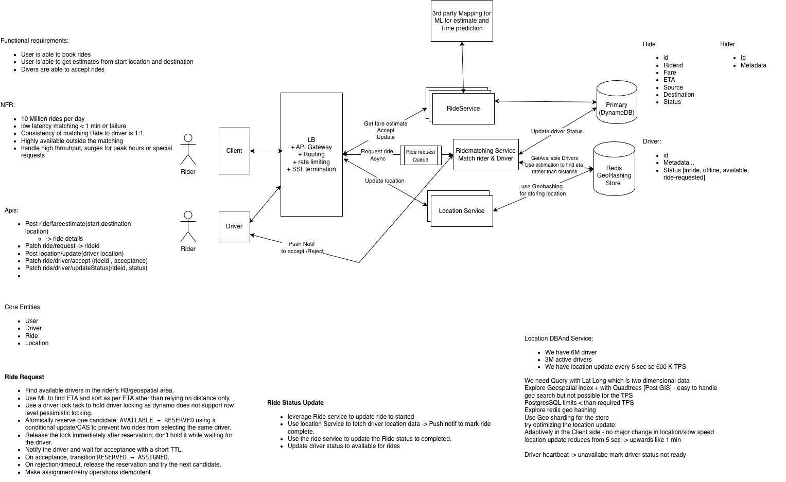

# Uber – Ride Booking System Design

## 1. Functional Requirements

- Rider can request/book a ride from source to destination.
- Rider can get fare and ETA estimates.
- Driver can accept/reject ride requests.
- Rider can track ride status and driver location.
- Driver location should be available for matching and active-trip tracking.

## 2. Non-Functional Requirements

- ~10M rides/day.
- Low-latency driver matching, target <1 sec under normal conditions.
- High availability.
- A driver must not be assigned to multiple active rides.
- Handle traffic spikes during peak hours/special events.
- Location ingestion must support millions of active drivers.

### Scale

Assume:
- 3M active drivers.
- Driver location update every 5 seconds.

Location ingestion:

`3M / 5 = ~600K location updates/sec`

This is much higher than the transactional ride workload, so location data should not be written directly to the primary ride database.

---

## 3. High-Level Architecture

```text
Rider / Driver Apps
        |
        v
   LB + API Gateway
        |
   +----+--------------------+
   |                         |
   v                         v
Ride Service           Location Service
   |                         |
   |                         v
   |                    H3 / Geo Index
   |                         |
   v                         |
Ride DB <---- Events ---- Kafka
(DynamoDB)                  |
                             v
                     Matching Service
                             |
                       Candidate Drivers
                             |
                       ETA / Routing
                             |
                         Rank drivers
                             |
                    Atomic Reservation
                             |
                       Push Notification
                             |
                         Driver App
```



### Main components

#### API Gateway / Load Balancer

- Authentication/authorization.
- Rate limiting.
- Routing.
- SSL termination.

#### Ride Service

Owns durable ride state:

- ride ID
- rider ID
- driver ID
- source/destination
- fare
- ETA
- ride status
- timestamps

Ride state machine:

```text
REQUESTED
   |
MATCHING
   |
RESERVED
   |
ASSIGNED / ACCEPTED
   |
DRIVER_ARRIVING
   |
DRIVER_ARRIVED
   |
TRIP_STARTED
   |
COMPLETED
```

Cancellation can happen from appropriate intermediate states.

#### Location Service

Handles high-volume driver location updates.

Responsibilities:

- Receive driver GPS updates.
- Maintain current location.
- Maintain `lastUpdatedAt`.
- Maintain driver availability for matching.
- Remove/ignore stale drivers.
- Publish/serve location for active-trip tracking.

Do not use the primary ride DB for every GPS update.

#### GeoSpatial Index

Use H3-style spatial cells with a low-latency store such as Redis.

Conceptually:

```text
(lat, lng)
    |
    v
H3 cell
    |
    v
cell -> available driver IDs
```

For a request:

```text
Rider location
      |
   H3 cell
      |
Neighboring cells
      |
Candidate drivers
```

Expand to neighboring cells if the initial cell does not contain enough candidates.

#### Matching Service

Responsible for:

1. Find available drivers geographically close to rider.
2. Filter invalid/stale candidates.
3. Obtain ETA for candidates.
4. Rank candidates using ETA/business rules.
5. Atomically reserve a driver.
6. Notify the driver.
7. Wait for acceptance with a short TTL.
8. On rejection/timeout, release reservation and try another candidate.

---

## 4. Driver Matching and Concurrency

### Core invariant

> A driver can have at most one active reservation/assignment.

Do not rely on a normal read followed by a write:

```text
read driver.status == AVAILABLE
        |
        v
write RESERVED
```

Two matching workers could both read `AVAILABLE`.

### Atomic reservation

Use a conditional update / CAS:

```text
AVAILABLE -> RESERVED
```

Conceptually:

```text
UPDATE Driver
SET status = RESERVED,
    rideId = <rideId>
WHERE driverId = <driverId>
  AND status = AVAILABLE
```

Only one concurrent request succeeds.

A Redis atomic operation/Lua script or a database conditional write can provide the same semantic guarantee.

### Important: do not hold a pessimistic lock while waiting

Bad:

```text
lock driver
   |
send request
   |
wait 10 seconds for driver
   |
unlock
```

The lock should protect the short reservation transition, not the human/network interaction.

Better:

```text
AVAILABLE
   |
atomic reservation
   |
RESERVED + TTL
   |
release transactional lock
   |
notify driver
   |
+-----------+-----------+
|                       |
ACCEPT                 TIMEOUT/REJECT
|                       |
ASSIGNED             release reservation
                        |
                    next candidate
```

### Reservation TTL

Use a short TTL for `RESERVED`.

If the matching service crashes or the driver never responds:

```text
RESERVED
   |
TTL expiry
   |
AVAILABLE
```

This prevents abandoned reservations from permanently blocking drivers.

---

## 5. Idempotency

Retries are expected in distributed systems.

Examples:

- Driver sends `accept` twice.
- Client retries ride creation.
- Matching service retries assignment.
- Network timeout occurs after the server already processed a request.

Use an idempotency key/request ID and state-transition validation.

Example:

```text
RESERVED -> ASSIGNED
```

First request succeeds.

A duplicate request sees:

```text
ASSIGNED -> ASSIGNED
```

and becomes a no-op rather than creating another assignment.

---

## 6. Ride Request Durability

A ride request should not depend on a matching worker being alive at that exact moment.

Flow:

```text
Ride Service
    |
    v
RideRequested event
    |
   Kafka
    |
    v
Matching Service
```

Benefits:

- Durable requests.
- Matching workers can scale independently.
- Backpressure during traffic spikes.
- Failed consumers can resume processing.
- Partitioning can align processing with geographic regions/cells.

For a large deployment, geographic partitioning can reduce cross-region traffic and keep matching close to the rider/driver population.

---

## 7. Location Ingestion

### Why a separate Location Service?

3M active drivers × 1 update / 5 sec = ~600K updates/sec.

Writing all of these directly to DynamoDB would make the transactional ride database handle a workload it does not need to own.

Instead:

```text
Driver App
    |
    v
Location Service
    |
    +--> Current location / geo index
    |
    +--> optional event stream for analytics
```

### Adaptive location updates

Avoid a fixed update interval.

Example:

```text
Stationary / idle
    -> low frequency

Moving normally
    -> moderate frequency

Matched / approaching rider
    -> high frequency

Active trip
    -> high frequency
```

Factors can include:

- speed
- distance moved
- direction changes
- trip/matching state
- network conditions

This reduces location traffic while maintaining accuracy where it matters.

### Driver heartbeat

Track:

`lastUpdatedAt`

If:

`now - lastUpdatedAt > threshold`

mark the driver as stale/unavailable for matching.

---

## 8. ETA and Driver Ranking

Do not select a driver solely by geographic distance.

Example:

```text
Driver A
1 km away
ETA = 8 min

Driver B
2 km away
ETA = 4 min
```

Driver B may be the better candidate.

Use:

```text
H3 candidate lookup
       |
       v
ETA / Routing Service
       |
       v
Candidate ranking
       |
       v
Atomic reservation
```

Keep routing behind an abstraction such as `ETA/Routing Service`; the implementation could use an external provider or an internal routing system.

---

## 9. Ride Status Updates

Ride Service should own the durable ride lifecycle.

Location Service owns current location, but should not independently decide the ride is complete.

Example:

```text
Driver location
      |
      v
Location Service
      |
      v
Ride / Trip Service
      |
      v
Ride status transition
```

Use validated state transitions so stale or duplicated events cannot move a ride backwards.

---

## 10. Data Ownership

### Ride DB – DynamoDB

Durable transactional entities:

```text
Ride
Rider
Driver metadata
Fare
Ride status
```

### Redis + H3

Ephemeral/high-frequency state:

```text
H3 cell -> driver IDs
Current driver location
Availability
Short-lived reservations
Reservation TTL
```

### Kafka

Events:

```text
RideRequested
DriverReserved
DriverAccepted
RideStarted
RideCompleted
RideCancelled
LocationUpdated (if required for downstream consumers)
```

### Analytics / Data Lake

Historical data for:

- trip analytics
- demand/supply analysis
- pricing
- operational reporting
- ML

---

## 11. Failure Scenarios

### Matching service crashes

Kafka retains the ride request; another consumer can process it.

### Driver does not respond

Reservation TTL expires; release the driver and try the next candidate.

### Driver rejects

Release reservation and continue with the next candidate.

### Two rides select the same driver

Conditional update/CAS ensures only one reservation succeeds.

### Duplicate driver acceptance

Idempotency key + state transition check makes the second request a no-op.

### Stale driver location

Heartbeat/`lastUpdatedAt` removes the driver from the candidate pool.

### Redis and durable state temporarily disagree

Treat the geo store/reservation state as ephemeral and use durable ride state as the source of truth. Reconciliation/expiry should recover abandoned temporary state.

---

## 12. Scaling

### Geographic partitioning

Partition matching and location processing by geographic region/H3 cells.

Benefits:

- Lower latency.
- Better locality.
- Reduced cross-region traffic.
- Independent scaling for busy cities/regions.

A hot city or H3 region can be split into smaller partitions.

### Matching workers

Scale horizontally based on:

- Kafka lag.
- active ride requests.
- CPU/network utilization.

### Location Service

Scale horizontally because location ingestion is stateless at the API layer.

The geo index is partitioned/sharded by spatial cell.

---

## 13. Surge / Dynamic Pricing (Optional Deep Dive)

Do not put this in the core diagram unless pricing is explicitly required.

Conceptually:

```text
Demand
  +
Available supply
  |
  v
H3 cell
  |
  v
Pricing Service
  |
  v
Surge multiplier
```

This can be calculated at a geographic-cell level rather than globally.

---

# Interview Questions / Expected Follow-Ups

Use this section as the interview-preparation checklist. These are the questions an interviewer is likely to ask after the initial HLD, especially at Staff level.

# Interview Deep-Dive Questions

## Requirements / Scale

1. How did you arrive at 600K location updates/sec?
2. What is the expected matching latency?
3. Which workload is the real bottleneck: rides or location updates?
4. What happens during a major event when demand suddenly spikes?

## Geospatial

5. Why H3 instead of a normal database query on latitude/longitude?
6. Why Redis for the geo index?
7. How do you find drivers near a rider?
8. What happens if the rider's H3 cell has no available drivers?
9. How do you handle hot geographic cells?
10. How do you remove stale drivers?

## Concurrency / Consistency

11. Two riders select the same driver. How do you prevent double assignment?
12. Why CAS/conditional update instead of pessimistic locking?
13. What happens if the driver accepts twice?
14. What happens if the matching service crashes after reserving a driver?
15. What happens if the DB update succeeds but the notification fails?
16. What happens if the notification succeeds but the DB update times out?
17. Where do you need strong consistency and where is eventual consistency acceptable?

## Messaging

18. Why Kafka between Ride Service and Matching Service?
19. What should the Kafka partition key be?
20. How do you guarantee a ride request is not lost?
21. How do you handle duplicate messages?
22. What happens if a consumer is down for several minutes?

## Location

23. Why not write locations directly to DynamoDB?
24. How would you reduce 600K updates/sec?
25. What should the driver location update frequency be?
26. How do you detect a driver that has gone offline?
27. Do you store every GPS point or only the latest location?

## Reliability

28. What happens if Redis goes down?
29. What happens if Kafka goes down?
30. What happens if the routing provider is unavailable?
31. How do you handle a regional outage?
32. How do you reconcile ephemeral matching state with durable ride state?

## Tradeoffs

33. DynamoDB vs Cassandra?
34. Redis Geo vs H3 + Redis?
35. Synchronous matching vs asynchronous matching?
36. Kafka vs a traditional queue?
37. Pessimistic locking vs optimistic/CAS reservation?
38. Fixed location intervals vs adaptive intervals?

---

# Staff-Level Talking Points

The strongest way to present this design is not to list technologies. Tie each major decision to a constraint:

```text
600K GPS updates/sec
        |
        v
Separate Location Service
        |
        v
H3 + Redis instead of Ride DB
```

```text
One driver = one active ride
        |
        v
Atomic reservation / CAS
        |
        v
Short TTL
        |
        v
Idempotent assignment
```

```text
Driver response can take seconds
        |
        v
Do not hold DB locks
        |
        v
Reserve briefly + wait asynchronously
```

```text
Matching service can fail
        |
        v
Durable RideRequested event
        |
        v
Kafka
```

The recurring Staff-level pattern is:

**Requirement → bottleneck/invariant → design choice → failure mode → tradeoff.**

---

## Suggested Final Architecture

```text
                         +----------------+
                         | Rider / Driver |
                         |     Apps       |
                         +-------+--------+
                                 |
                                 v
                       +-------------------+
                       | LB / API Gateway  |
                       +---------+---------+
                                 |
                  +--------------+--------------+
                  |                             |
                  v                             v
          +---------------+             +---------------+
          | Ride Service  |             | Location      |
          |               |             | Service       |
          +-------+-------+             +-------+-------+
                  |                             |
                  v                             v
          +---------------+             +---------------+
          | DynamoDB      |             | H3 + Redis    |
          | Ride State    |             | Geo Index     |
          +-------+-------+             +-------+-------+
                  |                             |
                  | RideRequested                |
                  v                             |
             +----------+                       |
             |  Kafka   |                       |
             +----+-----+                       |
                  |                             |
                  v                             |
          +---------------+ <-------------------+
          | Matching      |
          | Service       |
          +-------+-------+
                  |
                  v
          +---------------+
          | ETA / Routing |
          +-------+-------+
                  |
                  v
          Candidate ranking
                  |
                  v
          Atomic reservation
                  |
          +-------+-------+
          |               |
       ACCEPT          TIMEOUT
          |               |
          v               v
      ASSIGNED         RELEASE
                          |
                          v
                    Next candidate
```

## Key Takeaways

1. **Location is the high-throughput workload** (~600K updates/sec under the stated assumptions).
2. **H3 provides spatial partitioning; Redis provides fast ephemeral lookup/state.**
3. **Matching is a concurrency problem**, not just a nearest-neighbor search.
4. **Atomic reservation/CAS protects the 1:1 driver invariant.**
5. **Never hold a pessimistic lock while waiting for driver acceptance.**
6. **TTL handles abandoned reservations.**
7. **Kafka makes ride requests durable and decouples matching from ride creation.**
8. **Adaptive GPS updates reduce unnecessary location traffic.**
9. **Ride Service owns durable ride state; Location Service owns current location.**
10. **Staff-level discussion should focus on invariants, failure modes, consistency boundaries, and tradeoffs.**
