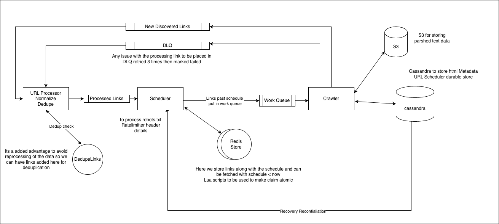

# Web Crawler — HLD Notes

## 1. Requirements

### Functional
- Crawl a set of seed URLs.
- Fetch pages and extract/discover new URLs.
- Avoid duplicate URL processing.
- Respect `robots.txt` and per-domain crawl limits.
- Retry transient failures and send exhausted failures to a DLQ.
- Store crawled content and crawl metadata.

### Non-functional
- Horizontally scalable.
- High URL-ingestion throughput.
- Durable URL/crawl state.
- Per-domain fairness/politeness.
- Fault tolerant with replay/recovery.

---

## 2. High-Level Architecture

```text
                    New Discovered Links
                            |
                            v
                    +---------------+
                    | URL Processor  |
                    | Normalize      |
                    | Deduplicate    |
                    +-------+-------+
                            |
                            v
                    Processed Links
                     Kafka / Queue
                            |
                            v
                    +---------------+
                    |   Scheduler   |
                    |---------------|
                    | robots policy |
                    | priority      |
                    | rate limits   |
                    | next crawl    |
                    +---+-------+---+
                        |       |
                        v       v
                   Cassandra   Redis
                   durable     hot
                   state       frontier
                        |       |
                        +---+---+
                            |
                            v
                      Work Queue
                            |
                            v
                    +---------------+
                    |    Crawler    |
                    +-------+-------+
                            |
                    +-------+-------+
                    |               |
                    v               v
                   S3          Cassandra
                page content   crawl metadata
                    |
                    +----> New URLs
                              |
                              +----> URL Processor
```




### Responsibilities

| Component | Responsibility |
|---|---|
| URL Processor | Normalize URLs, deduplicate, validate discovered links |
| Processed Links Kafka | Durable ingestion/replay stream for processed/discovered URLs |
| Scheduler | Decides when URLs are eligible; applies priority, robots and domain rate limits |
| Cassandra | Durable URL/crawl state and durable future scheduling buckets |
| Redis Cluster | Near-term scheduling frontier / fast operational state |
| Work Queue | Distributes executable crawl tasks to crawler workers |
| Crawler | Executes HTTP requests and returns crawl results |
| S3 | Stores raw/parsed page content |
| DLQ | Holds URLs that exhaust retry policy |

---

## 3. URL Lifecycle

```text
DISCOVERED
   |
   v
NORMALIZED
   |
   v
DEDUPLICATED
   |
   v
SCHEDULED
   |
   v
READY
   |
   v
CLAIMED
   |
   v
CRAWLING
   |
   +------> SUCCESS
   |
   +------> RETRY
   |
   +------> DLQ
```

The Scheduler owns the transition from scheduled state to ready/claimed work.

---

## 4. URL Frontier and Scheduler

A URL Frontier is the system that manages URLs waiting to be crawled.

The Scheduler answers:

> Which URL is allowed to be crawled now?

It considers:

- `next_crawl_at`
- priority
- per-domain rate limits
- `robots.txt`
- fairness across domains
- retry timing

### Scheduler flow

```text
Processed Links
      |
      v
 Scheduler
      |
      +----> persist durable URL state
      |
      +----> update Redis scheduling state
      |
      v
 when URL becomes eligible
      |
      v
 atomically claim URL
      |
      v
 Work Queue
      |
      v
 Crawler
```

The crawler does not choose URLs. The Scheduler selects and claims them; the Work Queue distributes crawl tasks to workers.

---

## 5. Cassandra Design

Cassandra is not used as a synchronous hot-path lookup for every scheduling decision.

It stores durable state such as:

```text
URL_STATE
---------
url_hash
url
domain
status
retry_count
last_crawled_at
next_crawl_at
http_status
content_location
```

### Future scheduling

Do not scan billions of URL rows to find URLs becoming eligible.

Use a separate time-bucketed scheduling table:

```text
SCHEDULE_BUCKET
---------------
bucket_time
shard_id
url_hash
next_crawl_at
```

Conceptually:

```text
12:30 bucket
  |
  +-- shard 0
  +-- shard 1
  +-- ...
  +-- shard 49
```

This gives the Scheduler an efficient way to load only relevant time buckets.

Use separate Cassandra tables for separate access patterns rather than trying to make one table serve all queries.

---

## 6. Redis Frontier

Redis is the **hot scheduling layer**, not the durable 10B-URL database.

Only keep a near-term scheduling horizon in Redis.

Example:

```text
Cassandra
10B durable URLs
      |
      | next 30 min
      v
Redis Cluster
near-term frontier
      |
      v
Work Queue
```

### Sharding

Use URL hash for Redis distribution:

```text
redis_shard = hash(url_hash) % N
```

Do not shard by domain because a popular domain could create a hotspot.

### TTL

Redis scheduling state can have a strong TTL to bound memory.

The TTL applies to the Redis operational state, not to the durable Cassandra URL record.

If Redis loses state, Scheduler can reconstruct it from Cassandra's time buckets.

---

## 7. Atomic URL Claim

Multiple Scheduler instances may compete for the same URL.

Use an atomic Redis operation / Lua script:

```text
READY
  |
  | atomic claim
  v
CLAIMED
  |
  v
Work Queue
```

A lease can be associated with the claim:

```text
url_hash
status = CLAIMED
worker/scheduler = X
lease_until = T
```

If the worker/scheduler dies, the lease expires and the URL can be rescheduled.

---

## 8. Queue Evolution

Start simple:

```text
New URLs -> Links Queue -> Crawler
```

Then evolve as scale/problems appear:

```text
New URLs
   |
   v
URL Processor
   |
   v
Processed Links Queue
   |
   v
Scheduler
   |
   v
Work Queue
   |
   v
Crawler
```

This keeps ingestion, scheduling and execution independently scalable.

---

## 9. Throughput / Capacity

Target:

```text
10 billion URLs / 5 days

= 10,000,000,000 / 432,000
≈ 23,148 URLs/sec
```

Design target:

```text
~25K URLs/sec
```

A logical 50-way workload distribution gives:

```text
25,000 / 50
≈ 500 URLs/sec per scheduler/shard
```

This is a capacity-planning target, not a claim that Cassandra has exactly 500 TPS per physical shard.

Cassandra's actual capacity depends on:

- cluster size
- replication factor
- consistency level
- partition-key distribution
- row size
- hardware
- compaction
- workload mix

With RF=3, replica traffic is roughly higher than the logical application write rate and must be included in capacity planning.

---

## 10. Cassandra Write Strategy

Do not introduce another Kafka between Scheduler and Cassandra just to move the same workload.

The Scheduler already consumes the durable Processed Links stream.

Use asynchronous/bounded-concurrency Cassandra writes:

```text
Kafka
  |
  v
Scheduler
  |
  +----> bounded async writes ---> Cassandra
  |
  +----> Redis frontier
```

Avoid huge Cassandra logged batches for unrelated partitions. Cassandra generally performs better with independent asynchronous writes when atomicity across partitions is not required.

---

## 11. Failure / Recovery

### Redis failure

```text
Redis lost
   |
   v
Scheduler
   |
   v
Cassandra schedule buckets
   |
   v
rebuild near-term Redis state
```

No URL is lost because durable scheduling state exists in Cassandra.

### Scheduler failure

Kafka offsets are committed only after the required durable processing succeeds.

Replay is safe if Cassandra writes are idempotent/upserts.

### Crawler failure

```text
Crawler
  |
  +--> transient error -> retry/reschedule
  |
  +--> retry limit exceeded -> DLQ
```

### Work Queue failure

The queue should provide durable delivery/visibility timeout semantics so unacknowledged crawl tasks can be redelivered.

---

## 12. Robots and Politeness

The Scheduler should maintain per-domain policy:

```text
A.com -> 2 req/sec
B.com -> 10 req/sec
C.com -> 5 req/sec
```

Do not let priority alone determine execution, otherwise one large domain can monopolize crawler capacity.

The Scheduler combines:

```text
priority
+
domain eligibility
+
next_crawl_at
+
robots.txt
+
fairness
```

to select work.

---

## 13. Storage Separation

### Cassandra
Durable, queryable crawl/URL metadata.

### Redis
Fast, temporary scheduling state.

### S3
Large raw/parsed page content.

Keeping raw HTML can allow reparsing later if the parser changes.

---

## 14. Key Tradeoffs

### Kafka vs direct URL queue
Kafka provides durable ingestion, replay and buffering for the high-volume discovered-link stream.

### Redis vs Cassandra for scheduling
Redis gives low-latency scheduling operations; Cassandra provides durable recovery/state.

### Near-term Redis horizon
Avoid keeping billions of future URLs in memory. Cassandra time buckets hold future schedules; Redis holds only the active horizon.

### Hash-based sharding
Distributes URLs evenly but does not solve domain-level rate limiting; domain policy must be maintained separately.

### At-least-once processing
Prefer at-least-once delivery with idempotent URL state updates over trying to build end-to-end exactly-once crawling.

---

## 15. Interview Questions / Follow-ups

1. How do you prevent the same URL from being crawled twice?
2. How do you normalize URLs?
3. How does the Scheduler enforce per-domain rate limits?
4. How do you implement `robots.txt`?
5. Why Redis + Cassandra? Why not just Cassandra?
6. Why not keep all URLs in Redis?
7. How do you recover if Redis is completely lost?
8. How do you partition Cassandra?
9. What prevents a hot Cassandra partition?
10. How do you handle a domain with billions of URLs?
11. How do multiple Scheduler instances atomically claim a URL?
12. What happens if Scheduler crashes after Cassandra succeeds but before Redis succeeds?
13. What happens if Redis succeeds but Cassandra fails?
14. Why use Kafka between URL Processor and Scheduler?
15. Why not add Kafka between Scheduler and Cassandra?
16. How do you handle 429/5xx vs permanent 4xx failures?
17. How do you handle backpressure when crawler capacity is lower than discovery rate?
18. How do you prioritize important URLs without starving other domains?
19. How do you rebuild Redis after failure?
20. How would you scale from 25K URLs/sec to 100K URLs/sec?
