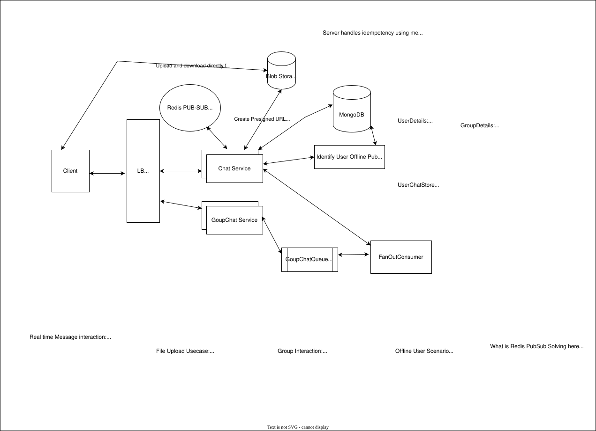

# Dropbox-like File Synchronization System - HLD

## 1. Problem

Design a Dropbox-like distributed file storage and synchronization system.

Core requirements:

- Users can upload/download files.
- Files synchronize across multiple devices.
- Large files should support resumable uploads.
- Multiple devices can modify the same file.
- Deletes must propagate to offline devices.
- Files should be stored durably and efficiently.
- System should support sharing and multi-region deployment.

---

# 2. High-Level Architecture

```text
                         Global DNS / GSLB
                                |
                         API Gateway
                                |
              +-----------------+-----------------+
              |                                   |
        File Service                         Sync Service
              |                                   |
        Metadata DB                         ChangeLog
              |                                   |
              +-------------+---------------------+
                            |
                      Object Storage
                         (S3/GCS)
                            |
                     Client Devices
              +-------------+-------------+
              |                           |
          Local DB                   Local Files
```




### Important design choice

The client uploads/downloads file data directly to object storage using short-lived presigned URLs.

Application services handle:

- Authentication
- Authorization
- Metadata
- Versioning
- Sync decisions
- Upload lifecycle

They should not proxy large file payloads.

---

# 3. File Upload Flow

For large files, split the file into chunks.

Example:

```text
report.pdf
    |
    +-- Chunk 0
    +-- Chunk 1
    +-- Chunk 2
    +-- Chunk 3
```

A typical chunk size could be 5 MB.

Each chunk gets a SHA-256 fingerprint.

```text
Chunk 0 → hash A
Chunk 1 → hash B
Chunk 2 → hash C
```

Fingerprints help with:

- Change detection
- Deduplication
- Resumable uploads
- Integrity validation

### Fingerprint vs checksum

The same hash algorithm can serve different purposes.

**Fingerprint:**

> Is this the same content?

**Checksum:**

> Was this content corrupted?

---

# 4. Metadata Model

Keep logical files, immutable versions, and chunks separate.

### File

```text
fileId
ownerId
fileName
parentFolderId
currentVersion
status
createdAt
updatedAt
```

### FileVersion

```text
fileId
versionId
versionNumber
baseVersion
size
fileChecksum
totalChunks
createdAt
status
```

### Chunk

```text
fileId
versionId
chunkIndex
fingerprint
size
storageKey
status
```

Actual file bytes live in object storage.

Metadata DB stores references to the objects.

### Why immutable versions?

```text
File F123
   |
   +-- V1
   +-- V2
   +-- V3
   +-- V4
```

A modification creates a new version rather than modifying an old version.

Example:

```text
V4 = [A, B, C, D]

New version:

V5 = [A, B, X, D]
```

Unchanged chunks can be reused.

---

# 5. Resumable Upload

Create an upload session before uploading chunks.

```text
UploadSession

uploadId
fileId
versionId
totalChunks
status
```

Upload state:

```text
UPLOADING
     |
     v
FINALIZING
     |
     v
COMPLETED
```

### Flow

```text
Client
  |
  | Create upload session
  v
File Service
  |
  | Presigned URLs
  v
Client
  |
  | Upload chunks directly
  v
Object Storage
```

If the network fails:

```text
Uploaded:
0 1 2 4

Missing:
3
```

Client only retries chunk 3.

It does not upload the entire file again.

### Temporary namespace

```text
S3/temp/{uploadId}/chunk-{n}
```

Temporary objects are not considered part of the current file until finalization succeeds.

---

# 6. Upload Finalization

When all chunks are uploaded:

```text
UPLOADING
    |
    | all chunks present
    v
FINALIZING
    |
    | validate fingerprints/checksum
    v
DB transaction
    |
    +-- Create FileVersion
    +-- Store chunk references
    +-- Update currentVersion
    +-- Add ChangeLog entry
    +-- Mark upload COMPLETED
```

The metadata transaction should atomically update the file state and the change record where the database supports transactions.

---

# 7. DB + Object Storage Consistency

There is normally no ACID transaction spanning:

```text
Metadata DB + S3
```

Do not introduce 2PC just for this.

Use:

- Upload state machine
- Immutable objects
- Idempotent operations
- Durable upload events
- Reconciliation jobs

### Example failure

```text
S3 upload succeeds
        |
        v
DB update fails
```

The upload remains in:

```text
FINALIZING
```

A retry/reconciliation process can safely complete it.

### Orphan objects

If an upload permanently fails:

```text
S3/temp/{uploadId}/...
```

can be cleaned using:

- TTL/lifecycle rules
- Background reconciliation

### Completed version but missing S3 object

Periodic reconciliation checks that metadata references actually exist in object storage.

---

# 8. Idempotency

Network failures can cause clients to retry a request even though the server already processed it.

### Chunk idempotency

A chunk is uniquely identified by:

```text
(uploadId, chunkIndex)
```

Persist:

```text
status
fingerprint
```

If the same request is retried:

```text
Already uploaded
      ↓
Return existing result
```

If the same chunk index is retried with a different fingerprint:

```text
Conflict
```

Do not silently overwrite it.

### Complete upload must also be idempotent

If completion succeeded but the response was lost:

```text
Client → completeUpload()
       X response lost

Client → completeUpload() again
```

The server should return the already-created version instead of creating another version.

### Fingerprint != idempotency key

Fingerprint:

> Identifies content.

Idempotency key:

> Identifies an operation/request.

---

# 9. Versioning

Treat each modification as an immutable FileVersion.

```text
File F123
   |
   +-- V1
   +-- V2
   +-- V3
   +-- V4 ← current
```

A version can contain:

```text
versionId
versionNumber
baseVersion
fileChecksum
totalSize
totalChunks
```

Benefits:

- Conflict detection
- Version history
- Restore
- Sync
- Reuse of unchanged chunks

---

# 10. Conflict Resolution

Two devices can modify the same version.

```text
                 V5
                /  \
               /    \
          Device A  Device B
             |         |
            V6-A      V6-B
```

When uploading, the client sends:

```text
baseVersion = 5
```

Server checks:

```text
currentVersion == baseVersion
```

### No conflict

```text
currentVersion = 5
baseVersion    = 5

→ create V6
```

### Conflict

```text
currentVersion = 6
baseVersion    = 5

→ conflict
```

Do not silently overwrite the existing version.

For generic files, create a conflicted copy.

For application-specific formats, merge logic could be applied.

---

# 11. ChangeLog + Cursor Based Sync

Use short polling rather than pushing every change to every device.

The Sync Service maintains a durable change stream.

Example:

```text
userId
sequence
fileId
versionId
operation
timestamp
```

Operations:

```text
CREATE
UPDATE
DELETE
```

### Cursor

The client stores:

```text
cursor = 1003
```

Then asks:

```text
GET /changes?cursor=1003
```

Server returns changes after sequence 1003.

```text
1004 → file A updated
1005 → file B created
1006 → file C deleted
```

And:

```text
nextCursor = 1006
```

### Why sequence instead of timestamp?

Timestamps can:

- Collide
- Arrive out of order
- Depend on clock behavior

A logical monotonically ordered sequence is cleaner.

For strict per-user ordering, use a per-user sequence.

### Cursor advancement

Client should:

1. Fetch changes.
2. Apply changes locally.
3. Persist local state.
4. Persist the new cursor.

If the client crashes before step 4, the same changes may be received again.

Therefore client-side application should also be idempotent.

### Cursor expiration

ChangeLog entries cannot live forever.

If a client has been offline beyond the retention period:

```text
cursor expired
       |
       v
Full metadata reconciliation
       |
       v
Establish new cursor
```

---

# 12. Delete Propagation

Do not immediately remove all metadata when a file is deleted.

Use a tombstone.

```text
File F123

status = DELETED
deletedAt = ...
```

And record:

```text
F123 → DELETE
```

This is important for offline clients.

### Example

Device A deletes:

```text
report.pdf
```

Device B has been offline for 10 days.

When Device B reconnects:

```text
ChangeLog
   |
   v
DELETE F123
   |
   v
Remove local report.pdf
```

After the retention period:

```text
Tombstone
    |
    v
Background cleanup
    |
    +-- Remove metadata
    +-- Remove unused versions/chunks
    +-- Remove S3 objects
```

---

# 13. Authorization and Sharing

Keep authorization logically separate from file metadata.

Example:

```text
resourceId = FolderA
userId     = UserB
role       = EDITOR
```

Typical roles:

```text
OWNER
EDITOR
VIEWER
```

### Download flow

```text
Client
  |
  v
API Gateway
  |
  v
File Service
  |
  v
Authorization check
  |
  v
Generate presigned URL
  |
  v
Client → Object Storage
```

Never allow the client to construct arbitrary object-storage keys.

The service should resolve:

```text
fileId
   ↓
authorization
   ↓
storageKey
   ↓
presigned URL
```

Folder permissions can be inherited by descendant files/folders.

---

# 14. Multi-Region

Keep the main design simple.

Deploy stateless services across regions.

```text
                  Global DNS / GSLB
                         |
              +----------+----------+
              |                     |
           Region A              Region B
              |                     |
        API + Services        API + Services
              |                     |
           Metadata DB ← replication →
              |
        Object Storage
           ↕ replication
```

### Home region

Assign a user's namespace to a home region.

```text
User A → Region A
User B → Region B
User C → Region C
```

Metadata writes primarily go to the user's home region.

This gives a clear authority for metadata writes and avoids unnecessary multi-master conflicts.

Object storage can use cross-region replication.

During regional failure, traffic can fail over to another region depending on the consistency/failover strategy.

---

# 15. Failure Handling Summary

| Failure | Handling |
|---|---|
| Network failure during upload | Retry missing chunks |
| Duplicate chunk request | Idempotent response |
| Different content for same chunk | Conflict |
| Completion request retried | Idempotent completion |
| S3 succeeds, DB fails | FINALIZING + retry/reconciliation |
| DB succeeds, response lost | Retry safely |
| Temporary upload abandoned | Lifecycle/TTL cleanup |
| Client offline | ChangeLog + cursor |
| Cursor expired | Full reconciliation |
| File deleted | Tombstone |
| Two devices edit same version | Optimistic concurrency |
| S3 object missing | Reconciliation/alert |
| Region failure | Global routing + replicated data |

---

# 16. What Goes in the Main HLD Diagram?

Keep the diagram clean.

### Show

```text
Client
  ↓
API Gateway
  ↓
File Service
  ↓
Metadata DB

Client ───────────────→ Object Storage
        presigned URL

Client
  ↓
Sync Service
  ↓
ChangeLog
```

### Don't clutter the main diagram with

- Tombstones
- Cursor implementation
- Idempotency keys
- Upload state machine
- Conflict resolution
- Reconciliation jobs
- Detailed authorization model
- Multi-region replication details

These are excellent **interviewer follow-up topics**.

---

# 17. Staff-Level Interview Talking Points

If the interviewer asks for deeper details, focus on these:

### Upload

> "Large files are chunked and uploaded directly to object storage using presigned URLs. Upload sessions make the process resumable."

### Consistency

> "I don't try to create a distributed transaction between S3 and the metadata database. I use an upload state machine, immutable objects, idempotency and reconciliation."

### Sync

> "I'm using short polling with a durable ordered ChangeLog. Clients maintain a cursor and fetch only changes after that cursor."

### Delete

> "Deletes use tombstones so offline clients can learn that a file was deleted."

### Conflicts

> "The client sends its base version. If that version is no longer current, optimistic concurrency detects the conflict instead of silently overwriting another device's update."

### Sharing

> "Authorization is checked before generating a short-lived presigned URL."

### Multi-region

> "Users have a home region for metadata writes, while services and object storage are deployed across multiple regions for availability and disaster recovery."

---

# 18. Core Design Principles

The design relies on a few important principles:

```text
1. Separate metadata from file bytes.

2. Upload bytes directly to object storage.

3. Use immutable versions.

4. Make operations idempotent.

5. Don't rely on distributed ACID transactions.

6. Use reconciliation for eventual consistency failures.

7. Use ordered change tracking for synchronization.

8. Use tombstones for deletes.

9. Use optimistic concurrency for conflicting edits.

10. Keep the main HLD simple and explain deeper mechanisms when asked.
```
