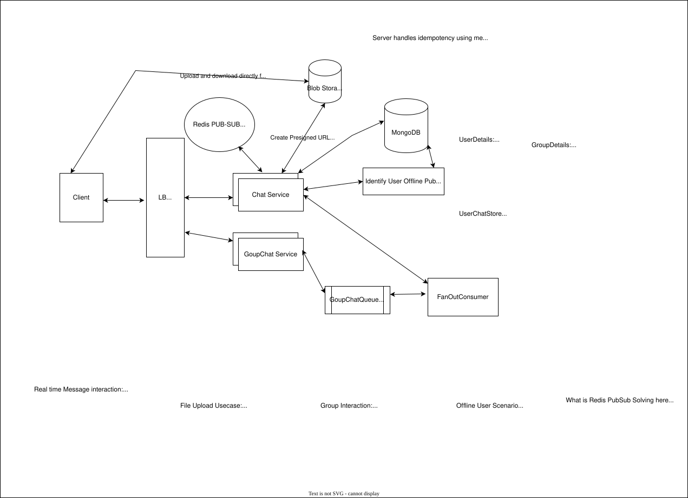

# WhatsApp — System Design HLD

## 1. Problem Statement

Design a WhatsApp-like messaging system supporting:

- 1:1 messaging
- Group messaging
- Real-time message delivery
- Offline message delivery
- Multi-server WebSocket connections
- Media/file sharing
- Reliable delivery with ACK + retry
- Large-scale concurrent connections

---

## 2. Requirements

### Functional

- Send/receive 1:1 messages
- Group chat
- Real-time delivery when recipient is online
- Store messages for offline users
- Deliver pending messages after reconnect
- Media upload/download
- Message acknowledgement
- Retry undelivered messages

### Non-functional

- Low-latency real-time delivery
- High availability
- Durable messages
- Horizontal scalability
- At-least-once delivery with idempotent processing
- Ordering within a conversation
- Support very large numbers of concurrent WebSocket connections

---

# 3. High-Level Architecture

```text
                         ┌──────────────┐
                         │    Client    │
                         └──────┬───────┘
                                │
                         WebSocket / HTTPS
                                │
                         ┌──────▼───────┐
                         │ Load Balancer│
                         └──────┬───────┘
                                │
              ┌─────────────────┼─────────────────┐
              ▼                 ▼                 ▼
        ┌───────────┐     ┌───────────┐     ┌───────────┐
        │ Chat Svr 1│     │ Chat Svr 2│     │ Chat Svr N│
        └─────┬─────┘     └─────┬─────┘     └─────┬─────┘
              │                 │                 │
              └─────────────────┼─────────────────┘
                                │
                         Redis Pub/Sub
                                │
                    Real-time message routing
                                │
                 ┌──────────────┴──────────────┐
                 │                             │
          Message / Inbox Store          Group Chat Queue
                 │                             │
                 │                       Fan-out Consumer
                 │                             │
                 └──────────────┬──────────────┘
                                │
                         Durable recovery
```



### Core principle

> **Redis Pub/Sub is the real-time delivery path, not the source of truth.**

The durable message/inbox store protects against Redis, WebSocket, network, and server failures.

---

# 4. WebSocket Architecture

HTTP is inefficient for continuous real-time communication because the client repeatedly needs to poll.

WebSocket provides a persistent bidirectional connection:

```text
Client ───────── persistent connection ──────── Chat Server
```

Chat Servers are horizontally scaled behind a Load Balancer.

### Connection capacity calculation

For interview estimation, use a clearly stated assumption:

- Registered users = 1B
- Peak concurrent users = 10%
- Concurrent connections = 100M
- Assume ~100K concurrent WebSocket connections/server

```text
100M / 100K
≈ 1,000 Chat Servers
```

With 30% headroom:

```text
1,000 × 1.3
≈ 1,300 servers
```

This is an **interview estimate**, not a universal server limit. Actual capacity depends on runtime, memory, TLS, kernel/network configuration, message rate, and connection behavior and should be validated through load testing.

### Memory sanity check

If effective connection overhead is assumed to be ~20 KB:

```text
100K × 20 KB ≈ 2 GB
```

This helps validate whether the server size is reasonable.

### Important distinction

- Chat Servers hold WebSocket connections.
- Redis Pub/Sub does not hold the WebSocket connections.
- Redis helps route messages between horizontally scaled Chat Servers.

---

# 5. Redis Pub/Sub

A user can be connected to any Chat Server.

Example:

```text
User B → WebSocket → Chat Server 7
```

Another server may receive a message for B:

```text
Chat Server 2
      │
      ▼
Redis Pub/Sub
      │
      ▼
Chat Server 7
      │
      ▼
User B
```

Each active connection subscribes to the relevant user/device channel.

### Important terminology

Do **not** call Redis Pub/Sub "Kafka-style partitioned".

Redis Pub/Sub is not Kafka's partitioned ordered log.

We can shard Redis infrastructure/channels for scalability, but Kafka-style ordering semantics belong to a queue/log such as Kafka.

---

# 6. Offline / Reliable Delivery

The important design rule:

> **Persist before attempting real-time delivery.**

Do not persist only when the WebSocket cannot be found.

A WebSocket can exist and still fail before the client ACK reaches the server.

### Flow

```text
A sends M101
     │
     ▼
Chat Service
     │
     ├── Persist Message
     │
     ├── Create UserInbox entry
     │
     └── Publish to Redis
                 │
                 ▼
          Recipient WebSocket
                 │
                 ▼
                B
                 │
             ACK(M101)
                 │
                 ▼
        Remove/mark Inbox entry
```

### Offline user

```text
A → Chat Service
       │
       ▼
Message + UserInbox
       │
       │ B offline
       │
       ▼
B reconnects
       │
       ▼
Fetch pending messages
       │
       ▼
Deliver
       │
       ▼
ACK
```

### Why ACK matters

Online/offline status is not sufficient to determine successful delivery.

A user can be online and the socket can fail immediately after the message is sent.

Therefore:

> **ACK determines delivery; connection status only determines the delivery path.**

### TTL

If the requirement is 30-day offline retention:

```text
UserInbox TTL = 30 days
```

This should be driven by the requirement, not by the database technology.

---

# 7. Message Store vs User Inbox

Avoid putting everything into one large `UserChatStore` document.

Separate the concepts.

### Message Store

```text
messageId
conversationId
senderId
timestamp
content
messageType
mediaId
```

Answers:

> What is message M101?

### UserInbox / Delivery State

```text
userId
deviceId
messageId
status
createdAt
```

Answers:

> Which messages for this recipient/device have not been acknowledged?

For group chat, delivery state is per recipient:

```text
User   Message   Status
B      M101      ACKED
C      M101      PENDING
D      M101      ACKED
```

The message payload itself does not need to be duplicated for every recipient.

---

# 8. Ordering

We do not need global ordering.

We need:

> **Ordering within a conversation.**

Example:

```text
Conversation A

M101
M102
M103
```

should not be displayed as:

```text
M103
M101
M102
```

### Important Redis clarification

Redis Pub/Sub should not be described as providing Kafka-style partition ordering.

If an ordered event log is required, Kafka can be used:

```text
Chat Service
     │
     ▼
Kafka
key = conversationId
     │
     ▼
Partition
     │
     ▼
Fan-out Consumer
     │
     ▼
Redis Pub/Sub
     │
     ▼
WebSocket
```

Messages with the same conversation ID go to the same Kafka partition, providing ordering within that partition while allowing different conversations to be processed in parallel.

A monotonically increasing sequence number can also be associated with messages:

```text
M101 → seq 101
M102 → seq 102
M103 → seq 103
```

This allows the client to detect gaps.

### Interview principle

> **We need per-conversation ordering, not global ordering.**

Do not introduce Kafka solely because it sounds scalable. Explain why an ordered event log is required before adding it.

---

# 9. Idempotency

Retries create the possibility of duplicates.

## Send-request duplicate

```text
Client
  │
  ├── send(M101)
  │
  ▼
Server persists M101
  │
  X response lost
  │
Client retries M101
```

Without idempotency:

```text
M101
M101
```

### Solution

Every message has a unique `messageId`.

The server uses it as the idempotency key.

```text
if messageId already exists:
    return existing result
else:
    persist message
```

The data model should enforce uniqueness appropriately.

---

## Delivery duplicate

Another scenario:

```text
B receives M101
       │
       ▼
B sends ACK
       X network failure
```

Server doesn't receive ACK and retries M101.

B receives M101 again.

Client checks:

```text
messageId already processed?
```

If yes:

```text
Do not display again
Send ACK again
```

Eventually the server receives the ACK and clears the pending inbox entry.

### Delivery semantics

Do not claim "exactly once delivery".

Use:

> **At-least-once delivery + idempotent processing = effectively-once user-visible delivery.**

---

# 10. Group Chat

Basic flow:

```text
GroupChat Service
       │
       ▼
GroupChat Queue
       │
       ▼
Fan-out Consumer
       │
       ├── User B
       ├── User C
       ├── User D
       └── User E
              │
              ▼
        Redis Pub/Sub
              │
              ▼
        WebSocket Servers
```

The queue decouples message ingestion from potentially expensive fan-out.

For very large groups, fan-out must be carefully controlled to avoid a single group becoming a hot workload.

### Important distinction

The Fan-out Consumer does not need to find the actual WebSocket.

It publishes to the recipient's Redis channel.

Redis routes the message to the Chat Server that owns the active connection.

---

# 11. Media / File Upload

Do not send large media through the Chat Service.

Use object/blob storage with a short-lived presigned URL.

```text
Client
   │
   ▼
Chat Service
   │
   │ presigned URL
   ▼
Client ───────────→ Blob Storage
```

The application server does not proxy the media bytes.

After upload:

```text
Client → Chat Service
         fileId
         checksum
         metadata
```

Message stores a media reference:

```text
messageId
messageType = IMAGE
mediaId
```

Media metadata can contain:

```text
mediaId
blobPath
contentType
size
checksum
```

Checksum can be used to validate upload integrity.

---

# 12. Failure Recovery

### Chat Server crashes

```text
Chat Server 3 💥
       │
       ▼
Client reconnects
       │
       ▼
Load Balancer
       │
       ▼
Chat Server 7
       │
       ▼
Pending UserInbox messages
```

WebSocket connections are ephemeral; durable message state survives.

### Redis fails

Real-time delivery may temporarily fail, but:

```text
Message Store + UserInbox
```

remain available as the recovery path.

### Fan-out Consumer crashes

Queue processing can retry.

Because delivery is idempotent:

```text
M101 → retry → M101
```

does not create duplicate user-visible messages.

### Client crashes

If ACK wasn't received:

```text
M101 remains pending
```

The client receives it after reconnect.

### Network partition

The server cannot know whether a message reached the client.

Therefore:

```text
No ACK → retry
ACK received → clear pending state
```

Do not infer delivery from TCP/WebSocket connection status alone.

---

# 13. Multi-device

A user may have:

```text
User B
 ├── Phone
 ├── Laptop
 └── Web
```

Model the connection as:

```text
(userId, deviceId) → connection/server
```

Example:

```text
B:phone  → Chat Server 1
B:laptop → Chat Server 7
B:web    → Chat Server 3
```

Redis maintains this ephemeral connection mapping.

Durable delivery state can be maintained per device when independent synchronization is required:

```text
userId   deviceId   messageId   status
B        phone      M101        ACKED
B        laptop     M101        PENDING
B        web        M101        ACKED
```

The message payload itself is stored once.

---

# 14. Storage Choices

A reasonable separation:

### MongoDB

Durable metadata:

```text
Users
Groups
Membership
Device metadata
```

### Cassandra / DynamoDB

High-volume message and inbox workloads.

The exact database is a technology choice; the important part is modeling around access patterns.

### Redis

Ephemeral realtime state:

```text
Presence
Connection mapping
Pub/Sub
```

### Blob Storage

Large media/files.

---

# 15. Core Design Principles

Remember these during the interview:

1. **WebSocket = persistent realtime connection**
2. **Chat Servers = hold connections**
3. **Redis Pub/Sub = realtime routing**
4. **Durable store = source of truth**
5. **UserInbox = pending delivery state**
6. **ACK = delivery confirmation**
7. **No ACK = retry**
8. **messageId = idempotency key**
9. **At-least-once + idempotency = effectively-once UX**
10. **Per-conversation ordering, not global ordering**
11. **Presigned URL = direct media upload**
12. **Connection status ≠ delivery confirmation**

---

# 16. Interview Questions

## Requirements / Estimation

1. What functional requirements would you clarify for WhatsApp?
2. What are the expected DAU and concurrent users?
3. How would you estimate WebSocket connections?
4. How many Chat Servers would you need for 100M concurrent connections?
5. How much memory would 100K connections consume?
6. What other capacity numbers would you calculate besides connections?
7. What happens if traffic suddenly increases 10x?

## WebSocket

8. Why WebSocket instead of polling?
9. How do you horizontally scale WebSocket servers?
10. How does Server 1 send a message to a user connected to Server 7?
11. What happens when a WebSocket server crashes?
12. How does reconnect work?
13. How do you detect dead connections?
14. What is the role of heartbeats?
15. Does the Load Balancer need sticky sessions?

## Redis

16. Why Redis Pub/Sub?
17. Does Redis Pub/Sub guarantee message durability?
18. Does Redis Pub/Sub provide Kafka-style partitions?
19. How would you scale Redis Pub/Sub?
20. What happens if Redis goes down?
21. Why shouldn't Redis be the source of truth?

## Message Delivery

22. How do you support offline users?
23. Why persist the message before real-time delivery?
24. Why is online/offline status insufficient to determine delivery?
25. How does ACK work?
26. What happens if ACK is lost?
27. How do you retry?
28. How long do you retain undelivered messages?
29. Why use TTL?
30. What happens after TTL expires?

## Idempotency

31. What happens if the client sends the same message twice?
32. What happens if the server response is lost?
33. How do you prevent duplicate messages?
34. Why do you need a messageId?
35. What happens if a message is delivered but the ACK is lost?
36. Can you guarantee exactly-once delivery?
37. What does at-least-once + idempotency mean?

## Ordering

38. Do you need global message ordering?
39. How do you guarantee ordering within a conversation?
40. Why use conversationId as a Kafka partition key?
41. Does Redis Pub/Sub provide Kafka-style partition ordering?
42. What happens when multiple Chat Servers receive messages concurrently?
43. Why do you need sequence numbers?
44. How would you detect a missing message?

## Group Chat

45. How does group fan-out work?
46. Why use a queue between GroupChat Service and Fan-out Consumer?
47. Why shouldn't the Fan-out Consumer directly find WebSockets?
48. How do you handle a group with millions of members?
49. What is a hot partition/group?
50. How would you prevent one large group from overwhelming the system?

## Storage

51. Why Cassandra/DynamoDB for messages?
52. What is your partition key?
53. How do you retrieve the latest 50 messages?
54. Why separate Message Store and UserInbox?
55. Why shouldn't you store all messages in one large user document?
56. What data belongs in Redis vs MongoDB vs Cassandra?
57. How do you handle data expiration?

## Media

58. Why shouldn't clients upload files through Chat Service?
59. What is a presigned URL?
60. How do you validate upload integrity?
61. Where do you store media metadata?
62. How does a message reference an image/file?

## Failure Recovery

63. What happens if Chat Server crashes?
64. What happens if Redis crashes?
65. What happens if the message store is temporarily unavailable?
66. What happens if the Fan-out Consumer crashes halfway through fan-out?
67. What happens if the client crashes before ACK?
68. What happens during a network partition?
69. How do retries avoid creating duplicates?
70. Which components are durable vs ephemeral?

## Multi-device

71. How do you support phone + laptop + web simultaneously?
72. Why isn't `userId → WebSocket` enough?
73. How do you model `(userId, deviceId)`?
74. What happens when one device is offline?
75. Does each device need independent ACK state?
76. How do devices catch up after reconnect?

---

# 17. Staff-Level Discussion Points

The interviewer is less interested in whether you know a particular database and more interested in whether you can explain the trade-offs.

Be ready to explain:

### Why Redis Pub/Sub?

For low-latency routing between Chat Servers, not durability.

### Why durable Inbox?

To survive offline users, network failures, WebSocket failures, and lost ACKs.

### Why ACK?

Connection establishment doesn't prove message delivery.

### Why messageId?

Retry is unavoidable in distributed systems; messageId makes retries safe.

### Why per-conversation ordering?

Global ordering is unnecessary and would reduce scalability.

### Why direct blob upload?

Keep large media traffic away from application servers.

### Why asynchronous group fan-out?

Separate message acceptance latency from potentially expensive recipient fan-out.

---

# 18. One-Minute Architecture Explanation

> "Clients maintain persistent WebSocket connections to horizontally scaled Chat Servers behind a load balancer. Redis Pub/Sub provides realtime routing between those servers without requiring a server to know where every user is connected.
>
> Messages are persisted before realtime delivery, and a recipient-specific Inbox tracks messages that haven't been acknowledged. Redis is therefore the fast path, while the durable store is the source of truth.
>
> When a recipient is online, the message is delivered through WebSocket. When offline, it remains in the Inbox and is delivered after reconnect. The client ACKs each message; if the ACK is lost, we retry. Since delivery is at-least-once, messageId provides idempotency and prevents duplicate user-visible messages.
>
> Group messages are asynchronously fanned out through a queue/consumer and then routed through Redis. Media is uploaded directly to blob storage using presigned URLs.
>
> For ordering, we care about per-conversation ordering rather than global ordering, and an ordered log such as Kafka can partition by conversationId if that level of infrastructure is justified."

---

# 19. Key Numbers Cheat Sheet

Use these as **explicit interview assumptions**, not universal facts.

```text
Registered users             1B
Peak concurrent users        10%
Concurrent connections       100M
Connections / server         ~100K
Servers                      ~1,000
30% headroom                 ~1,300
Connection memory assumption ~20 KB
Memory @ 100K connections    ~2 GB
Offline retention            30 days
```

For every estimate, say:

> **"This is an assumption; I'd validate it through load testing."**
