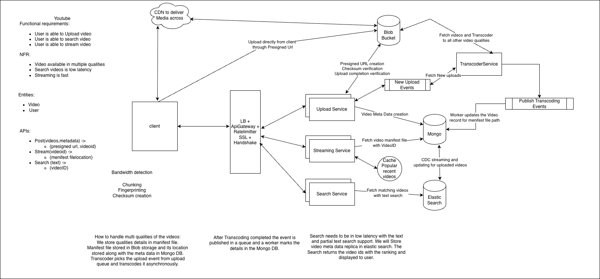

# YouTube — Video Upload, Processing & Streaming HLD

## 1. Functional Requirements

- User can upload a video.
- User can search for videos.
- User can stream/watch videos.

## 2. Non-Functional Requirements

- Video available in multiple qualities.
- Low-latency video search.
- Fast, scalable streaming.
- Asynchronous video processing.
- Resilient processing with retry and reconciliation.

## 3. High-Level Architecture

```text
Client
  |
  v
LB + API Gateway + Rate Limiter + SSL
  |
  +--------------------> Upload Service
  |                           |
  |                           +--> Mongo (video metadata/state)
  |                           |
  |                           +--> Kafka: VideoUploaded
  |                                      |
  |                                      v
  |                                  Transcoder
  |                                      |
  |                         +------------+-------------+
  |                         |            |             |
  |                       1080p        720p          480p/360p
  |                         |            |             |
  |                         +------------+-------------+
  |                                      |
  |                                      v
  |                               Blob Storage
  |                            segments + manifest
  |                                      |
  |                                      v
  |                              CDN --> Client
  |
  +--------------------> Streaming Service
  |                           |
  |                           +--> Mongo (manifest location)
  |                           +--> CDN
  |
  +--------------------> Search Service
                              |
                              v
                         Elasticsearch

Mongo --CDC--> Kafka --> Search Indexer --> Elasticsearch
```




## 4. Upload Flow

1. Client calls `POST /videos/metadata`.
2. Upload Service creates the initial video metadata and returns a pre-signed upload URL.
3. Client uploads the source video directly to Blob Storage.
4. Client can use chunking/resumable upload and calculates fingerprints/checksums.
5. Upload Service verifies the uploaded object/checksum.
6. Video state changes from `UPLOADING` to `UPLOADED`.
7. Upload Service publishes a `VideoUploaded` event to Kafka.
8. Processing starts asynchronously.

Direct-to-Blob upload keeps large media payloads away from application servers.

## 5. Asynchronous Transcoding

The transcoding workflow is event-driven:

```text
VideoUploaded
    |
    v
Kafka
    |
    v
Processing Worker / Transcoder
    |
    +--> 1080p
    +--> 720p
    +--> 480p
    +--> 360p
```

The transcoder fetches the source video from Blob Storage, creates the required representations/segments, and uploads the resulting artifacts back to Blob Storage.

The transcoder publishes a completion event after the relevant artifacts are successfully created.

A worker consumes the event and updates the corresponding video/quality state in MongoDB.

## 6. Manifest Management

The actual manifest is stored in Blob Storage, not MongoDB.

Mongo stores metadata such as:

```json
{
  "videoId": "v123",
  "status": "READY",
  "manifestPath": "videos/v123/master.m3u8",
  "qualities": {
    "1080p": "READY",
    "720p": "READY",
    "480p": "READY",
    "360p": "READY"
  }
}
```

HLS uses `.m3u8` playlists; MPEG-DASH commonly uses an `.mpd` manifest.

The manifest describes the available representations and the segments the player can request. The player can use this information for adaptive bitrate streaming.

## 7. Quality-Level State

Processing should be tracked per `videoId + quality`.

Example:

```text
1080p -> READY
720p  -> FAILED
480p  -> READY
360p  -> READY
```

A failure in one quality should not require retranscoding the entire video.

The failed quality can be retried independently.

Only qualities whose required artifacts are successfully available should be advertised in the final manifest.

## 8. Failure Handling

### Retry

Transient failures can be retried for the specific `videoId + quality`.

```text
Transcoding failure
       |
       v
Retry
       |
       +--> success -> READY
       |
       +--> repeated failure -> DLQ / investigation
```

### Idempotency

Kafka events may be delivered more than once.

The worker must process events idempotently using an event ID or a stable key such as:

```text
videoId + quality + processingVersion
```

Duplicate completion events must not corrupt the processing state or trigger unnecessary work.

### Reconciliation

A reconciliation pipeline runs asynchronously and detects failed, stuck, or inconsistent processing records.

It verifies the expected manifest and video segments in Blob Storage using object existence and checksum validation.

```text
Reconciliation
      |
      v
Find failed/stuck/inconsistent videoId + quality
      |
      v
Validate Blob artifacts
      |
      +--> valid -> repair/update state if required
      |
      +--> invalid/missing -> resubmit that quality for transcoding
```

This protects against cases such as:

- Transcoder uploads artifacts but crashes before publishing the completion event.
- Worker consumes an event but crashes before updating Mongo.
- Mongo says `READY` while an artifact is missing.
- A subset of segments is corrupted or missing.

## 9. CDN and Streaming

Both manifests and video segments are cacheable at the CDN.

```text
Client
  |
  v
CDN
  |
  +--> cached manifest
  |
  +--> cached video segments
  |
  v
Blob Storage (origin)
```

Video segments are generally immutable after generation, making them highly cache-friendly.

CDN caching:

- Reduces playback latency.
- Reduces origin requests.
- Reduces Blob Storage egress/load.
- Allows popular videos to scale to large viewer counts.

Useful metrics include CDN cache-hit ratio, origin requests, segment latency, and rebuffering rate.

## 10. Search Architecture

MongoDB is the source of truth for video metadata.

Elasticsearch is a derived search/read model.

```text
Mongo
  |
  | CDC
  v
Kafka
  |
  v
Search Indexer
  |
  v
Elasticsearch
```

This keeps search low latency while avoiding synchronous updates to Elasticsearch on the critical write path.

Search is therefore eventually consistent with MongoDB.

## 11. Why CDC vs Domain Events?

Use domain events to drive business workflows:

```text
VideoUploaded
    -> start transcoding

TranscodingCompleted
    -> update processing state
```

Use CDC to propagate committed source-of-truth changes to derived systems:

```text
Mongo change
    -> CDC
    -> Kafka
    -> Search Indexer
    -> Elasticsearch
```

CDC is therefore not required for the transcoding workflow itself.

## 12. Important Consistency Invariants

- MongoDB is the source of truth for video metadata and processing state.
- Blob Storage contains the actual media artifacts and manifest.
- Elasticsearch is eventually consistent and is not the source of truth.
- A quality should only be marked `READY` after its required artifacts are verified.
- A manifest should not advertise unavailable/corrupt qualities.
- Processing events must be idempotent.
- Reconciliation provides eventual repair when asynchronous components fail.

## 13. Scaling Considerations

### Upload

Use direct-to-Blob pre-signed URLs so application servers do not proxy large video payloads.

### Transcoding

Transcoding is CPU/GPU intensive and should scale independently from API services. Jobs can be distributed across workers based on the required quality and workload.

### Streaming

CDN absorbs most traffic for popular content. Blob Storage acts as the origin.

### Search

Elasticsearch can scale independently from MongoDB and the API services.

## 14. Key Data Model

### Video

```text
videoId
userId
title
description
status
manifestPath
createdAt
updatedAt
qualities
```

### Quality State

```text
videoId
quality
status
attemptCount
artifactPath
updatedAt
```

Possible states:

```text
UPLOADING
UPLOADED
PROCESSING
READY
FAILED
```

## 15. Interview Questions

### Architecture

- Why use Blob Storage instead of storing videos in MongoDB?
- Why upload directly using a pre-signed URL?
- Why do we need a CDN?
- Why MongoDB + Elasticsearch instead of only Elasticsearch?
- Why is the manifest stored in Blob Storage rather than MongoDB?
- Why do we need a separate Streaming Service?

### Transcoding

- Why is transcoding asynchronous?
- How do you scale transcoding workers?
- What happens if only one quality fails?
- What happens if the transcoder crashes after uploading some segments?
- How do you prevent duplicate transcoding?
- How do you know a quality is actually ready?

### Kafka / Events

- What happens if the same event is delivered twice?
- What happens if the worker crashes after consuming an event?
- How do you handle poison messages?
- When would you use Kafka/domain events versus CDC?
- How do you guarantee that a completed transcoding result is eventually reflected in Mongo?

### Consistency

- What if Mongo says READY but the manifest is missing?
- What if the manifest advertises a segment that does not exist?
- How does reconciliation work?
- What consistency model does Elasticsearch provide relative to Mongo?

### Streaming

- What are HLS and MPEG-DASH?
- Why split videos into segments?
- How does adaptive bitrate streaming work?
- Why cache both the manifest and segments?
- What happens when a video suddenly becomes viral?

### Reliability

- What is your retry strategy?
- When do you send a job to DLQ?
- How do you avoid retranscoding all qualities when one quality fails?
- How do you detect stuck processing jobs?
- How do you make reconciliation safe and idempotent?

## 16. Summary

The core design is:

```text
Direct Upload
    -> Blob Storage
    -> Upload Verification
    -> VideoUploaded Event
    -> Async Transcoding
    -> Quality Segments + Manifest
    -> Blob Storage
    -> CDN
    -> Client

MongoDB
    -> Source of truth for metadata/state

MongoDB
    -> CDC
    -> Kafka
    -> Search Indexer
    -> Elasticsearch

Reconciliation
    -> Detect inconsistent artifacts/state
    -> Retry only the affected videoId + quality
```
